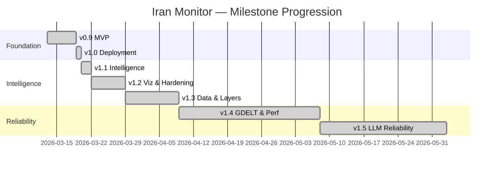

# Phase 41: Public Reveal Polish - Research

**Researched:** 2026-06-05
**Domain:** Portfolio-documentation authoring (in-repo synthesis) + a guided-tour/intro-overlay reveal surface on a Vite-SPA React 19 / Deck.gl / Zustand / Tailwind-v4 stack, plus Playwright headless layer-capture tooling and SPA Open Graph assets.
**Confidence:** HIGH (stack facts verified in-repo; library facts verified via npm/official docs; doc strand is synthesis from already-read in-repo sources)

## Summary

Phase 41 is two strands with very different research profiles. **REVEAL-DOCS (10 reqs)** is almost entirely markdown synthesis from in-repo source material that already exists and is enumerated below — there is no external-technology unknown there; the work is mapping each doc to its concrete inputs and wiring cross-links, plus a Wave-0 audit gate. **REVEAL-SITE (4 reqs)** carries the only real implementation unknowns: a re-openable guided tour, a first-visit intro overlay, headless layer-capture tooling, and SPA Open Graph assets.

The stack is verified: React 19.1, Zustand 5.0.11 (curried `create<T>()()`), Tailwind v4.2 CSS-first `@theme`, Vite 6.3, Playwright 1.58, no SSR. The existing codebase already gives you every primitive you need: conditionally-rendered overlay components gated on a Zustand boolean (SearchModal, DashboardAuthModal, DevApiStatus all follow this exact pattern), a z-index CSS-var scale (`--z-modal: 40`, `--z-tooltip: 50`), a `localStorage`-backed persistence pattern in `uiStore` (`readBool` + `markets-collapsed`), and a working Playwright headless-WebGL capture harness (`scripts/capture-hero.ts`) that already solves SwiftShader/ANGLE WebGL rendering, layer-toggle sequencing, and map-settle waits.

**Primary recommendation:** Use **driver.js** (5 KB gzipped, zero deps, framework-agnostic, MIT, TS-native) for the guided tour — it sidesteps React-19 peer-dep risk entirely and its SVG-cutout spotlight targets DOM HUD chrome cleanly. Build the first-visit intro overlay as a plain conditionally-rendered React component gated on a new `uiStore` first-visit flag persisted to `localStorage` (mirror the existing `readBool`/`markets-collapsed` pattern). Extend `scripts/capture-hero.ts` into `capture:layers` rather than writing new tooling. Put OG/Twitter tags statically in `index.html` with absolute `https://otg-iran-monitor.vercel.app/...` URLs — crawlers read raw HTML, so no SSR is needed. Run the D-10 audit as a Wave-0 blocking gate with parallel subagents before any docs land.

<user_constraints>

## User Constraints (from CONTEXT.md)

### Locked Decisions

- **D-01:** The public landing surface IS the live dashboard (no separate landing page). A lightweight, **dismissible first-visit intro overlay** frames what the visitor is seeing on first load. Front door stays the map; narrative framing lives in the overlay.
- **D-02:** The operator/dev surface (API Health tab — `DevApiStatus`, FlightRecorderBlock, budget/cost blocks) stays **visible read-only** to unauthenticated visitors. Write-actions (replay / prune / force-trigger) remain Bearer-gated. No new gating to build.
- **D-03:** Primary mechanism = a **step-through guided tour overlay** (~5-7 spotlight steps walking layers → LLM enrichment → threat density → API Health). The first-visit intro overlay (D-01) is the entry point to this tour. Must be **re-openable** via a persistent "Tour" affordance (not first-visit-only).
- **D-04:** The tour and `npm run capture:layers` both render against **live data** — no fixtures, no `?demo=true` canned state. "Reproducible" means re-runnable, not byte-identical.
- **D-05:** Guided-tour hub = **`docs/SHOWCASE.md`** (flat file at `docs/` root). README hero block links to it.
- **D-06:** Screenshots **consolidate to `public/screenshots/`**. Move the existing 6 PNGs out of `docs/screenshots/` and `docs/hero.gif` into `public/screenshots/`, add ~10 new layer captures, update README/doc references.
- **D-07:** Brainstorms cleanup = **cross-link as receipts from BUILDING-WITH-CLAUDE-CODE.md**. Keep originals in place; pull interesting bits into BUILDING; cross-link as "historical receipts". Nothing deleted or archived.
- **D-08:** **All 14 REQs ship in this phase, wave-structured** into plans: docs core (BUILDING / SHOWCASE / JOURNEY) → round-out docs (concepts / COSTS / operator-guide) → polish (10 screenshots / LESSONS / brainstorms) + the REVEAL-SITE strand. One clean, complete reveal.
- **D-09:** Custom-domain decision (REVEAL-SITE-04) = **stay on `otg-iran-monitor.vercel.app`**. OG/share absolute URLs use the `vercel.app` origin. Decision recorded as "stay" — the requirement is satisfied by the decision itself.
- **D-10:** Final-sweep audit (REVEAL-DOCS-10) = **full re-audit with parallel subagents, as a Wave-0 blocking gate** that runs BEFORE any REVEAL-DOCS work lands (satisfies SC41-1). Re-run the v1.5-close 2nd-pass code+docs audit against then-current `main`, diff against the `project-v1-6-cleanup-punchlist` + `project-v1-6-docs-drift` memories, merge net-new findings into Phase 41 scope, drop captured-but-resolved items, refresh both memories.
- **D-11:** Narrative voice for the meta-story docs (BUILDING / JOURNEY / LESSONS) = **first-person builder voice**. Authentic, personal, matches the agentic-dev "you can do this too" angle.

### Claude's Discretion

- Intro-overlay + guided-tour exact copy, step list, ordering, and spotlight target selectors.
- Tour implementation approach (custom React overlay vs a lightweight coachmark lib) — pick what fits the existing Deck.gl + React + Zustand stack with minimal new deps.
- `SHOWCASE.md` section ordering and the exact 1-click cross-link targets.
- `capture:layers` headless/Playwright mechanics, viewport, per-layer toggle sequencing, output naming.
- OG/Twitter card image source + dimensions (hero GIF or a derived static PNG), favicon refresh scope.
- `concepts.md` final term list (~30 terms; req gives the seed set) and per-term length.
- Per-doc length within the req-stated targets (e.g., BUILDING ~600-1000 lines).

### Deferred Ideas (OUT OF SCOPE)

- None — discussion stayed within phase scope. No new ADRs, no new architecture diagrams, no docs site (Docusaurus/Mintlify) — GitHub-rendered markdown only.
- `timeline.md` is NOT a standalone file: folded into `JOURNEY.md` as a Mermaid gantt (7 portfolio docs, not 8).
- Two weak-match todos (`phase-27.4.2-ci-health.md`, `phase-27.4.3-deckgl-v9-type-drift.md`) reviewed and NOT folded — out of scope for a docs/reveal phase.
  </user_constraints>

<phase_requirements>

## Phase Requirements

| ID             | Description                                                                                      | Research Support                                                                                                                                                                                                                             |
| -------------- | ------------------------------------------------------------------------------------------------ | -------------------------------------------------------------------------------------------------------------------------------------------------------------------------------------------------------------------------------------------- |
| REVEAL-DOCS-01 | `docs/BUILDING-WITH-CLAUDE-CODE.md` ~600-1000 lines, agentic-dev meta-story, first-person (D-11) | Source map below: synthesize from `.planning/RETROSPECTIVE.md` (What Worked / Inefficient / Patterns / Lessons per milestone), `.planning/MILESTONES.md`, Phase 37-SUMMARY framing-gap, ADR-0005 + ADR-0010. Cross-links brainstorms (D-07). |
| REVEAL-DOCS-02 | `docs/SHOWCASE.md` guided-tour hub (D-05 flat file)                                              | Cross-link path defined below; README hero links in. No new tech.                                                                                                                                                                            |
| REVEAL-DOCS-03 | `docs/JOURNEY.md` product-arc narrative + Mermaid gantt (timeline.md folded in)                  | `.planning/MILESTONES.md` (7 entries w/ ship dates) → gantt; `.planning/RETROSPECTIVE.md` → WHY-per-milestone prose. Mermaid gantt syntax below.                                                                                             |
| REVEAL-DOCS-04 | `docs/concepts.md` ~30-term glossary                                                             | Seed terms in CONTEXT specifics + CLAUDE.md is the authoritative source for definitions (Pitfall 1 bridge, 6-path resolver, degrade-open, flight recorder, etc.).                                                                            |
| REVEAL-DOCS-05 | `docs/COSTS.md` transparency                                                                     | Cost facts in CLAUDE.md (Vercel Pro $20/mo, NIM/Upstash/etc free) + `.planning/RETROSPECTIVE.md` Cost Observations sections (v0.9, v1.5).                                                                                                    |
| REVEAL-DOCS-06 | `docs/operator-guide.md` visitor how-to                                                          | Maps to existing scripts (`eval:replay`, `capture:hero`), endpoints (`?force=true`, `/api/operator-status`, prune), `.env.example`. Distinct from `runbook.md` incident response.                                                            |
| REVEAL-DOCS-07 | `public/screenshots/` extension + reproducible `npm run capture:layers`                          | Extend `scripts/capture-hero.ts` (full analysis below). Headless-WebGL already solved in-repo.                                                                                                                                               |
| REVEAL-DOCS-08 | `docs/LESSONS.md` distilled retrospective                                                        | Pull `### Key Lessons` blocks from each milestone in `.planning/RETROSPECTIVE.md` (lines 45, 92, 135, 184, 242) to a 1-page doc.                                                                                                             |
| REVEAL-DOCS-09 | Brainstorms cleanup (D-07 cross-link as receipts)                                                | `docs/brainstorms/2026-03-13-...md` + `docs/superpowers/plans/` (4) + `docs/superpowers/specs/` (4). Keep in place, cross-link from BUILDING.                                                                                                |
| REVEAL-DOCS-10 | Wave-0 final-sweep audit gate (D-10)                                                             | Audit approach + memory-diff mechanics below. BLOCKING before any docs land.                                                                                                                                                                 |
| REVEAL-SITE-01 | First-visit intro overlay (D-01)                                                                 | Conditionally-rendered overlay gated on new `uiStore` first-visit flag, `localStorage`-persisted dismissal. Pattern below.                                                                                                                   |
| REVEAL-SITE-02 | Guided tour (D-03)                                                                               | driver.js recommendation + spotlight-target analysis below.                                                                                                                                                                                  |
| REVEAL-SITE-03 | Social-share assets (D-09)                                                                       | Static OG/Twitter tags in `index.html`, absolute vercel.app URLs, og:image sourcing + dims below.                                                                                                                                            |
| REVEAL-SITE-04 | Custom-domain decision (D-09 = stay)                                                             | Satisfied by the decision itself; record in COSTS.md / SHOWCASE.md. No work beyond documenting the "stay" decision.                                                                                                                          |

</phase_requirements>

## Architectural Responsibility Map

| Capability                                                     | Primary Tier                          | Secondary Tier     | Rationale                                                                                                    |
| -------------------------------------------------------------- | ------------------------------------- | ------------------ | ------------------------------------------------------------------------------------------------------------ |
| Portfolio docs (all REVEAL-DOCS)                               | Repo (markdown)                       | —                  | GitHub-rendered markdown, no runtime tier touched.                                                           |
| First-visit intro overlay (REVEAL-SITE-01)                     | Browser / Client                      | —                  | Pure client UI gated on `localStorage`; no server involvement.                                               |
| Guided tour (REVEAL-SITE-02)                                   | Browser / Client                      | —                  | DOM-overlay spotlight on existing HUD chrome; reads existing Zustand/live data, no new data layer.           |
| OG/Twitter/meta tags (REVEAL-SITE-03)                          | CDN / Static (index.html)             | —                  | Static HTML served as-is to crawlers; no SSR. og:image is a static asset under `public/`.                    |
| og:image + screenshots assets (REVEAL-DOCS-07, REVEAL-SITE-03) | CDN / Static (`public/`)              | —                  | `public/` is the Vite static-asset origin; same files double as GitHub-README images via repo-relative path. |
| `capture:layers` tooling (REVEAL-DOCS-07)                      | Build/dev tooling (Node + Playwright) | Browser (headless) | Runs against the local dev server; not a runtime tier.                                                       |
| D-10 audit gate (REVEAL-DOCS-10)                               | Planning/process                      | —                  | Subagent audit of code+docs against memories; no shipped artifact beyond fix tasks + refreshed memories.     |

## Standard Stack

### Core (new dependency — exactly one)

| Library     | Version                                  | Purpose                                            | Why Standard                                                                                                                                                                                                                                                                                                                                                          |
| ----------- | ---------------------------------------- | -------------------------------------------------- | --------------------------------------------------------------------------------------------------------------------------------------------------------------------------------------------------------------------------------------------------------------------------------------------------------------------------------------------------------------------- |
| `driver.js` | `^1.3.x` (verify at install — see audit) | Guided tour / coachmark spotlight (REVEAL-SITE-02) | 5 KB gzipped, zero runtime deps, framework-agnostic (no React peer dep → immune to the React-19 peer-dep churn that plagued react-joyride v2), TS-native, MIT. Programmatic `driver().drive()` / `.destroy()` / `.moveNext()` makes re-opening trivial. `[CITED: driverjs.com/docs/configuration]` `[ASSUMED: exact patch version — confirm via npm view at install]` |

### Supporting (already in-repo — no install)

| Library               | Version | Purpose                                   | When to Use                                                                                         |
| --------------------- | ------- | ----------------------------------------- | --------------------------------------------------------------------------------------------------- |
| `zustand`             | 5.0.11  | First-visit + tour-open + tour-step state | New `uiStore` slice (curried `create<T>()()`, `s => s.field` selectors). `[VERIFIED: package.json]` |
| `@playwright/test`    | 1.58.2  | `capture:layers` headless driver          | Extend `scripts/capture-hero.ts`. `[VERIFIED: package.json]`                                        |
| `tailwindcss`         | 4.2.1   | Overlay/tour-chrome styling               | CSS-first `@theme`; colors via `colorBridge` tokens, not inline hex. `[VERIFIED: package.json]`     |
| `react` / `react-dom` | 19.1.0  | Overlay components                        | Conditionally-rendered, mounted in `AppShell`. `[VERIFIED: package.json]`                           |

### Alternatives Considered

| Instead of | Could Use                                                         | Tradeoff                                                                                                                                                                                                                                                                                                                                                  |
| ---------- | ----------------------------------------------------------------- | --------------------------------------------------------------------------------------------------------------------------------------------------------------------------------------------------------------------------------------------------------------------------------------------------------------------------------------------------------- |
| driver.js  | **react-joyride v3.0.2** (React-19-compatible since v3, Mar 2026) | Heavier (~30% smaller than v2's 498 KB unpacked but still much larger than driver.js's 5 KB), React-specific so re-couples you to React peer-dep cadence, Floating-UI dependency. Strong choice if you wanted React-idiomatic step components, but D-03 says "minimal new deps" — driver.js wins. `[CITED: github.com/gilbarbara/react-joyride/releases]` |
| driver.js  | **shepherd.js**                                                   | Heavier, has its own theming system that would fight Tailwind/colorBridge; more config surface than needed for 5-7 steps. `[ASSUMED]`                                                                                                                                                                                                                     |
| driver.js  | **Custom React overlay** (DIY spotlight)                          | Zero new deps, full control via existing modal pattern, but you re-implement bounding-box tracking, scroll/resize repositioning, focus management, and the SVG cutout — driver.js is 5 KB and battle-tested. DIY only wins if the audit (D-10) flags a hard no-new-deps constraint; not worth the maintenance otherwise. `[ASSUMED]`                      |

**Installation:**

```bash
npm install driver.js   # ~5 KB gzipped, zero runtime deps, MIT
```

**Version verification (run before locking the Standard Stack table at plan time):**

```bash
npm view driver.js version
npm view driver.js dependencies   # expect {} — zero runtime deps
```

## Package Legitimacy Audit

> slopcheck was not installable in this research session (no network-install attempted to avoid executing unverified tooling). The single new package below is therefore tagged `[ASSUMED]` and the planner MUST gate its install behind a `checkpoint:human-verify` task. This is a well-known package (driver.js, kamranahmedse), but per the package-name provenance rule, registry existence alone does not confer VERIFIED status.

| Package     | Registry | Age                                       | Downloads          | Source Repo                        | slopcheck     | Disposition                                                       |
| ----------- | -------- | ----------------------------------------- | ------------------ | ---------------------------------- | ------------- | ----------------------------------------------------------------- |
| `driver.js` | npm      | ~6 yrs (orig. 2019; TS rewrite v1.0 2023) | high (popular OSS) | github.com/kamranahmedse/driver.js | n/a (not run) | `[ASSUMED]` — planner adds checkpoint:human-verify before install |

**Packages removed due to slopcheck [SLOP] verdict:** none
**Packages flagged as suspicious [SUS]:** none

**Pre-install verification the planner must encode as a checkpoint task:**

```bash
npm view driver.js version                 # confirm current
npm view driver.js maintainers             # expect kamranahmedse
npm view driver.js dependencies            # expect {} (zero deps)
npm view driver.js scripts.postinstall     # expect undefined (no postinstall)
```

If any of these surprises (postinstall present, unexpected maintainer, transitive deps appear), fall back to the **Custom React overlay** alternative — the existing SearchModal/DashboardAuthModal pattern already covers everything driver.js does for DOM-chrome targets.

## Architecture Patterns

### System Architecture Diagram (REVEAL-SITE runtime flow)

```
                          First load (no localStorage flag)
                                      │
   index.html (static OG/Twitter      ▼
   tags, absolute vercel.app URLs) ─► React app boots in AppShell
   served as-is to crawlers              │
                                         ├─ uiStore reads `iran-monitor.intro-seen`
                                         │     (localStorage, via readBool pattern)
                                         │
                          first-visit? ──┴── YES ──► <IntroOverlay/>  (z = --z-modal..tooltip)
                                         │              │  "Start tour" ──► driver().drive()
                                         │              │  "Dismiss"    ──► setIntroSeen(true) → localStorage write
                                         NO             │
                                         │              ▼
                                         ▼          driver.js spotlights, in order, REAL DOM nodes:
   Persistent "Tour" affordance ───────►│            1. Topbar / StatusDropdown (entity counts)
   (always visible, re-opens tour)      │            2. Layer toggles panel (LayerTogglesSlot)
   driver().drive() ───────────────────►┘            3. A live event → DetailPanelSlot
                                                      4. Threat-density layer legend
                                                      5. API Health tab (DevApiStatus, read-only)
                                                      (each step popover = live data, no fixtures, D-04)

   Map/Deck.gl WebGL canvas ── entities live INSIDE the canvas, NOT DOM ──► NOT directly spotlightable
                                                      (spotlight HUD chrome, not in-canvas pixels — see Pitfall 1)
```

### Recommended new files

```
src/
├── components/
│   └── reveal/
│       ├── IntroOverlay.tsx       # first-visit dismissible overlay (REVEAL-SITE-01)
│       ├── GuidedTour.tsx         # driver.js wiring + step config (REVEAL-SITE-02)
│       └── TourTrigger.tsx        # persistent "Tour" affordance (re-open, D-03)
├── lib/
│   └── tourSteps.ts              # step list: selector + popover copy (Claude's discretion)
└── stores/
    └── uiStore.ts                # ADD: isIntroSeen / setIntroSeen / isTourOpen / openTour / closeTour
```

### Pattern 1: Conditionally-rendered overlay gated on a Zustand boolean (in-repo idiom)

**What:** The codebase's universal modal/overlay pattern — render `null` unless an `isOpen` flag is true; mount once in `AppShell`.
**When to use:** Both the IntroOverlay and the TourTrigger/GuidedTour.
**Example (mirrors `SearchModal` / `DashboardAuthModal`):**

```tsx
// Source: in-repo pattern, src/components/search/SearchModal.tsx + src/components/ui/DashboardAuthModal.tsx
export function IntroOverlay() {
  const introSeen = useUIStore((s) => s.isIntroSeen);
  const setIntroSeen = useUIStore((s) => s.setIntroSeen);
  const openTour = useUIStore((s) => s.openTour);
  if (introSeen) return null;
  return (
    <div className="absolute inset-0 z-[var(--z-modal)] grid place-items-center bg-black/60">
      {/* narrative framing copy (D-01); colors via colorBridge tokens, not inline hex */}
      <button
        onClick={() => {
          setIntroSeen(true);
          openTour();
        }}
      >
        Start the tour
      </button>
      <button onClick={() => setIntroSeen(true)}>Explore the map</button>
    </div>
  );
}
```

### Pattern 2: localStorage-persisted Zustand flag (in-repo idiom)

**What:** `uiStore` already persists `markets-collapsed` via a `readBool` initializer + write-through in the action. Reuse it verbatim for the first-visit flag.
**Example:**

```ts
// Source: in-repo pattern, src/stores/uiStore.ts (readBool + toggleMarkets/collapseMarkets)
const INTRO_KEY = 'iran-monitor.intro-seen';
// in create<UIState>()((set, get) => ({
isIntroSeen: readBool(INTRO_KEY, false),
setIntroSeen: (seen) => {
  set({ isIntroSeen: seen });
  try { localStorage.setItem(INTRO_KEY, String(seen)); } catch { /* */ }
},
isTourOpen: false,
openTour: () => set({ isTourOpen: true }),
closeTour: () => set({ isTourOpen: false }),
```

> NOTE: the existing `readBool` lives at top of `uiStore.ts` and is already used for `markets-collapsed` — no new helper needed. The `UIState` type in `src/types/ui.ts` must be extended with the 5 new members.

### Pattern 3: driver.js wiring against existing DOM selectors

**What:** driver.js highlights by CSS selector or DOM element. Target the existing, stable selectors that `capture-hero.ts` already relies on (e.g. `aria-label="Layers"`, `getByRole('switch', { name: /Toggle … layer/ })`, `[data-testid="map-container"]`, the API Health tab trigger).
**When to use:** GuidedTour.tsx, driven by `openTour`/`closeTour`.
**Example:**

```ts
// Source: driverjs.com/docs/configuration
import { driver } from 'driver.js';
import 'driver.js/dist/driver.css';
const tour = driver({
  showProgress: true,
  steps: [
    { element: '[data-tour="status"]', popover: { title: 'Live counts', description: '…' } },
    {
      element: '[data-tour="layers"]',
      popover: { title: 'Visualization layers', description: '…' },
    },
    {
      element: '[data-tour="api-health"]',
      popover: { title: 'Operator dashboard', description: '…' },
    },
  ],
  onDestroyed: () => useUIStore.getState().closeTour(),
});
// re-open: tour.drive();   destroy: tour.destroy();
```

> **Add stable `data-tour="…"` attributes** to the spotlight targets rather than relying on Tailwind class selectors (which churn). This is the single most important implementation discipline for tour stability.

### Anti-Patterns to Avoid

- **Spotlighting in-canvas map entities:** Deck.gl/maplibre render entities as WebGL pixels inside a single `<canvas>`, not as DOM nodes. driver.js can only cut out a DOM bounding box. Spotlight the **HUD chrome** (StatusDropdown, layer toggles, detail panel, API Health tab) — not a flight icon on the map. If a step must "point at the map," highlight the whole `map-container` div, not an entity.
- **`?demo=true` / fixture state:** Explicitly forbidden by D-04. Non-event layers (geographic/ethnic/water-stress/threat-density) are always populated, so the live map is visually rich even on a quiet day.
- **Inline hex in overlay/tour chrome:** Tailwind v4 `@theme` + `colorBridge` is the single source of truth (CLAUDE.md D-13). Source overlay colors from tokens.
- **A second landing-page route:** D-01 locks the dashboard AS the landing surface. Do not add a separate `/` landing component.
- **Re-styling the dev-shell tab bar:** Phase 40 D-04b already shipped tab-bar interaction affordances. REVEAL-SITE-01 must not double-touch the shell chrome.

## Don't Hand-Roll

| Problem                                                         | Don't Build                                                                            | Use Instead                                         | Why                                                                                                                                                                             |
| --------------------------------------------------------------- | -------------------------------------------------------------------------------------- | --------------------------------------------------- | ------------------------------------------------------------------------------------------------------------------------------------------------------------------------------- |
| Spotlight cutout + popover positioning + scroll/resize tracking | Custom SVG-mask overlay with manual `getBoundingClientRect` recompute on scroll/resize | driver.js                                           | 5 KB, handles repositioning, focus, keyboard nav, the SVG cutout, and step progression out of the box.                                                                          |
| Headless WebGL capture                                          | A new Puppeteer/Playwright script                                                      | Extend `scripts/capture-hero.ts`                    | It already solves SwiftShader/ANGLE WebGL rendering (`--use-gl=angle --use-angle=swiftshader`), `window.__map` settle-waits, layer-toggle sequencing, and 2× deviceScaleFactor. |
| OG/Twitter preview generation                                   | An SSR layer or edge function rewriting meta per route                                 | Static tags in `index.html`                         | This SPA has a single shared URL with no per-route OG needs; static absolute-URL tags are read directly by crawlers. SSR is over-engineering here.                              |
| First-visit persistence                                         | sessionStorage hacks / cookie machinery                                                | `uiStore` `readBool` + `localStorage` write-through | The exact pattern already exists for `markets-collapsed`.                                                                                                                       |
| Milestone gantt                                                 | Hand-drawn image                                                                       | Mermaid `gantt` in `JOURNEY.md`                     | GitHub renders Mermaid natively; D-05/999.6 forbid a docs site but Mermaid-in-markdown is already used (21 diagrams in-repo).                                                   |

**Key insight:** Every REVEAL-SITE primitive already exists in this codebase as a pattern (overlay component, localStorage flag, Playwright capture, z-index scale, colorBridge). The only genuinely new thing is the 5 KB tour library — and even that has a zero-new-deps fallback in the existing modal pattern.

## REVEAL-DOCS Source-Material Map (the core of the docs strand)

Each portfolio doc maps to concrete in-repo inputs. The planner should encode "read X, synthesize into Y" tasks, not "research X."

| Doc                                             | Primary inputs (read these)                                                                                                                                                                                                                                                                                        | Cross-links out                                                                                                                       | Voice                 |
| ----------------------------------------------- | ------------------------------------------------------------------------------------------------------------------------------------------------------------------------------------------------------------------------------------------------------------------------------------------------------------------ | ------------------------------------------------------------------------------------------------------------------------------------- | --------------------- |
| `BUILDING-WITH-CLAUDE-CODE.md` (REVEAL-DOCS-01) | `.planning/RETROSPECTIVE.md` (per-milestone _What Worked / Inefficient / Patterns / Key Lessons_, lines 20-260); `.planning/MILESTONES.md`; Phase 37-SUMMARY framing-gap; the 4 named anecdotes (26.2 NLP scrap, 31 early-close, 34 honest deferral, 37 unblocker PRs)                                             | ADR-0005, ADR-0010, `docs/brainstorms/2026-03-13-…md`, `docs/superpowers/plans/` + `specs/` (as receipts, D-07)                       | First-person (D-11)   |
| `SHOWCASE.md` (REVEAL-DOCS-02)                  | README hero block; the 999.6 tour path                                                                                                                                                                                                                                                                             | hero GIF → ADR-0005 + ADR-0010 → `system-context.md` → `runbook.md` → BUILDING-WITH-CLAUDE-CODE.md → `src/components/map/BaseMap.tsx` | Neutral hub           |
| `JOURNEY.md` (REVEAL-DOCS-03)                   | `.planning/MILESTONES.md` (7 entries w/ ship dates: v0.9 2026-03-19 → v1.5 2026-06-03) for the gantt; `.planning/RETROSPECTIVE.md` for WHY-per-milestone                                                                                                                                                           | timeline folded in as gantt                                                                                                           | First-person (D-11)   |
| `concepts.md` (REVEAL-DOCS-04)                  | CLAUDE.md (authoritative definitions for Pitfall 1 bridge, 6-path resolver, degrade-open, flight recorder, tier-green gate, ghost event, canonical actor catalog, mechanical drift gate, honest deferral, probe-before-commit, polite-citizen contracts, LLM-optional architecture); CONTEXT seed list (~30 terms) | inline links to ADRs / architecture docs                                                                                              | Reference             |
| `COSTS.md` (REVEAL-DOCS-05)                     | CLAUDE.md (Vercel Pro $20/mo; NIM/Upstash/GDELT/OpenSky/adsb.lol/Open-Meteo/Yahoo/AISStream/Overpass/WRI/Natural-Earth/GeoEPR all free); `.planning/RETROSPECTIVE.md` _Cost Observations_ (v0.9 line 52, v1.5 line 252)                                                                                            | —                                                                                                                                     | "You can do this too" |
| `operator-guide.md` (REVEAL-DOCS-06)            | `package.json` scripts (`eval:replay`, `capture:hero`); `.env.example`; `?force=true`+Bearer cron; `/api/operator-status`; prune flow                                                                                                                                                                              | Distinct from `runbook.md` (incident response)                                                                                        | How-to                |
| `LESSONS.md` (REVEAL-DOCS-08)                   | `### Key Lessons` blocks in `.planning/RETROSPECTIVE.md` (lines 45, 92, 135, 184, 242)                                                                                                                                                                                                                             | BUILDING-WITH-CLAUDE-CODE.md                                                                                                          | First-person (D-11)   |
| Brainstorms cleanup (REVEAL-DOCS-09)            | `docs/brainstorms/2026-03-13-…md`; `docs/superpowers/plans/` (4 files); `docs/superpowers/specs/` (4 files)                                                                                                                                                                                                        | Cross-linked FROM BUILDING as "historical receipts" (D-07) — nothing moved/deleted                                                    | —                     |

### Mermaid gantt for JOURNEY.md (GitHub-native, verified syntax shape)

````markdown

````

````
> Dates verified against `.planning/MILESTONES.md` ship-date headers. `[VERIFIED: .planning/MILESTONES.md]`

## Screenshot Consolidation Mechanics (D-06)

**Current state (verified):**
- `docs/screenshots/` holds 6 PNGs: `detail-panel.png`, `ethnic-layer.png`, `political-layer.png`, `search-modal.png`, `threat-density.png`, `water-stress.png` (some 3 MB+).
- `docs/hero.gif` exists. README references `docs/hero.gif` (line 5) and `docs/screenshots/*.png` (lines 265-284). `scripts/capture-hero.ts` writes to `docs/` (`DOCS_DIR`, `SCREENSHOTS_DIR`, `HERO_GIF` constants, lines 42-44).

**Move target:** `public/screenshots/` (currently does not exist — `public/` holds `favicon.svg`, `robots.txt`, `vite.svg`).

**The dual-path subtlety (load-bearing — get this right):**
- **GitHub README** renders images by **repo-relative path**: after the move, README must read `public/screenshots/…png` and `public/hero.gif` (or `public/screenshots/hero.gif`). GitHub renders any path that exists in the repo — `public/…` works fine.
- **App-served URL** (for the OG image and any in-app use): Vite **strips the `public/` prefix** at build/serve time. A file at `public/screenshots/og-card.png` is served at `https://otg-iran-monitor.vercel.app/screenshots/og-card.png` — NOT `/public/screenshots/...`. The OG `<meta>` tag must use the served path (no `public/`), while the README uses the repo path (`public/...`). **These two paths differ for the same file.**

**Every reference that must be updated (verified via grep):**
1. `README.md` line 5 (``) → `public/...`
2. `README.md` lines 265-268 (table screenshot links) → `public/screenshots/...`
3. `README.md` lines 279-284 (screenshot bullet list) → `public/screenshots/...`
4. `scripts/capture-hero.ts` lines 42-44 (`DOCS_DIR`/`SCREENSHOTS_DIR`/`HERO_GIF` constants) → repoint to `public/screenshots/`
5. `scripts/capture-hero.ts` docstring lines 17-22 (output paths) → update
6. `package.json` `docs:lint` script (line 38) currently lint-checks `README.md` + `docs/**/*.md` links via `markdown-link-check` — after the move, the README's image links point at `public/`; confirm `markdown-link-check` still resolves local relative paths (it does, but verify the new paths exist before the lint runs in CI).
7. Any `docs/*.md` that embeds a screenshot (grep `docs/` for `screenshots/` before the move — system-context.md / runbook.md may reference them).

> **Sequencing within the wave:** move files + update `capture-hero.ts` constants FIRST, then run `capture:layers` to (re)generate into the new location, then update README/doc links, then run `docs:lint` as the gate.

## `capture:layers` Tooling Analysis (REVEAL-DOCS-07)

**Extend `scripts/capture-hero.ts`, do not rewrite.** It already provides every hard primitive:
- Headless WebGL: `chromium.launch({ headless: true, args: ['--use-gl=angle','--use-angle=swiftshader','--enable-webgl','--ignore-gpu-blocklist'] })` — **this is the headless-WebGL solution; without it the map canvas renders zeroed frames** (the script's own comment, lines 244-248, documents this).
- Crisp PNGs: `deviceScaleFactor: 2` in the screenshots context (line 402).
- Map settle: `waitForMap()` (lines 102-132) — waits `window.__map` exists → `isStyleLoaded()` → 3 s dwell. Reuse verbatim.
- Layer sequencing: `openLayersPanel()` + `setOnlyLayer()` / `enableAllLayers()` drive the real UI controls by `aria-label`/`role=switch` (lines 140-192). The `ALL_LAYERS` array (line 61) maps UI labels (`Climate` = weather!) — keep in sync.
- Capture: `page.screenshot({ path, fullPage: false })`.

**New work for `capture:layers` (the ~10 shots per REVEAL-DOCS-07 / CONTEXT specifics):**
| Shot | How to drive (existing primitives) |
|------|-------------------------------------|
| geographic, weather(=`Climate`), political, ethnic, water-stress, threat-density (6) | `setOnlyLayer(page, label)` then jumpTo + dwell + screenshot — pattern already in `captureScreenshots()` for 4 of them; add `Geographic` + `Climate`. |
| API Health dashboard | Open the dev shell (DevApiStatus is visible read-only per D-02 — needs a Bearer in prod, but `capture:layers` runs against **local dev** where `import.meta.env.DEV` gates it open). Click the API Health tab trigger, dwell, screenshot. |
| threat-density clusters click-through | enable Threat Density, click a cluster centroid, wait for DetailPanelSlot, screenshot. |
| actor-quality drill-down | open DevApiStatus → API Health → actor-quality block, screenshot. |
| ghost-event prune flow | API Health → dead-URL drill-down / prune affordance, screenshot (read-only view; no actual prune needed). |
| FlightRecorderBlock drill-down (Phase 39) | API Health → FlightRecorderBlock, expand a run, screenshot. |

**Settle discipline for async polling data (D-04 live data):** the 6 viz layers are populated from one-time fetch or fast polling and settle inside the existing 1.5-1.8 s dwells. Event/threat-density data depends on the LLM/GDELT cache; on a quiet day clusters may be sparse — acceptable per D-04 ("re-runnable, not byte-identical"). Add a defensive `waitForFunction` on the relevant store count where a shot needs entities present (e.g. wait for `flightStore`/`eventStore` length > 0 before the click-through shots) rather than a fixed timeout.

**"Reproducible" (D-04) means:** `npm run capture:layers` re-runs end-to-end and regenerates the full set from live data; it does NOT mean pixel-identical output. The script should be idempotent (overwrites into `public/screenshots/`), self-checking (warns if a target selector isn't found, as the existing script does at lines 144/162), and prerequisite-guarded (dev server reachable — `checkPrereqs()` already does this).

**Add the npm script:** `"capture:layers": "tsx scripts/capture-hero.ts --layers"` (or split into a sibling script that imports shared helpers). Prefer a `--layers` mode flag in the existing `parseArgs()` (currently `full|gif|shots`) over a duplicate file, to share `waitForMap`/`setOnlyLayer`/`openLayersPanel`.

## OG / Twitter / Social-Share Mechanics (REVEAL-SITE-03, D-09)

**This SPA needs NO SSR for OG tags.** LinkedIn / Twitter / Facebook / Slack crawlers fetch the raw `index.html` and parse the `<meta>` tags from the static HTML — they do not execute the React app. Because every share uses the SAME URL (single-page app, one canonical reveal URL), static tags in `index.html` fully satisfy the requirement. `[CITED: thomashunter.name/posts/2022-05-24-setting-open-graph-tags-without-ssr; digitalocean OG/Twitter tutorial]`

**Tags to add to `index.html` `<head>` (currently only favicon + title, lines 1-13):**
```html
<!-- Source: ogp.me + Twitter card docs; absolute URLs required (D-09) -->
<meta property="og:type" content="website" />
<meta property="og:title" content="Iran Monitor — Real-time conflict intelligence dashboard" />
<meta property="og:description" content="…numbers over narratives…" />
<meta property="og:url" content="https://otg-iran-monitor.vercel.app/" />
<meta property="og:image" content="https://otg-iran-monitor.vercel.app/screenshots/og-card.png" />
<meta property="og:image:width" content="1200" />
<meta property="og:image:height" content="630" />
<meta name="twitter:card" content="summary_large_image" />
<meta name="twitter:title" content="…" />
<meta name="twitter:description" content="…" />
<meta name="twitter:image" content="https://otg-iran-monitor.vercel.app/screenshots/og-card.png" />
<meta name="description" content="…" />
````

**Key rules:**

- **Absolute URLs are mandatory** for `og:image` / `og:url` (D-09 + crawler requirement) — relative paths fail in most crawlers. Use the `vercel.app` origin (D-09 decision).
- **og:image dimensions: 1200×630** is the universal standard (`summary_large_image` Twitter card + LinkedIn/Facebook). `[CITED: ogp.me / digitalocean tutorial]`
- **og:image source:** a **dedicated static 1200×630 PNG is strongly preferred over the hero GIF.** Crawlers do not animate GIFs in previews (they show frame 1, often the wide/empty start frame), and many cap preview image size. Derive a static `og-card.png` — either capture one well-composed frame via `capture:layers` (Hormuz zoom, all layers, branded) or compose a card. Place it at `public/screenshots/og-card.png` → served at `/screenshots/og-card.png`. The GIF stays the README hero; the static PNG is the share card.
- **Favicon refresh scope:** `public/favicon.svg` already exists and is referenced. Minimal scope: keep the SVG; optionally add a `favicon.png`/`apple-touch-icon.png` for platforms that don't render SVG favicons. Not load-bearing for the reveal — Claude's discretion (CONTEXT).

**Validation (manual, post-deploy — encode as a checkpoint, not an automated test):**

- Facebook Sharing Debugger (`developers.facebook.com/tools/debug/`) — forces a recrawl, shows parsed OG.
- Twitter/X Card Validator (or post-and-preview).
- LinkedIn Post Inspector (`linkedin.com/post-inspector/`).
- `robots.txt` already `Allow: /` for the root (verified) — crawlers can reach `index.html` and `/screenshots/`. (`/api/` and `/health` are disallowed, which is fine.)

## D-10 Wave-0 Audit Gate (REVEAL-DOCS-10)

**Structure as the FIRST wave, blocking everything else.** SC41-1 requires the audit to land before any REVEAL-DOCS work.

**Inputs:**

- The two operator memories (live in `~/.claude/projects/.../memory/`, summarized in CLAUDE.md MEMORY index): `project_v1_6_cleanup_punchlist.md` (19-item code/LLM-pipeline cleanup, captured 2026-06-03) and `project_v1_6_docs_drift.md` (23-item docs drift, captured 2026-06-03). Both are partially stale post-Phase-38/39/40.
- Then-current `main` (Phases 38/39/40 have moved things since v1.5 close).

**Recommended task shape (parallel subagents per D-10):**

1. **Code-audit subagent** — re-run the v1.5-close 2nd-pass code audit against `main`; diff findings against the 19-item cleanup punch-list; classify each as `resolved` (drop), `still-open` (carry into Phase 41 scope), or `net-new` (add).
2. **Docs-audit subagent** — same against the 23-item docs-drift list (e.g. the CLAUDE.md "Hobby cap 3 entries" stale framing, `docs/architecture/deployment.md` "Hobby 60s ceiling" — both already flagged in 999.6-CONTEXT item 11; verify whether Phase 38 fixed them).
3. **Merge step** — consolidate net-new + still-open findings into Phase 41 scope as concrete fix tasks; refresh BOTH memories (drop resolved, add net-new).

**Output of the gate:** an in-phase findings doc (e.g. `41-AUDIT.md` or a wave summary) listing the merged net-new scope, plus refreshed memory files. The docs strand must not start until this lands (D-10).

**Note for the planner:** this is a process/planning gate, not a shippable feature — but it produces _additional fix tasks_ that fold into later waves. Budget for it (D-10 accepts higher token spend for thoroughness).

## Common Pitfalls

### Pitfall 1: Spotlighting WebGL-canvas content

**What goes wrong:** A tour step tries to highlight a map entity (flight, event, cluster); driver.js highlights nothing or the wrong box.
**Why:** Deck.gl/maplibre entities are WebGL pixels in one `<canvas>`, not DOM nodes with bounding boxes.
**How to avoid:** Spotlight DOM HUD chrome (`data-tour` attributes on StatusDropdown, layer toggles, detail panel, API Health tab). To "point at the map," highlight the `map-container` div.
**Warning signs:** A step's `element` selector resolves to the `<canvas>` or `null`.

### Pitfall 2: The dual screenshot path (README vs served URL)

**What goes wrong:** OG image 404s in crawlers, or README images break, after the D-06 move.
**Why:** `public/screenshots/x.png` is referenced as `public/screenshots/x.png` in the README (repo path) but served at `/screenshots/x.png` (Vite strips `public/`). Mixing them breaks one or the other.
**How to avoid:** README/doc markdown → `public/screenshots/...`; OG `<meta>` + any in-app `` → `/screenshots/...` (no `public/`). Enumerate all 7 reference sites (above) and update each correctly.
**Warning signs:** OG validator shows a broken image; or GitHub README renders a broken image icon.

### Pitfall 3: react-joyride v2 React-19 incompatibility (if you pick joyride anyway)

**What goes wrong:** react-joyride **v2** depends on `unmountComponentAtNode` / `unstable_renderSubtreeIntoContainer`, removed in React 19 → runtime crash.
**Why:** Those APIs are gone in React 19.1 (this repo's version).
**How to avoid:** If you choose joyride over driver.js, pin **v3.0.0+** (React-19 support landed March 2026). driver.js avoids this class of problem entirely (no React peer dep). `[CITED: github.com/gilbarbara/react-joyride issues #1122/#1130/#1151]`
**Warning signs:** peer-dep warning on install; `unmountComponentAtNode is not a function` at runtime.

### Pitfall 4: Quiet-day empty event/threat layers during capture

**What goes wrong:** `capture:layers` produces a sparse threat-density or empty-cluster shot on a low-activity day.
**Why:** Event/cluster data is live (D-04). Non-event layers are always rich; event layers aren't.
**How to avoid:** D-04 accepts this ("re-runnable, not byte-identical"). For shots needing entities, add a `waitForFunction` on the store count and skip-with-warning if zero (the script already warns on missing selectors). Re-run on a busier day if a specific shot matters.
**Warning signs:** A cluster-drill-down shot has nothing to click.

### Pitfall 5: Tour selectors coupled to Tailwind classes

**What goes wrong:** Tour breaks when a component's classes change in a future UI tweak.
**Why:** Tailwind utility classes are volatile; using them as tour selectors is fragile.
**How to avoid:** Add stable `data-tour="…"` attributes to the 5-7 target nodes; select on those. (The capture script already prefers `data-testid` / `aria-label` / `role` for the same reason.)
**Warning signs:** A tour step's selector matches multiple or zero elements.

## Validation Architecture

> `workflow.nyquist_validation: true` in `.planning/config.json` — this section is REQUIRED.

### Test Framework

| Property           | Value                                                                    |
| ------------------ | ------------------------------------------------------------------------ |
| Framework          | Vitest 4.1 + jsdom (frontend) / node (server) `[VERIFIED: package.json]` |
| Config file        | `vite.config.ts` (test block; map libs mocked via `test.alias`)          |
| Quick run command  | `npx vitest run src/__tests__/components/reveal/` (new tests)            |
| Full suite command | `npx vitest run`                                                         |

### Phase Requirements → Test Map

| Req ID                | Behavior                                                                                     | Test Type                                                                 | Automated Command                                                                  | File Exists?         |
| --------------------- | -------------------------------------------------------------------------------------------- | ------------------------------------------------------------------------- | ---------------------------------------------------------------------------------- | -------------------- |
| REVEAL-SITE-01        | Intro overlay renders on first visit; hidden when `isIntroSeen` true                         | unit (RTL)                                                                | `npx vitest run src/__tests__/components/reveal/IntroOverlay.test.tsx`             | ❌ Wave 0            |
| REVEAL-SITE-01        | Dismissal writes `iran-monitor.intro-seen=true` to localStorage and persists across re-mount | unit (RTL)                                                                | same file                                                                          | ❌ Wave 0            |
| REVEAL-SITE-02        | `openTour`/`closeTour` toggle `isTourOpen`; tour re-openable after dismissal                 | unit (store)                                                              | `npx vitest run src/__tests__/stores/uiStore.reveal.test.ts`                       | ❌ Wave 0            |
| REVEAL-SITE-02        | TourTrigger affordance always rendered (not first-visit-gated)                               | unit (RTL)                                                                | `npx vitest run src/__tests__/components/reveal/TourTrigger.test.tsx`              | ❌ Wave 0            |
| REVEAL-SITE-02        | Tour step list references only stable `data-tour` selectors that exist in the rendered shell | unit (RTL, render AppShell + assert each `data-tour` node present)        | `npx vitest run src/__tests__/components/reveal/tourSteps.test.tsx`                | ❌ Wave 0            |
| REVEAL-SITE-03        | `index.html` contains required OG/Twitter tags with absolute vercel.app URLs + 1200×630 dims | unit (read index.html, assert tags)                                       | `npx vitest run src/__tests__/og-tags.test.ts`                                     | ❌ Wave 0            |
| REVEAL-DOCS-07        | `capture:layers` script exports the expected output filenames / target selectors resolve     | unit (assert ALL_LAYERS + output-path constants; selector list non-empty) | `npx vitest run src/__tests__/capture-layers.contract.test.ts`                     | ❌ Wave 0            |
| REVEAL-DOCS-06/08/etc | Doc cross-links resolve (no dead links)                                                      | lint                                                                      | `npm run docs:lint` (existing)                                                     | ✅ exists            |
| REVEAL-DOCS-02..09    | New docs exist at expected paths                                                             | unit/script                                                               | `npx vitest run src/__tests__/docs-exist.test.ts` (assert `docs/SHOWCASE.md` etc.) | ❌ Wave 0 (optional) |

> driver.js DOM-spotlight behavior is **not** unit-testable in jsdom (no layout/bounding boxes). Test the _store wiring_ and _step-selector existence_ (above) instead; the actual spotlight is verified manually + via `capture:layers` producing the API-Health/tour shots. Mark the visual spotlight verification a **manual checkpoint**, not an automated test.

### Sampling Rate

- **Per task commit:** `npx vitest run src/__tests__/components/reveal/ src/__tests__/stores/uiStore.reveal.test.ts` + `npm run docs:lint` (fast).
- **Per wave merge:** `npx vitest run` (full suite) + `npm run typecheck` + `npm run lint`.
- **Phase gate:** Full suite green + `docs:lint` green + manual OG-validator + manual tour walkthrough before `/gsd-verify-work`.

### Wave 0 Gaps

- [ ] `src/__tests__/components/reveal/IntroOverlay.test.tsx` — REVEAL-SITE-01
- [ ] `src/__tests__/components/reveal/TourTrigger.test.tsx` — REVEAL-SITE-02
- [ ] `src/__tests__/components/reveal/tourSteps.test.tsx` — REVEAL-SITE-02 selector existence
- [ ] `src/__tests__/stores/uiStore.reveal.test.ts` — REVEAL-SITE-01/02 store slice
- [ ] `src/__tests__/og-tags.test.ts` — REVEAL-SITE-03 static-tag assertions
- [ ] `src/__tests__/capture-layers.contract.test.ts` — REVEAL-DOCS-07 contract
- [ ] Framework install: none — Vitest + RTL already present.

## Recommended Wave Structure

Per D-08 (all 14 ship, wave-structured) + D-10 (audit Wave-0 blocking):

- **Wave 0 (BLOCKING gate):** D-10 final-sweep audit (parallel code+docs subagents) → merge net-new findings into scope, refresh both memories. + Test-infra Wave-0 gaps (the 6 new test files as stubs / contracts). Nothing else starts until this lands.
- **Wave 1 — docs core:** `BUILDING-WITH-CLAUDE-CODE.md` (biggest move), `SHOWCASE.md`, `JOURNEY.md` (+ gantt). First-person voice (D-11).
- **Wave 2 — round-out docs:** `concepts.md`, `COSTS.md`, `operator-guide.md`.
- **Wave 3 — polish + REVEAL-SITE:** screenshot consolidation (D-06 move + reference updates) → `capture:layers` extension → 10 captures → og-card.png; `LESSONS.md`; brainstorms cross-link (D-07); `IntroOverlay` + `GuidedTour` + `TourTrigger` (driver.js); `index.html` OG tags; REVEAL-SITE-04 "stay" decision recorded.
  - Within Wave 3, the **screenshot move + capture must precede** README/OG reference updates and precede og:image wiring (the OG image is sourced from `public/screenshots/`).

> Net-new fix tasks from the Wave-0 audit fold into Waves 1-3 by domain (code fixes → site wave; docs fixes → relevant docs wave).

## State of the Art

| Old Approach                                  | Current Approach                              | When Changed                 | Impact                                                                 |
| --------------------------------------------- | --------------------------------------------- | ---------------------------- | ---------------------------------------------------------------------- |
| react-joyride v2 (renderSubtreeIntoContainer) | react-joyride v3 (Floating UI, React 16.8-19) | Mar 2026 (v3.0.0)            | If joyride is ever chosen, must be v3+. driver.js avoids the question. |
| SSR / prerender for OG tags                   | Static OG tags in index.html (single-URL SPA) | n/a (crawlers read raw HTML) | No SSR needed for this SPA's single shared reveal URL.                 |

**Deprecated/outdated:**

- `docs/timeline.md` as a standalone file — folded into `JOURNEY.md` as a Mermaid gantt (locked, not built).
- `?demo=true` canned-state idea (from REVEAL-SITE-02 req text) — superseded by D-04 (live data, no fixtures).

## Assumptions Log

| #   | Claim                                                                                                                     | Section                 | Risk if Wrong                                                                                                                                                      |
| --- | ------------------------------------------------------------------------------------------------------------------------- | ----------------------- | ------------------------------------------------------------------------------------------------------------------------------------------------------------------ |
| A1  | driver.js current is `^1.3.x` with zero runtime deps and no postinstall                                                   | Standard Stack / Audit  | Low — verify via `npm view` at install (checkpoint already required). Fallback: custom React overlay.                                                              |
| A2  | Choosing driver.js over react-joyride best fits "minimal new deps" (D-03)                                                 | Standard Stack          | Low — both work on React 19; driver.js is objectively smaller/decoupled. Planner may override if React-idiomatic steps are wanted.                                 |
| A3  | DevApiStatus is `import.meta.env.DEV`-gated open in local dev (so `capture:layers` can shoot API Health without a Bearer) | capture:layers analysis | Medium — verify `useShouldRenderDashboard()` returns true in dev; if not, the capture script must inject a dashboard-auth key into localStorage before navigating. |
| A4  | shepherd.js is heavier / theming fights Tailwind                                                                          | Alternatives            | Low — not recommended anyway.                                                                                                                                      |
| A5  | A static og-card.png is preferable to the hero GIF for previews                                                           | OG mechanics            | Low — well-established crawler behavior (GIFs show frame 1, size caps).                                                                                            |
| A6  | `markdown-link-check` (docs:lint) resolves local `public/...` relative paths post-move                                    | Screenshot mechanics    | Medium — verify after the move; if it only checks `docs/`, extend the lint glob or accept manual link verification.                                                |

## Open Questions (RESOLVED)

1. **Does `useShouldRenderDashboard()` open DevApiStatus in local dev without a Bearer?** (A3)
   - What we know: prod gates it behind a localStorage dashboard-auth key; dev historically used `import.meta.env.DEV`.
   - What's unclear: whether the Phase 27.4.4/28.2 refactor kept the dev-open path.
   - Recommendation: the executor reads `src/lib/dashboardAuth.ts` `useShouldRenderDashboard`; if dev isn't auto-open, the `capture:layers` API-Health shots must `page.addInitScript` a localStorage auth key before navigating.
   - **RESOLVED (during planning):** `src/lib/dashboardAuth.ts` `useShouldRenderDashboard` returns `import.meta.env.DEV || hasDashboardKey()` — DevApiStatus is dev-open in local dev, so `capture:layers` needs NO localStorage auth injection for the API-Health shots. (Resolved inline by Plan 04 Task 1, which reads `dashboardAuth.ts` and relies on the dev-open path.)

2. **Exact 5-7 tour steps + copy + which `data-tour` nodes** — Claude's discretion (CONTEXT). Recommendation: StatusDropdown → LayerTogglesSlot → a live event/DetailPanelSlot → threat-density legend → API Health tab. Planner/executor finalize.
   - **RESOLVED: delegated to Claude's Discretion per CONTEXT.** Plan 06 Task 3a finalizes the 5-7 step list, copy, and `data-tour` selector set; no operator input required.

3. **og-card.png composition** — capture a branded frame vs. compose a card. Recommendation: capture the all-layers Hormuz frame via `capture:layers` with a title overlay, simplest path; Claude's discretion.
   - **RESOLVED: delegated to Claude's Discretion per CONTEXT.** Plan 04 produces `og-card.png` (1200×630) via the simplest viable path; no operator input required.

## Environment Availability

| Dependency                              | Required By                                                    | Available      | Version                     | Fallback                                                                                                                |
| --------------------------------------- | -------------------------------------------------------------- | -------------- | --------------------------- | ----------------------------------------------------------------------------------------------------------------------- |
| Node                                    | all                                                            | ✓              | 22.x (package.json engines) | —                                                                                                                       |
| `@playwright/test` (+ chromium)         | `capture:layers`                                               | ✓ (devDep)     | 1.58.2                      | —                                                                                                                       |
| `ffmpeg` + `gifski`                     | `capture:hero` GIF only (NOT needed for `capture:layers` PNGs) | host-dependent | —                           | PNG capture path needs neither; only the GIF stitch uses them. `capture:layers` (PNGs) has no ffmpeg/gifski dependency. |
| Local dev server (`npm run dev`, :5173) | `capture:layers` (D-04 live data)                              | runtime        | —                           | none — script `checkPrereqs()` fails fast if unreachable.                                                               |
| `driver.js`                             | REVEAL-SITE-02                                                 | ✗ (to install) | `^1.3.x` (verify)           | Custom React overlay (existing modal pattern).                                                                          |
| `markdown-link-check`                   | `docs:lint` gate                                               | ✓ (devDep)     | 3.14.2                      | —                                                                                                                       |

**Missing dependencies with no fallback:** none (dev server is a runtime prerequisite, not an install).
**Missing dependencies with fallback:** `driver.js` (fallback: custom overlay); `ffmpeg`/`gifski` only matter for the GIF, which already exists and isn't required by `capture:layers`.

## Sources

### Primary (HIGH confidence)

- In-repo (verified via Read/grep): `scripts/capture-hero.ts`, `src/stores/uiStore.ts`, `src/types/ui.ts`, `src/components/layout/AppShell.tsx`, `src/components/search/SearchModal.tsx`, `index.html`, `package.json`, `src/styles/app.css` (z-index scale), `public/`, `docs/screenshots/`, `.planning/MILESTONES.md`, `.planning/RETROSPECTIVE.md` (headers), `.planning/REQUIREMENTS.md`, `.planning/config.json`, `41-CONTEXT.md`, `999.6-CONTEXT.md`, `README.md` (image refs).
- driverjs.com/docs/configuration — spotlight/stage/cutout mechanism, steps, hooks, programmatic control.

### Secondary (MEDIUM confidence)

- github.com/gilbarbara/react-joyride/releases + issues #1122/#1130/#1151 — react-joyride v2 React-19 incompatibility, v3 fix (Mar 2026).
- thomashunter.name/posts/2022-05-24-setting-open-graph-tags-without-ssr; digitalocean.com OG/Twitter tutorial — static OG tags for SPA, crawler behavior, 1200×630 dims.
- usertourkit.com / driverjs.com — driver.js 5 KB gzipped, zero deps, framework-agnostic, MIT.

### Tertiary (LOW confidence)

- driver.js exact current patch version + zero-postinstall claim — to confirm via `npm view` at install (checkpoint required).

## Metadata

**Confidence breakdown:**

- Standard stack (driver.js + in-repo libs): HIGH — versions verified in package.json; driver.js fit verified against official docs + the React-19 constraint.
- Architecture (overlay/tour wiring): HIGH — mirrors three existing in-repo overlay components and the existing localStorage-flag pattern.
- capture:layers: HIGH — extends an existing working script; every primitive verified in-repo.
- OG/SPA: HIGH — well-established crawler behavior; single-URL SPA needs no SSR.
- Docs source-map: HIGH — all inputs already exist in-repo and were enumerated.
- Pitfalls: HIGH-MEDIUM — WebGL-canvas spotlight limitation and dual-path screenshot are concrete; quiet-day capture is inherent to D-04.

**Research date:** 2026-06-05
**Valid until:** 2026-07-05 (stable; only driver.js version needs a re-check at install)

## RESEARCH COMPLETE
