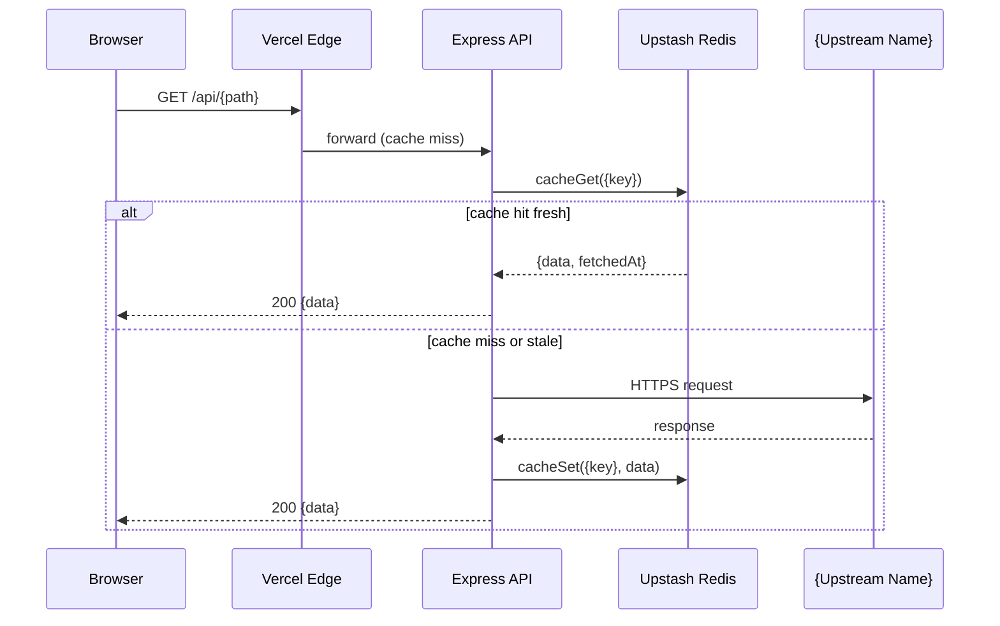

<objective>
Produce exhaustive Mermaid-based architecture documentation under `docs/architecture/`. Captures the system at four altitudes (system context, data flows, frontend components, deployment) plus a deep ontology subdirectory documenting types, algorithms, state machines, and runtime complexity. All diagrams render natively on GitHub via Mermaid — no binary assets, no build step. Follows the as-built principle: documents what exists today, including labeled tech debt.

Purpose: This is the reviewer's deep-dive entry point after the README hero. The user explicitly asked for "every single aspect of ontology" — abstractions, type relationships, algorithm decisions, runtime complexity. The four-file ontology split (recommended by research) prevents an unreadable wall while still being comprehensive.

Output: 10 Markdown files under `docs/architecture/`, all using Mermaid syntax, all renderable on github.com without a build step.
</objective>

<execution_context>
@/Users/zackmaz/.claude/get-shit-done/workflows/execute-plan.md
@/Users/zackmaz/.claude/get-shit-done/templates/summary.md
</execution_context>

<context>
@.planning/STATE.md
@.planning/PROJECT.md
@.planning/phases/26.4-documentation-external-presentation/26.4-CONTEXT.md
@.planning/phases/26.4-documentation-external-presentation/26.4-RESEARCH.md

# Plan 01 (cleanup) must be complete so the codebase is in a stable, lint-clean state for accurate documentation
@.planning/phases/26.4-documentation-external-presentation/26.4-01-SUMMARY.md

# Source material — read these to extract the ground truth of the system
@server/openapi.yaml
@server/index.ts
@server/config.ts
@server/cache/redis.ts
@src/types/
@src/stores/
@src/hooks/useFlightPolling.ts
@src/hooks/useEntityLayers.ts
@src/components/map/BaseMap.tsx
@src/lib/severity.ts
@src/lib/newsMatching.ts
@src/lib/timeGroup.ts
@server/adapters/gdelt.ts
@server/adapters/overpass.ts
@server/lib/dispersion.ts
@server/lib/basinLookup.ts
</context>

<tasks>

<task type="auto">
  <name>Task 1: Create architecture index and system-context diagram</name>
  <files>docs/architecture/README.md, docs/architecture/system-context.md</files>
  <action>
1. Create `docs/architecture/` directory: `mkdir -p docs/architecture/ontology`

2. Write `docs/architecture/README.md` as the index. Structure:
   - H1: "Architecture Documentation"
   - One-paragraph overview pointing to the README quick-start
   - **System-level diagrams** section with linked bullets:
     - `system-context.md` — high-level topology
     - `data-flows.md` — per-source request/response sequences
     - `frontend.md` — component, store, and hook structure
     - `deployment.md` — Vercel functions, cron jobs, CDN
   - **Ontology deep-dive** section linking the 4 ontology files
   - Note about as-built honesty: "These diagrams reflect what ships today, including labeled tech debt"
   - Footer linking back to project README

3. Write `docs/architecture/system-context.md`:
   - H1: "System Context"
   - One-paragraph overview
   - **Mermaid C4Context block** showing:
     - Person: User (browser)
     - System_Boundary "Iran Conflict Monitor"
       - Container: Vite/React frontend (browser, MapLibre + Deck.gl)
       - Container: Express API (Vercel serverless)
       - ContainerDb: Upstash Redis (REST cache)
     - System_Ext: 8 upstream data sources — OpenSky, ADS-B Exchange, adsb.lol, AISStream, GDELT v2, GDELT DOC, Overpass, Yahoo Finance, Open-Meteo, Nominatim
     - Rel: User → Frontend (HTTPS)
     - Rel: Frontend → Express API (HTTPS, /api/*)
     - Rel: Express API → Upstash (cache get/set)
     - Rel: Express API → 8 upstream sources (HTTPS polling)
   - **Notes** section explaining:
     - Vercel CDN edge layer between browser and serverless functions (s-maxage cache headers)
     - Upstash REST means no persistent connections (serverless-friendly)
     - In-memory fallback when Upstash is unreachable (`server/cache/redis.ts:cacheGetSafe`)
     - Per-endpoint rate limiters from Phase 26.3
   - Link to `data-flows.md` for the next altitude down

4. Verify both files exist and contain Mermaid blocks:
   - `test -f docs/architecture/README.md && grep -q "## " docs/architecture/README.md`
   - `test -f docs/architecture/system-context.md && grep -q '```mermaid' docs/architecture/system-context.md`
  </action>
  <verify>
    <automated>test -f docs/architecture/README.md &amp;&amp; test -f docs/architecture/system-context.md &amp;&amp; grep -q '```mermaid' docs/architecture/system-context.md &amp;&amp; grep -q 'C4Context\|flowchart\|graph' docs/architecture/system-context.md</automated>
  </verify>
  <done>
    Index file lists all 10 architecture documents.
    system-context.md has at least one Mermaid block using C4Context (or flowchart fallback if C4 syntax fails).
    Notes explain the tech debt and resilience patterns visible at this altitude.
  </done>
</task>

<task type="auto">
  <name>Task 2: Document data flows with one sequence diagram per source</name>
  <files>docs/architecture/data-flows.md</files>
  <action>
1. Read `server/adapters/` to identify all 8-9 active data sources. Use `ls server/adapters/*.ts` and inspect each file's exported function signature plus the route that calls it.

2. Write `docs/architecture/data-flows.md` with one section per source. Section template:

```markdown
## {Source Name}

**Adapter:** `server/adapters/{file}.ts`
**Route:** `server/routes/{route}.ts`
**Cache key:** `{key}` ({TTL} TTL)
**Polling cadence:** {N seconds/minutes from client hook}



**Notes:**
- {one-liner about quirks: e.g., "AISStream uses on-demand WebSocket connect for N ms"}
- {one-liner about resilience: e.g., "Falls back to in-memory if Upstash is unreachable"}
```

3. Repeat for all 8 sources:
   - Flights (3 variants but share normalize step — group as one "Flights" section with note about source switch)
   - Ships (AISStream WebSocket — note the on-demand connect pattern)
   - Events (GDELT v2 — note ZIP download and CSV parse)
   - News (GDELT DOC + RSS — note dedup/clustering step)
   - Sites (Overpass — note one-time fetch on mount, 24h cache)
   - Water (Overpass + Open-Meteo precip — note two-source merge)
   - Markets (Yahoo Finance)
   - Weather (Open-Meteo)
   - Geocode (Nominatim — note quantization to 2 decimal places, 30-day cache)

4. At the bottom, add a **Cross-cutting concerns** section briefly explaining:
   - Cache fallback (in-memory when Upstash fails)
   - Rate limiting (per-endpoint via `rateLimiters.{name}`)
   - Request tracing (X-Request-ID propagation from Phase 26.3)
   - Cache-Control headers (s-maxage per route from CDN integration)

5. Verify file size and Mermaid count:
   - `test $(wc -l < docs/architecture/data-flows.md) -ge 200`
   - `grep -c '```mermaid' docs/architecture/data-flows.md` should return at least 8
  </action>
  <verify>
    <automated>test -f docs/architecture/data-flows.md &amp;&amp; test $(wc -l &lt; docs/architecture/data-flows.md) -ge 200 &amp;&amp; test $(grep -c '```mermaid' docs/architecture/data-flows.md) -ge 8</automated>
  </verify>
  <done>
    data-flows.md exists and is at least 200 lines.
    Contains at least 8 Mermaid sequenceDiagram blocks, one per data source.
    Each section names its adapter file, route, cache key, and polling cadence.
    Cross-cutting concerns section documents cache fallback, rate limiting, request tracing, CDN headers.
  </done>
</task>

<task type="auto">
  <name>Task 3: Document frontend components, stores, and deployment</name>
  <files>docs/architecture/frontend.md, docs/architecture/deployment.md</files>
  <action>
1. Write `docs/architecture/frontend.md`:
   - H1: "Frontend Architecture"
   - **Component layout** section:
     - One Mermaid `flowchart TD` showing AppShell → BaseMap + Sidebar + LayerTogglesSlot + DetailPanelSlot + CountersSlot + MarketsSlot + StatusPanel + NotificationBell + SearchModal
     - One sentence per major component
   - **Map layer stacking** section:
     - Documented order from `useEntityLayers.ts`, `usePoliticalLayers.ts`, `useEthnicLayers.ts`, `useWaterLayers.ts`, `ThreatHeatmapOverlay.tsx`, etc.
     - Note the zoom-dependent crossover: clusters on top below zoom 9, behind events above zoom 9 (from `mapStore.isBelowZoom9`)
     - Mermaid `flowchart` showing the layer order top-to-bottom by z-index
   - **Zustand store dependency graph** section:
     - Mermaid `flowchart` showing: mapStore, uiStore, flightStore, shipStore, eventStore, siteStore, waterStore, newsStore, marketStore, notificationStore, searchStore, filterStore, layerStore, navigationStack
     - Arrows where one store reads/derives from another (e.g., notificationStore reads eventStore + newsStore; useNotifications derives from both)
   - **Polling hooks** section:
     - Table: hook name, store, cadence, file
     - useFlightPolling (5s/30s/260s by source), useShipPolling (30s), useEventPolling (15min), useNewsPolling (15min), useMarketPolling (60s), useWaterPrecipPolling (6h), useSiteFetch (one-time), useWaterFetch (one-time)
     - Note tab-visibility-aware pattern (recursive setTimeout, pauses on document.visibilitychange hidden)
   - **Cross-store interactions** section:
     - Note useSelectedEntity does cross-store entity lookup
     - Note attackStatus.ts cross-references siteStore with eventStore
     - Note useNotifications correlates eventStore with newsStore via newsMatching.ts

2. Write `docs/architecture/deployment.md`:
   - H1: "Deployment Architecture"
   - **Mermaid flowchart** showing:
     - User → Vercel Edge CDN
     - Edge → Static SPA (Vite build) for non-/api/* paths
     - Edge → Serverless function (server/vercel-entry.ts → createApp() → Express) for /api/*
     - Serverless function → Upstash Redis (REST)
     - Cron jobs (vercel.json crons) → /api/cron/warm + /api/cron/health
   - **Build pipeline** section:
     - npm run build = Vite (frontend) + tsup (server bundle) + tsc (typecheck)
     - Output: dist/ + dist-server/vercel.cjs
   - **Cache strategy** section:
     - Per-endpoint Cache-Control headers via cacheControl(s-maxage, swr) middleware
     - Table: route → s-maxage → swr (from server/index.ts)
   - **Cron jobs** section:
     - vercel.json schedule for warm (every N min) and health (every N min)
     - Purpose: keep cache warm, surface degraded state to monitoring
   - **Environment variables** section:
     - Reference .env.example, list which are required (UPSTASH_*) vs optional (provider keys)
     - Note that the Zod schema in server/config.ts crashes on missing required vars
   - **Failover** section:
     - In-memory fallback when Upstash REST returns errors (cacheGetSafe pattern)
     - Stale-while-revalidate via CDN s-maxage headers
     - /health endpoint reports degraded state for monitoring

3. Verify both files exist and have substantial Mermaid content:
   - `test $(wc -l < docs/architecture/frontend.md) -ge 80`
   - `test $(wc -l < docs/architecture/deployment.md) -ge 60`
   - Both contain at least 1 Mermaid block
  </action>
  <verify>
    <automated>test -f docs/architecture/frontend.md &amp;&amp; test -f docs/architecture/deployment.md &amp;&amp; test $(wc -l &lt; docs/architecture/frontend.md) -ge 80 &amp;&amp; test $(wc -l &lt; docs/architecture/deployment.md) -ge 60 &amp;&amp; grep -q '```mermaid' docs/architecture/frontend.md &amp;&amp; grep -q '```mermaid' docs/architecture/deployment.md</automated>
  </verify>
  <done>
    frontend.md has at least 80 lines, documents component layout, map layer stacking, store dependencies, polling hooks, cross-store interactions.
    deployment.md has at least 60 lines, documents Vercel topology, build pipeline, cache strategy, cron jobs, env vars, failover.
    Both use Mermaid for diagrams.
  </done>
</task>

<task type="auto">
  <name>Task 4: Write ontology deep dive (types, algorithms, state machines, complexity)</name>
  <files>docs/architecture/ontology/README.md, docs/architecture/ontology/types.md, docs/architecture/ontology/algorithms.md, docs/architecture/ontology/state-machines.md, docs/architecture/ontology/complexity.md</files>
  <action>
1. Write `docs/architecture/ontology/README.md` as a 1-paragraph index linking the 4 ontology files. Brief — this is a navigation aid only.

2. Write `docs/architecture/ontology/types.md`:
   - H1: "Type Ontology"
   - **MapEntity discriminated union** section:
     - Document the union members (flight, ship, plus 11 ConflictEventType values), shared fields (id, type, lat, lng, timestamp, label), nested type-specific data
     - Mermaid `classDiagram` showing the relationship
     - Source pointer: `src/types/`
   - **SiteEntity** section:
     - NOT in MapEntity union (separate type)
     - SiteType union: nuclear, naval, oil, airbase, port (desalination removed in Phase 26)
     - Source pointer
   - **WaterFacility** section:
     - Separate from MapEntity and SiteEntity
     - Source pointer + note about Phase 26 split
   - **ConflictEventType** section:
     - 11 CAMEO-based types with their CAMEO base codes
     - CONFLICT_TOGGLE_GROUPS (3 groups)
     - Source: `server/types.ts` and `src/lib/conflictEvents.ts`
   - **NewsCluster / NewsArticle** section:
     - Cluster contains articles, articles have sourceCountry, dedup via Jaccard similarity
   - **NotificationItem** section:
     - Derived from events + matched news, severity-scored
   - **ConnectionStatus** section:
     - 'connected' | 'stale' | 'error' | 'loading' (plus 'idle' for SiteConnectionStatus)
   - **CacheEntry<T>** section:
     - {data, fetchedAt} envelope, hard Redis TTL = 10x logical TTL
   - **AppError** section:
     - Phase 26.3 addition: {statusCode, code, message} with consistent envelope

3. Write `docs/architecture/ontology/algorithms.md`:
   - H1: "Algorithm Decisions"
   - One section per major algorithm. Each section: name, file, purpose, input/output, decisions made, why.
     1. **Threat density clustering** — `src/components/map/layers/ThreatHeatmapOverlay.tsx`. BFS cluster merging on 0.25° grid. RadialGradientExtension GLSL shader for radial alpha falloff. Why: deck.gl's stock heatmap doesn't support per-cluster radius scaling.
     2. **GDELT event dispersion** — `server/lib/dispersion.ts`. City-centroid events dispersed into concentric rings (6 at 3km, 12 at 6km, 18 at 9km), deterministic timestamp-sorted positioning. Why: prevents stacking artifacts at low-resolution geocoded events.
     3. **Severity scoring** — `src/lib/severity.ts`. typeWeight × log(mentions+1) × log(sources+1) × recencyDecay. Recency: exponential decay with halfLife=6h. Why: monotonic ordering by impact + freshness without overweighting old events.
     4. **News clustering** — `server/lib/newsClustering.ts`. Jaccard similarity threshold 0.8, 5-token min, 7-day sliding window. Why: dedupe near-duplicate headlines across sources without losing low-overlap signal.
     5. **News matching** — `src/lib/newsMatching.ts`. Correlate GDELT events with news clusters by ±6h temporal proximity + geographic/keyword overlap. Why: bind structured event records to qualitative reporting.
     6. **Basin lookup** — `server/lib/basinLookup.ts`. Nearest country-centroid match against 6377 WRI Aqueduct basins. Why: O(n) is fine at this catalog size; KD-tree would be overkill.
     7. **Composite water health** — `src/lib/waterStress.ts`. WRI baseline stress + Open-Meteo precipitation anomaly into health score. Why: combines static long-term stress with rolling short-term signal.
     8. **Time grouping** — `src/lib/timeGroup.ts`. Buckets: "Last hour", "Last 6 hours", "Last 24 hours". Why: human-readable UI grouping without per-pixel precision.
   - Reference algorithm files for source-of-truth implementation.

4. Write `docs/architecture/ontology/state-machines.md`:
   - H1: "State Machines"
   - **Connection lifecycle** section:
     - Mermaid `stateDiagram-v2` showing transitions: loading → connected → stale → error → connected
     - Apply to flightStore, shipStore, eventStore, newsStore, marketStore, waterStore
   - **Polling lifecycle** section:
     - Mermaid `stateDiagram-v2` showing: idle → polling → waiting → polling → paused (visibility hidden) → polling
     - Note tab-visibility behavior
   - **Detail panel navigation stack** section:
     - Phase 23.1 — pushView/popView, slideDirection animations
     - Mermaid stateDiagram showing: closed → open(entity A) → open(entity B with stack) → open(cluster from B) → back → A
   - **Cache freshness** section:
     - fresh → stale (after logical TTL) → expired (after hard TTL = 10x logical) → evicted
     - Note that "stale" still serves with stale=true flag

5. Write `docs/architecture/ontology/complexity.md`:
   - H1: "Runtime and Space Complexity"
   - **Hot paths** table:
     | Operation | Where | Time | Space | Notes |
     |-----------|-------|------|-------|-------|
     | Flight render | useEntityLayers.ts | O(n) per frame | O(n) | n ≤ 200 typical |
     | Threat clustering | ThreatHeatmapOverlay | O(n²) BFS on 0.25° grid | O(n) | n=events in window |
     | News clustering | newsClustering.ts | O(n²·t) Jaccard comparison | O(n·t) | t=tokens, n=articles |
     | Basin lookup | basinLookup.ts | O(b) per facility | O(1) | b=6377 basins |
     | Notification derivation | useNotifications | O(e + a) where e=events, a=articles | O(min(e,a)) | runs on store change |
     | Filter evaluation | useFilteredEntities | O(n·k) where k=active filters | O(n) | per render |
     | Search AST eval | useSearchResults | O(n·q) where q=query AST size | O(matches) | runs on debounced input |
   - **Pagination/load reasoning** section:
     - Why we don't paginate: typical entity counts are O(100s), not O(10ks); ceiling is well under what deck.gl can render at 60fps on modest hardware
     - Bottleneck is upstream API quotas, not local computation
   - **Frame budget** section:
     - Map redraw target: 60fps = 16.6ms budget
     - Heaviest layer: threat clustering with shader (GPU-bound, not CPU)
     - Re-render triggers: store updates via Zustand selectors with shallow equality

6. Verify all 5 files exist and meet minimum sizes:
   - `test $(wc -l < docs/architecture/ontology/types.md) -ge 100`
   - `test $(wc -l < docs/architecture/ontology/algorithms.md) -ge 100`
   - `test $(wc -l < docs/architecture/ontology/state-machines.md) -ge 80`
   - `test $(wc -l < docs/architecture/ontology/complexity.md) -ge 60`
  </action>
  <verify>
    <automated>test -f docs/architecture/ontology/types.md &amp;&amp; test -f docs/architecture/ontology/algorithms.md &amp;&amp; test -f docs/architecture/ontology/state-machines.md &amp;&amp; test -f docs/architecture/ontology/complexity.md &amp;&amp; test $(wc -l &lt; docs/architecture/ontology/types.md) -ge 100 &amp;&amp; test $(wc -l &lt; docs/architecture/ontology/algorithms.md) -ge 100 &amp;&amp; test $(wc -l &lt; docs/architecture/ontology/state-machines.md) -ge 80 &amp;&amp; test $(wc -l &lt; docs/architecture/ontology/complexity.md) -ge 60</automated>
  </verify>
  <done>
    All 4 ontology files exist with the documented minimum line counts.
    types.md catalogs every entity type and discriminated union with source pointers.
    algorithms.md documents 8 hot-path algorithms with rationale.
    state-machines.md uses Mermaid stateDiagram blocks for connection, polling, navigation, cache lifecycles.
    complexity.md has a complexity table for at least 7 hot-path operations.
  </done>
</task>

<task type="auto">
  <name>Task 5: Render-check on GitHub via push to a temporary branch</name>
  <files></files>
  <action>
1. Stage all docs/architecture/ files: `git add docs/architecture/`
2. Commit on the current feature branch: `git commit -m "docs(26.4-05): add Mermaid architecture documentation"`
3. Push to origin: `git push -u origin HEAD`
4. Open the GitHub URL of each file and verify Mermaid renders. Files to check:
   - docs/architecture/system-context.md
   - docs/architecture/data-flows.md
   - docs/architecture/frontend.md
   - docs/architecture/deployment.md
   - docs/architecture/ontology/state-machines.md
5. If any block fails to render (red error box on GitHub), inspect the syntax — common issues:
   - C4Context might not be supported in older Mermaid versions; fall back to flowchart
   - Subgraph names with special chars need quotes
   - sequenceDiagram participants with spaces need quotes
6. Fix syntax errors locally, force-push, re-verify.
7. Note: this task is partially manual (visiting URLs in a browser). The automated check confirms the push succeeded.
  </action>
  <verify>
    <automated>git log --oneline -1 | grep -q "26.4-05" &amp;&amp; git rev-parse @{u} &gt;/dev/null 2&gt;&amp;1</automated>
  </verify>
  <done>
    All architecture files committed and pushed to origin.
    Manual visual verification confirms Mermaid diagrams render natively on github.com (recorded in SUMMARY.md).
    Any syntax errors fixed in follow-up commits.
  </done>
</task>

</tasks>

<verification>
- docs/architecture/ contains: README.md, system-context.md, data-flows.md, frontend.md, deployment.md
- docs/architecture/ontology/ contains: README.md, types.md, algorithms.md, state-machines.md, complexity.md
- Every diagram file contains at least one ```mermaid``` fenced block
- data-flows.md has at least 8 sequenceDiagram blocks
- All files meet their min_lines targets
- Visual inspection on github.com confirms all Mermaid blocks render (no red error boxes)
- Files reference real source paths (no broken links to non-existent code)
</verification>

<success_criteria>
A reviewer reading the architecture docs can answer: "How does data flow through the system?", "What entity types exist and how do they relate?", "What algorithms do the heavy lifting?", "What are the runtime characteristics?", "Where is the tech debt?". All without leaving GitHub or building the project.
</success_criteria>

<output>
After completion, create .planning/phases/26.4-documentation-external-presentation/26.4-05-SUMMARY.md documenting:
- All 10 files created with line counts
- Total Mermaid block count across all files
- Confirmation that GitHub render check passed (or list of fixes applied)
- Any TODO(26.2) or other tech debt labels added inline to diagrams
- File tree of docs/architecture/
</output>
