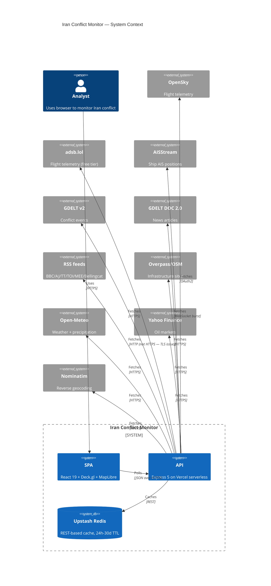

# Phase 26.4: Documentation & External Presentation - Research

**Researched:** 2026-04-07
**Domain:** DX tooling + portfolio documentation + engineering rigor gap closure
**Confidence:** HIGH (tooling), MEDIUM (subjective README structure), HIGH (Palantir gap tooling)

<user_constraints>
## User Constraints (from CONTEXT.md)

### Locked Decisions

**Final Code Cleanup Pass (do this FIRST)**
- Plan 01 of the phase is a grooming pass BEFORE documentation work begins
- Targets:
  - Run `eslint --fix` and `prettier --write` across the whole repo and review diff
  - Remove all `TODO`/`FIXME` comments that aren't the intentional `TODO(26.2)` GDELT-redo flags
  - Audit `console.log` / `console.error` — 26.3 removed production ones but sweep client code too
  - Review unused exports (ts-unused-exports or equivalent) and delete dead code
  - Audit `package.json` scripts for dead/outdated entries, devDependencies for unused packages
  - Check for `.DS_Store`, `.env.local`, other stragglers that shouldn't be tracked
  - Verify `.env.example` matches the actual env vars consumed by `server/config.ts`
  - Sanity check git history for weird merge artifacts in recent commits
- Rationale: don't polish external docs on top of a messy codebase — clean first, then document

**README Structure**
- Hero + table of contents + structured expandable sections (navigable, not a scroll wall)
- First ~30 lines: hero screenshot/GIF, one-line tagline, 2-3 sentence problem/motivation
- Objective content at top (what it is, how built, how to run, architecture, data sources, engineering metrics)
- Subjective content at bottom ("What I learned", "What I'd do differently", trade-offs — portfolio-signal section)
- Dedicated Engineering section near the top with badges/metrics:
  - Test count (1241 passing)
  - Type coverage % (from the new type-coverage gate)
  - TypeScript strict mode (noUncheckedIndexedAccess)
  - OpenAPI spec link
  - CI status badge
  - Coverage badge (from Codecov/Coveralls)
- Preserve existing content: architecture table, data sources table, env vars table

**Visual Proof**
- Hero asset: animated GIF (~5-10s, <3MB) showing Strait of Hormuz zoom with ALL layers on (geographic, weather, political, ethnic, water, threat density, entities)
- Body assets: 4-6 static PNG screenshots committed to `docs/screenshots/`
- Live demo: Vercel production URL in README as "Live Demo" link
  - BEFORE publishing: audit and harden rate limits (Redis command budget already at ~92% — scraper abuse would tip it over)
  - Consider IP-based throttling for the prod instance
  - Document the demo policy in README ("please don't hammer it")
- Screenshot maintenance: manual capture, not Playwright scripted

**Architecture Diagrams (Exhaustive Ontology)**
- Tool: Mermaid inline (live, diff-able, renders on GitHub, evolves with the code)
- Levels to produce:
  - System context diagram (browser → Vercel edge → Express API → Upstash + 8 upstream APIs) — README hero area
  - Data flow sequence diagrams, one per source (flights, ships, events, news, sites, water, markets, weather) — `docs/architecture/data-flows.md`
  - Frontend component diagram: map layer stacking, Zustand store dependencies, polling hook ownership — `docs/architecture/frontend.md`
  - Deployment diagram: Vercel functions, cron jobs, Redis, CDN, domain — `docs/architecture/deployment.md`
  - Full ontology documentation: abstractions, variable relationships, class/type relationships, algorithm decisions, runtime complexity notes — `docs/architecture/ontology.md` or split into sub-documents
- Scope: as-built, warts-and-all — label tech debt items directly on diagrams

**CI/CD (GitHub Actions)**
- Workflow 1: `.github/workflows/ci.yml` — on every PR
  - `npx tsc -b` (strict mode across server + app)
  - `npx vitest run` (full 1241-test suite)
  - `npm audit --audit-level=high`
  - GitHub CodeQL analysis
  - Coverage upload to Codecov (or Coveralls) → README badge
- Workflow 2: Vercel preview deploy on PR — via Vercel↔GitHub integration, not custom YAML
- Type coverage gate: CI fails if below 99%

**Pre-commit Hooks (husky + lint-staged)**
- Scope: fast only — ESLint + Prettier on staged files
- Target runtime: <2s per commit
- Skip tsc and test runs in pre-commit (CI catches those on push)
- Exception: gitleaks pre-commit hook scans staged files for leaked secrets

**Palantir-Grade Gaps (four)**
1. Log redaction (pino `redact` for authorization, x-api-key, Upstash tokens, client IPs in prod; test verifies end-to-end)
2. Type coverage measurement + CI threshold at 99% (surface in README Engineering)
3. Chaos test: graceful degradation when Redis dies (mock throws, verify fallback, /health degraded, no 500s)
4. Response schema validation (Zod parse at output, fail loud in dev, log warn in prod)

### Claude's Discretion
- ADR format and which decisions to document (recommend Michael Nygard short format with 5-8 high-impact decisions from Phase 22-26 — threat clusters, political boundaries, water stress approach, NLP scrap, etc.)
- OpenAPI spec presentation (Swagger UI at /api/docs vs static Redocly HTML vs raw YAML link)
- Graceful degradation docs format (README section vs dedicated `docs/degradation.md`)
- Runbook format and location (MD vs structured YAML — recommend MD for readability)
- Exact badge providers (Codecov vs Coveralls, shields.io vs native)
- Wave ordering and parallelization within the phase
- Whether to add dependabot / commitlint / PR template despite user not selecting them (lean toward not adding — user consciously rejected)

### Deferred Ideas (OUT OF SCOPE)
- Dependabot — user consciously skipped
- Commitlint — user consciously skipped; conventional commits stay manually enforced
- PR template — user consciously skipped
- Mutation testing (Stryker) — defer to dedicated "test rigor" mini-phase
- Dependency SBOM / signed releases — overkill for personal OSINT tool
- Swagger UI embedded at /api/docs — nice-to-have, planner's call
- Phase 26.2 GDELT redo — TODO(26.2) flags stay in place
- Phase 27 Performance & Load Testing — separate roadmap phase
</user_constraints>

<phase_requirements>
## Phase Requirements

Phase 26.4 has no pre-assigned requirement IDs. Suggested `PRES-*` allocation for the planner (can be adjusted):

| ID | Description | Research Support |
|----|-------------|-----------------|
| **Cleanup pass (Plan 01)** | | |
| PRES-01 | Zero ESLint errors and Prettier-formatted across `src/`, `server/`, `scripts/` | Current `eslint.config.js` is minimal (TS-ESLint recommended + react-hooks); Prettier not yet installed — need to add and configure |
| PRES-02 | Zero `TODO`/`FIXME` comments except explicit `TODO(26.2)` GDELT-redo flags and `TODO(coverage)` ratchet note | Grep found 3 `TODO`/`FIXME` in `src/hooks/useWaterFetch.ts`, `useSiteFetch.ts`, `useWaterPrecipPolling.ts` (client-side `console.warn`), 3 in `server/lib/eventScoring.ts`, `server/lib/geoValidation.ts` |
| PRES-03 | Zero `console.log`/`console.warn`/`console.error` in client polling/fetch hooks; use an equivalent frontend logger shim or just propagate errors | Found 3 client-side `console.warn` calls (useWaterFetch, useSiteFetch, useWaterPrecipPolling) |
| PRES-04 | Knip run on client+server reports zero unused files, zero unused dependencies, zero unused exports (or each is explicitly whitelisted in `knip.json` with rationale) | Knip is the 2026 standard (see Standard Stack below) |
| PRES-05 | `package.json` `scripts` block contains only scripts still used by CI or docs; removed-feature scripts (e.g., NLP-related) are purged | `package.json` already lean (7 scripts) — verify each still runs and is referenced |
| PRES-06 | `.env.example` lists every env var consumed by `server/config.ts` with a one-line description and example value shape; no stale or missing entries | `.env.example` currently lists ACLED (deprecated) and omits LOG_LEVEL, NODE_ENV, EVENT_* tuning knobs |
| PRES-07 | Tracked files scan detects no `.DS_Store`, `.env.local`, `coverage/`, `dist/`, `test-results/`, `.playwright-mcp/` | `.gitignore` looks correct; need to verify actual tracked file list |
| **CI/CD (Plan 02)** | | |
| PRES-10 | `.github/workflows/ci.yml` runs on PR: checkout → setup-node v4 → npm ci → `npm run lint` → `npm run typecheck` → `npx vitest run --coverage` → `npm audit --audit-level=high` → upload coverage to Codecov | All commands already exist in current `package.json`; only wiring needed |
| PRES-11 | `.github/workflows/codeql.yml` runs CodeQL `javascript-typescript` analysis weekly and on PR | Free for public repos; GitHub-provided starter workflow |
| PRES-12 | README shows CI status, coverage %, test count, and type coverage % badges that update automatically | Codecov action v5 and shields.io static badges |
| PRES-13 | Husky `prepare` script installs pre-commit hook on `npm install`; pre-commit runs `lint-staged` (ESLint+Prettier on staged files only); runtime <2s | Established husky v9+ pattern |
| PRES-14 | Gitleaks runs as second pre-commit hook scanning staged files with `gitleaks protect --staged --redact` and fails commit on match | Two options: native `gitleaks protect` or `.pre-commit-config.yaml` framework — native is lighter |
| **Palantir gaps (Plan 03)** | | |
| PRES-20 | `server/lib/logger.ts` has pino `redact` config covering: `req.headers.authorization`, `req.headers.cookie`, `req.headers["x-api-key"]`, `*.UPSTASH_REDIS_REST_TOKEN`, `*.OPENSKY_CLIENT_SECRET`, `*.AISSTREAM_API_KEY`, `*.ADSB_EXCHANGE_API_KEY`, `req.remoteAddress` (production only) | Pino native `redact.paths` array; path syntax supports `*` wildcards |
| PRES-21 | New test `server/__tests__/lib/logger-redaction.test.ts` logs objects containing each redacted path and asserts the output (captured via a write stream transport) contains `[REDACTED]` or is missing the key | Uses pino test pattern: construct logger with dest write stream, log, parse JSON lines, assert |
| PRES-22 | `type-coverage` devDep installed with `package.json` `"typeCoverage": { "atLeast": 99, "strict": true, "project": "tsconfig.server.json", "detail": true, "ignore-catch": true }`; `typecheck` runs it alongside `tsc -b`; CI fails below threshold | type-coverage 2.29+ supports both strict and atLeast; `strict: true` counts `any` in generics correctly |
| PRES-23 | README Engineering section surfaces the type coverage % as a dynamically-generated shields.io badge or a hand-bumped number | Use shields.io endpoint badge with a manual marker file or pre-computed in CI |
| PRES-24 | `server/__tests__/resilience/redis-death.test.ts` mocks `@upstash/redis` to throw on every call, calls each cached route handler via supertest, asserts 200 (stale/degraded) rather than 500, asserts `degraded: true` on response, asserts `/health` reports `status: "degraded"` | Existing `cacheGetSafe` already handles this — test just proves the claim |
| PRES-25 | Each route with a documented OpenAPI response shape has a Zod response schema (colocated with query schema); new `validateResponse<T>(schema)` helper calls `schema.safeParse(payload)` before `res.json(payload)`; mismatch → dev throws AppError(500, RESPONSE_SCHEMA_MISMATCH), prod logs warn + sends anyway | New shared `server/schemas/responses.ts` OR per-route colocated; planner's call — see recommendation below |
| **README + visuals + demo (Plan 04)** | | |
| PRES-30 | `README.md` rewritten per structure decision (hero → tagline → visual → engineering → TOC → setup → architecture → data sources → env vars → testing → what-I-learned → license) | Full template below |
| PRES-31 | `docs/hero.gif` (≤3MB) shows Hormuz zoom with layers on; committed as Git LFS or raw (raw acceptable at <5MB); README embeds via `` | ffmpeg → gifski pipeline |
| PRES-32 | `docs/screenshots/` contains 4-6 PNG screenshots (political, ethnic, water stress, threat density, detail panel, search modal) referenced inline in relevant README sections | Manual macOS `Cmd+Shift+4` area capture |
| PRES-33 | Live demo URL appears prominently near the hero section with an inline "Please don't hammer — Redis budget at 92%" callout; prod rate limit for unauthenticated `/api/*` capped to tighter per-IP values than dev | Upstash Ratelimit already per-endpoint; need a lower "public demo" tier |
| **Architecture diagrams (Plan 05)** | | |
| PRES-40 | `docs/architecture/system-context.md` contains a C4-style context diagram showing browser, Vercel edge, API functions, Upstash Redis, 8 upstream data APIs | Mermaid `C4Context` renders on GitHub natively |
| PRES-41 | `docs/architecture/data-flows.md` contains 8 Mermaid `sequenceDiagram`s, one per data source (flights, ships, events, news, sites, water, markets, weather), each showing client → API → cache → upstream → cache → client | All source data already documented in CLAUDE.md |
| PRES-42 | `docs/architecture/frontend.md` contains Mermaid `flowchart` / `classDiagram` showing store dependencies (Zustand), polling hook ownership (AppShell), and map layer stacking order | Layer stack order documented in CLAUDE.md Phase 20+ |
| PRES-43 | `docs/architecture/deployment.md` contains Mermaid deployment diagram: Vercel functions, cron jobs (warm, cron-health, water refresh), Upstash Redis, CDN, custom domain | Already have `api/vercel-entry.ts` + `vercel.json` |
| PRES-44 | `docs/architecture/ontology.md` documents the MapEntity discriminated union, ThreatCluster type, PanelView navigation stack, scoring algorithms (severity, threat weight, water composite health), runtime complexity annotations (BFS cluster merging O(N), Jaccard clustering O(N²) capped, Douglas-Peucker simplification) | Pulled from CLAUDE.md domain-specific sections |
| PRES-45 | All diagrams label known tech debt in-place (`TODO(26.2): hardcoded CAMEO table` annotated on the events sequence diagram, etc.) | Honesty-as-portfolio-signal requirement |
| **ADRs + runbook + degradation (Plan 06)** | | |
| PRES-50 | `docs/adr/` contains 5-8 ADRs in Michael Nygard short format (Title / Status / Context / Decision / Consequences); each ≤150 lines | Candidate list below |
| PRES-51 | `docs/runbook.md` enumerates 7+ failure modes with Symptom/Detection/Cause/Remediation sections | Template below |
| PRES-52 | `docs/degradation.md` (or README section) lists every graceful degradation claim and cites the code path that proves it (Redis fallback, Overpass mirror fallback, rate-limited serve-stale, GDELT backfill cooldown, etc.) | Inventory below |
</phase_requirements>

## Summary

Phase 26.4 is the external-facing twin of Phase 26.3: the internals are now portfolio-clean, and this phase ships the artifacts a reviewer actually sees (README, diagrams, live demo, CI badges, ADRs, runbook) plus closes four specific engineering gaps 26.3 did not address (pino log redaction, type-coverage CI gate, Redis-death chaos test, Zod response schema validation).

The tooling story is mostly settled — 2025–2026 best practices for each piece (husky v9, lint-staged, gitleaks native binary, type-coverage 2.29+, knip, GitHub Actions setup-node@v4, codecov-action@v5, pino `redact`) are mature and well-documented. The harder part is the **exhaustive ontology documentation** the user asked for — this is not a solved problem and needs careful scoping to avoid becoming an unreadable wall.

**Primary recommendation:** Execute in 6 plans across 4 waves. Plan 01 (code cleanup) is a mandatory prerequisite and **must ship first in its own wave** — it modifies files the other plans will touch. Plans 02 (CI/CD) and 03 (Palantir gap closure) can run in parallel in Wave 2 because they touch disjoint files. Plans 04 (README+visuals) and 05 (diagrams) can run in parallel in Wave 3 because they write to disjoint paths. Plan 06 (ADRs+runbook+degradation docs) ships last in Wave 4 because ADRs reference decisions the other plans locked in. See the Recommended Wave Structure section below for the full mapping.

## Standard Stack

### Core Tooling (install in Plan 01 / Plan 02)

| Library | Version | Purpose | Why Standard |
|---------|---------|---------|--------------|
| `prettier` | ^3.3 | Code formatter | Industry standard; no flat-config migration needed for v3 |
| `eslint-config-prettier` | ^9 | Disables ESLint rules that conflict with Prettier | Required when using ESLint + Prettier together |
| `knip` | ^5 | Unused files / exports / dependencies | 2026 standard, ~100 plugins, handles Vite/Vitest/TS out-of-box |
| `husky` | ^9 | Git hooks installer | De-facto standard, `prepare` script pattern stable since v9 |
| `lint-staged` | ^15 | Run linters on staged files only | Canonical pair with husky; sub-2s runtime achievable |
| `gitleaks` | binary (brew/scoop/go install) | Secret scanner | Not an npm package — binary tool; pre-commit hook shells out |
| `type-coverage` | ^2.29 | Measures % of identifiers not typed as `any` | CLI + package.json config; `strict: true` catches generic `any` leaks |

### CI Actions (Plan 02)

| Action | Version | Purpose |
|--------|---------|---------|
| `actions/checkout` | @v4 | Checkout source |
| `actions/setup-node` | @v4 | Node 22.x + npm cache |
| `codecov/codecov-action` | @v5 | Upload LCOV to Codecov |
| `github/codeql-action/init` + `analyze` | @v3 | CodeQL JS/TS analysis (free for public repos) |
| `gitleaks/gitleaks-action` | @v2 | Optional: CI-side secret scan (redundant with pre-commit but catches merge commits) |

### GIF Production (Plan 04)

| Tool | Purpose | Install |
|------|---------|---------|
| `ffmpeg` | Screen capture encode + frame extraction | `brew install ffmpeg` |
| `gifski` | High-quality palette-aware GIF encoder | `brew install gifski` |
| macOS `QuickTime Player` → `.mov` | Screen record UI interaction | built-in |

**Alternative:** Kap ([getkap.co](https://getkap.co)) — single-step screen record → GIF export with gifski under the hood. Recommended over ffmpeg pipeline for one-off hero asset production because of lower cognitive overhead.

### Diagramming (Plan 05)

| Tool | Rendering Venue | Notes |
|------|-----------------|-------|
| **Mermaid** (inline in `.md`) | Renders natively on GitHub since 2022; no build step | `sequenceDiagram`, `flowchart`, `classDiagram`, `erDiagram`, `C4Context` all render on GitHub |
| **Mermaid Live Editor** (mermaid.live) | For authoring/previewing before commit | No install |

### Alternatives Considered

| Instead of | Could Use | Tradeoff |
|------------|-----------|----------|
| Knip | `ts-unused-exports` + `depcheck` | Two tools instead of one, no framework-awareness |
| Husky | `simple-git-hooks` | Simpler, but husky's `prepare` auto-install is more reliable |
| Gitleaks native binary | `pre-commit` framework + `.pre-commit-config.yaml` | Framework adds a Python toolchain dependency — overkill for a single hook |
| Codecov | Coveralls | Both free for public repos; Codecov's action is simpler and the badge renders cleaner |
| Mermaid | PlantUML, Structurizr, D2, draw.io | Mermaid is the only one GitHub renders inline; others require committing images |
| gifski pipeline | Peek (Linux), LICEcap (old), ScreenToGif (Windows) | Platform mismatch — user is on darwin so Kap/QuickTime+gifski is the right pair |
| ADR format | MADR 3.0, Y-Statements, arc42 | Nygard short format is the canonical "simple" ADR; keeps artifacts readable |

### Installation

```bash
# Plan 01: cleanup tooling
npm install -D prettier eslint-config-prettier knip

# Plan 02: CI/CD tooling
npm install -D husky lint-staged
npx husky init   # creates .husky/pre-commit

# Plan 03: Palantir gap tooling
npm install -D type-coverage supertest @types/supertest

# Gitleaks (binary, not npm)
brew install gitleaks

# GIF tooling (macOS host)
brew install ffmpeg gifski
brew install --cask kap  # optional one-step alternative
```

## Architecture Patterns

### Recommended Directory Structure (new additions)

```
.github/
├── workflows/
│   ├── ci.yml                    # PR: lint + typecheck + test + coverage + audit
│   └── codeql.yml                # PR + weekly: CodeQL JS/TS analysis
└── (no PR template, no dependabot — user rejected)

.husky/
└── pre-commit                    # lint-staged + gitleaks protect --staged

docs/                             # (new directory at repo root)
├── hero.gif                      # 3MB hero asset
├── screenshots/                  # 4-6 PNG screenshots
│   ├── political-layer.png
│   ├── ethnic-layer.png
│   ├── water-stress.png
│   ├── threat-density.png
│   ├── detail-panel.png
│   └── search-modal.png
├── architecture/
│   ├── system-context.md         # C4 context diagram (Mermaid)
│   ├── data-flows.md             # 8 sequence diagrams
│   ├── frontend.md               # Store + layer stack diagrams
│   ├── deployment.md             # Vercel function topology
│   └── ontology.md               # Full type/algorithm reference
├── adr/
│   ├── 0001-threat-clusters-radial-gradient.md
│   ├── 0002-ethnic-distribution-geoepr.md
│   ├── 0003-water-stress-point-based.md
│   ├── 0004-political-boundaries-deckgl-geojsonlayer.md
│   ├── 0005-nlp-approach-scrapped.md
│   ├── 0006-upstash-over-self-hosted-redis.md
│   ├── 0007-hand-written-openapi-spec.md
│   └── 0008-pino-zod-strict-ts.md
├── runbook.md                    # Failure mode playbook
└── degradation.md                # Graceful degradation claims + proofs

server/schemas/                   # (new directory)
└── responses.ts                  # Shared Zod response schemas for all routes
# OR: colocate per-route (planner's call; see Pattern 3 below)

server/__tests__/
├── lib/
│   └── logger-redaction.test.ts  # PRES-21
└── resilience/
    └── redis-death.test.ts       # PRES-24 chaos test
```

### Pattern 1: Husky + lint-staged + gitleaks (fast pre-commit)

**What:** Run ESLint+Prettier on only staged files (husky triggers lint-staged), then run gitleaks on staged files. Total target <2s.

**When to use:** Every commit.

**Example `.husky/pre-commit`:**
```bash
#!/usr/bin/env bash
# husky v9 — no sourcing required
set -e

# Stage 1: format + lint on staged files (<1s typical)
npx lint-staged

# Stage 2: secret scan on staged files only
# Uses binary from PATH; fails commit on any match
if command -v gitleaks >/dev/null 2>&1; then
  gitleaks protect --staged --redact --verbose
else
  echo "⚠️  gitleaks not installed; skipping secret scan"
  echo "    install: brew install gitleaks"
fi
```

**`package.json` additions:**
```json
{
  "scripts": {
    "prepare": "husky",
    "lint:fix": "eslint . --fix",
    "format": "prettier --write .",
    "format:check": "prettier --check .",
    "knip": "knip",
    "type-coverage": "type-coverage",
    "typecheck": "tsc -b && type-coverage"
  },
  "lint-staged": {
    "*.{ts,tsx}": ["eslint --fix", "prettier --write"],
    "*.{json,md,css,yml,yaml}": ["prettier --write"]
  },
  "typeCoverage": {
    "atLeast": 99,
    "strict": true,
    "project": "tsconfig.server.json",
    "detail": true,
    "ignore-catch": true
  }
}
```

**Critical:** `prepare` script runs on `npm install` — this is how husky auto-installs hooks on clone. Never document "run `husky init`" in the README; `npm install` should just work.

**Note on lint-staged + TypeScript gotcha:** do NOT run `tsc` in lint-staged. The user explicitly decided pre-commit is fast-only. CI catches type errors. Running `tsc -b` pre-commit adds 10-30s and will get disabled with `--no-verify` within a week.

### Pattern 2: Pino Redaction (server/lib/logger.ts)

**What:** Add `redact` config to the existing pino logger to scrub sensitive paths before they hit the transport.

**When to use:** Always. One-line config change with no downstream impact.

**Example (extends current `server/lib/logger.ts`):**
```typescript
import pino from 'pino';

const isTest = process.env.NODE_ENV === 'test';
const isProd = process.env.NODE_ENV === 'production';

/**
 * Pino redaction paths.
 *
 * - `req.headers.authorization` — bearer tokens, basic auth
 * - `req.headers.cookie` — session cookies
 * - `req.headers["x-api-key"]` — upstream-provided API keys routed through us
 * - `*.UPSTASH_REDIS_REST_TOKEN` — env leak via error.cause spread
 * - `*.OPENSKY_CLIENT_SECRET` — OAuth secret
 * - `*.AISSTREAM_API_KEY` — WebSocket auth key
 * - `*.ADSB_EXCHANGE_API_KEY` — RapidAPI key
 * - `req.remoteAddress` / `req.ip` — client IP (PII under GDPR for EU visitors; redact in prod only)
 *
 * Paths syntax: see https://github.com/pinojs/pino/blob/main/docs/redaction.md
 */
const redactPaths = [
  'req.headers.authorization',
  'req.headers.cookie',
  'req.headers["x-api-key"]',
  '*.UPSTASH_REDIS_REST_TOKEN',
  '*.OPENSKY_CLIENT_SECRET',
  '*.AISSTREAM_API_KEY',
  '*.ADSB_EXCHANGE_API_KEY',
  ...(isProd ? ['req.remoteAddress', 'req.ip'] : []),
];

export const logger = pino({
  level: isTest ? 'silent' : (process.env.LOG_LEVEL ?? 'info'),
  redact: {
    paths: redactPaths,
    censor: '[REDACTED]',
    // remove: false — keep the key visible so missing-data bugs are obvious
  },
  ...(!isProd && !isTest
    ? {
        transport: {
          target: 'pino-pretty',
          options: { colorize: true, translateTime: 'SYS:standard' },
        },
      }
    : {}),
});
```

**Verification test pattern** (PRES-21, `server/__tests__/lib/logger-redaction.test.ts`):
```typescript
import { describe, it, expect } from 'vitest';
import pino from 'pino';
import { Writable } from 'node:stream';

describe('logger redaction', () => {
  it('redacts known sensitive paths', async () => {
    const lines: string[] = [];
    const sink = new Writable({
      write(chunk, _enc, cb) { lines.push(chunk.toString()); cb(); }
    });

    // Construct a logger with the same redact config (import from logger.ts)
    const testLogger = pino({
      redact: {
        paths: ['req.headers.authorization', '*.UPSTASH_REDIS_REST_TOKEN'],
        censor: '[REDACTED]',
      },
    }, sink);

    testLogger.info({
      req: { headers: { authorization: 'Bearer secret-token-123' } },
      env: { UPSTASH_REDIS_REST_TOKEN: 'upstash-secret-xyz' },
    }, 'test');

    const parsed = JSON.parse(lines[0]);
    expect(parsed.req.headers.authorization).toBe('[REDACTED]');
    expect(parsed.env.UPSTASH_REDIS_REST_TOKEN).toBe('[REDACTED]');
    expect(JSON.stringify(parsed)).not.toContain('secret-token-123');
    expect(JSON.stringify(parsed)).not.toContain('upstash-secret-xyz');
  });
});
```

**Source:** [pino redaction docs](https://github.com/pinojs/pino/blob/main/docs/redaction.md) — HIGH confidence.

### Pattern 3: Zod Response Schema Validation

**What:** Before `res.json(payload)`, parse `payload` through a Zod schema that mirrors the OpenAPI response shape. In dev, throw on mismatch (fail loud). In prod, log warn and send anyway (fail open — avoid cascade).

**Two placement options:**

**Option A: Colocate with query schemas (RECOMMENDED)**
- Each route file (e.g., `server/routes/flights.ts`) adds a `flightsResponseSchema` alongside `flightsQuerySchema`
- Pros: locality; easy to find; matches existing Phase 26.3 pattern
- Cons: some schemas are reused (CacheResponse<T> wrapper) — needs a shared base

**Option B: Centralized in `server/schemas/responses.ts`**
- All response schemas in one file
- Pros: DRY for the CacheResponse wrapper; single import
- Cons: schemas far from routes that use them

**Recommendation:** Option A with a shared `cacheResponseSchema<T>()` helper imported from `server/schemas/cacheResponse.ts`. This matches existing query schema locality.

**Example helper (new `server/middleware/validateResponse.ts`):**
```typescript
import type { Response } from 'express';
import type { ZodTypeAny, z } from 'zod';
import { logger } from '../lib/logger.js';
import { AppError } from './errorHandler.js';

/**
 * Parse `payload` through `schema` before sending as JSON.
 *
 * - Dev (NODE_ENV !== 'production'): throws AppError on mismatch
 *   so tests and local dev surface the drift immediately.
 * - Prod: logs a `warn` with the Zod issue list and sends the payload
 *   anyway. Schema drift should not take down the service; it should
 *   be fixed in the next commit.
 *
 * Usage:
 *   sendValidated(res, flightsResponseSchema, result);
 *   // instead of: res.json(result);
 */
export function sendValidated<S extends ZodTypeAny>(
  res: Response,
  schema: S,
  payload: unknown,
): void {
  const parsed = schema.safeParse(payload);
  if (!parsed.success) {
    const issues = parsed.error.issues;
    if (process.env.NODE_ENV !== 'production') {
      throw new AppError(500, 'RESPONSE_SCHEMA_MISMATCH',
        `Response does not match schema: ${JSON.stringify(issues)}`);
    }
    logger.warn({ issues, path: res.req.path }, 'response schema mismatch — sending anyway');
    res.json(payload);
    return;
  }
  res.json(parsed.data as z.infer<S>);
}
```

**Example usage in route:**
```typescript
// server/routes/flights.ts
import { sendValidated } from '../middleware/validateResponse.js';

const flightsResponseSchema = z.object({
  data: z.array(flightEntitySchema),
  stale: z.boolean(),
  lastFresh: z.number(),
  rateLimited: z.boolean().optional(),
  degraded: z.boolean().optional(),
});

// ... in handler:
sendValidated(res, flightsResponseSchema, { data: flights, stale: false, lastFresh: Date.now() });
```

**Source:** [Zod docs on outbound validation](https://zod.dev/) — MEDIUM confidence (pattern is well-known but specific Express helper is a custom write).

### Pattern 4: Redis-Death Chaos Test

**What:** Mock `@upstash/redis` to throw on every method. Call each cached route via supertest. Assert that the response is 200 with `degraded: true`, not 500.

**When to use:** One-time proof test; runs in CI on every PR.

**Example (`server/__tests__/resilience/redis-death.test.ts`):**
```typescript
import { describe, it, expect, beforeAll, vi } from 'vitest';
import request from 'supertest';

// Mock Redis BEFORE app import
vi.mock('../../cache/redis.js', async (importOriginal) => {
  const actual = await importOriginal<typeof import('../../cache/redis.js')>();
  const deadRedis = {
    get: vi.fn().mockRejectedValue(new Error('ECONNREFUSED')),
    set: vi.fn().mockRejectedValue(new Error('ECONNREFUSED')),
    del: vi.fn().mockRejectedValue(new Error('ECONNREFUSED')),
    ping: vi.fn().mockRejectedValue(new Error('ECONNREFUSED')),
  };
  return {
    ...actual,
    redis: deadRedis,
    cacheGet: vi.fn().mockRejectedValue(new Error('ECONNREFUSED')),
    cacheSet: vi.fn().mockRejectedValue(new Error('ECONNREFUSED')),
    // cacheGetSafe and cacheSetSafe are the ones the routes actually call —
    // they catch Redis errors and fall back to memCache. Let them through.
  };
});

import { createApp } from '../../app.js';

describe('chaos: Redis is dead', () => {
  const app = createApp();

  it('/health reports degraded status', async () => {
    const res = await request(app).get('/health');
    expect(res.status).toBe(200);
    expect(res.body.status).toBe('degraded');
    expect(res.body.redis).toBe(false);
  });

  it.each([
    ['/api/flights'],
    ['/api/ships'],
    ['/api/events'],
    ['/api/news'],
    ['/api/sites'],
    ['/api/water'],
    ['/api/markets'],
    ['/api/weather'],
  ])('%s returns 200 (not 500) with degraded: true', async (path) => {
    const res = await request(app).get(path);
    // Either: degraded-from-memCache 200, or empty-stale 200 with degraded:true,
    // or 503 UPSTREAM_ERROR (acceptable — still not a 500)
    expect([200, 503]).toContain(res.status);
    expect(res.status).not.toBe(500);
    if (res.status === 200 && res.body.degraded !== undefined) {
      expect(res.body.degraded).toBe(true);
    }
  });
});
```

**Critical insight:** the existing `cacheGetSafe` in `server/cache/redis.ts` ALREADY handles Redis failure (catches, falls back to in-memory Map, returns `degraded: true`). This test doesn't add resilience — it **proves** the existing resilience claim the README makes. The value is documentation-by-test.

### Pattern 5: Mermaid C4 Context Diagram (README-ready)

**What:** High-level system topology rendered inline in README.

**When to use:** README hero area, `docs/architecture/system-context.md`.



**Source:** [Mermaid C4Context docs](https://mermaid.js.org/syntax/c4.html). Renders natively on GitHub since 2022. HIGH confidence.

### Pattern 6: ADR Michael Nygard Short Format

**What:** 1-2 page decision log per architectural choice.

**Template:**
```markdown
# ADR NNNN: Title (noun phrase)

## Status

Accepted (or: Proposed, Deprecated, Superseded by ADR-XXXX)

## Context

The forces at play — technical, political, social, project-local.
State them honestly; they are in tension.

## Decision

What we decided, in active voice. No hedging.

## Consequences

Good, bad, and neutral outcomes. Tech debt we're taking on.
What becomes easier, what becomes harder, what is no longer possible.
```

**Candidate ADRs for this phase (5-8 pick recommended):**

1. **ADR-0001: Threat clusters use RadialGradientExtension with additive blending** — why custom GLSL shader over built-in deck.gl HeatmapLayer (control, look, performance)
2. **ADR-0002: Ethnic distribution data comes from GeoEPR 2021** — not hand-drawn, licensing, Yazidi limitation
3. **ADR-0003: Water stress rendered at facilities, not polygon fills** — point-based approach rationale
4. **ADR-0004: Political boundaries render via deck.gl GeoJsonLayer, not MapLibre fills** — terrain interaction reason
5. **ADR-0005: Phase 26.2 NLP approach was scrapped** — the honesty artifact; what the approach was, why it failed, what replaced it (nothing — tech debt flagged instead)
6. **ADR-0006: Upstash Redis over self-hosted / Railway / Redis Cloud** — serverless-native REST, command budget tradeoff
7. **ADR-0007: Hand-written OpenAPI spec over zod-to-openapi generation** — editorial descriptions, no codegen runtime dep
8. **ADR-0008: Phase 26.3 chose pino + Zod + strict TS together as a package** — coherent rigor story
9. **ADR-0009: Vercel serverless over traditional Node hosting** — zero-ops, cold start tradeoff, graceful config pattern

Pick 5-8 from this list. ADR-0005 (NLP scrap) is the highest portfolio signal — **do not skip it**.

**Source:** [Michael Nygard's original post](https://www.cognitect.com/blog/2011/11/15/documenting-architecture-decisions) + [joelparkerhenderson/architecture-decision-record](https://github.com/joelparkerhenderson/architecture-decision-record). HIGH confidence.

### Pattern 7: Runbook (Google SRE format, MD-native)

**What:** One failure mode per section. Each: **Symptom**, **Detection**, **Cause**, **Remediation**.

**Template:**
```markdown
# Runbook: Iran Conflict Monitor

## Upstash Redis Unreachable

### Symptom
- `/health` returns `status: "degraded", redis: false`
- `/api/*` endpoints serve `stale: true, degraded: true`
- Log line: `cacheGetSafe fallback to memCache` (once per endpoint)

### Detection
- `curl https://iran-conflict-monitor.vercel.app/health | jq .redis` → `false`
- Grep logs for `ECONNREFUSED` or `Upstash` errors
- Vercel function logs show repeated 500-prone cache ops

### Cause
1. Upstash region outage (check [status.upstash.com](https://status.upstash.com))
2. `UPSTASH_REDIS_REST_TOKEN` rotated or revoked — 401
3. Free-tier command budget exhausted (>500k/day)

### Remediation
1. **Regional outage**: wait; the in-memory fallback serves stale data for the cold function's lifetime
2. **Token**: rotate in Vercel env vars, redeploy (`vercel --prod`)
3. **Budget**: inspect `/health` `estimatedDailyCommands`; reduce polling intervals (flights → 10s, markets → 120s); temporarily disable backfill; consider upgrading Upstash tier
```

**Failure modes to document (user-specified list):**
1. Upstash Redis unreachable
2. GDELT `lastupdate.txt` returns 404 / stale
3. Overpass primary API timeout (falls back to `private.coffee` mirror)
4. AISStream WebSocket fails to connect
5. Yahoo Finance throttling (unofficial API)
6. Vercel function timeout (>10s for hobby, >60s for pro)
7. Redis command budget exhausted (currently ~92% per STATE.md)
8. adsb.lol rate-limits from shared IP
9. Open-Meteo batching hits hourly cap

**Source:** [Google SRE book Ch. 8 — Release Engineering and runbooks](https://sre.google/sre-book/release-engineering/). Adapted for MD readability. HIGH confidence.

### Anti-Patterns to Avoid

- **Lint-staged running `tsc`:** adds 10-30s to every commit, gets bypassed with `--no-verify` within a week. Keep pre-commit fast or it becomes dead weight.
- **Mermaid diagrams with absolute IDs:** breaks link rewriting on GitHub rendered view; use unquoted short IDs.
- **README as wall of text:** use `<details><summary>` collapsibles for long sections (env vars, troubleshooting, testing details) — keeps scan-ability high.
- **Gitleaks as pre-push instead of pre-commit:** too late — the secret is already in git history by the time pre-push runs.
- **Hero GIF >5MB:** GitHub soft-limits images; users on cellular will see broken hero.
- **ADRs as retrospective fiction:** write them in the tense the decision was made (past tense for "Accepted"), not as if you're pitching it now. Portfolio reviewers can smell this.
- **Response schema validation throwing in prod:** defeats the entire graceful-degradation story. Dev throws, prod warns.
- **Documentation that doesn't run:** anything that claims `npm run X` must actually work. The README's Quick Start section is the most-verified piece of a repo.

## Don't Hand-Roll

| Problem | Don't Build | Use Instead | Why |
|---------|-------------|-------------|-----|
| Dead export detection | grep + manual audit | `knip` | Handles barrel files, type-only imports, framework conventions |
| Secret scanning | regex over .env files | `gitleaks` | Knows 100+ secret shapes (AWS/GitHub/Stripe/etc.), has allowlist system |
| Type coverage metric | awk over `tsc` output | `type-coverage` | Checks generics, function params, identifiers — not just top-level |
| Pre-commit runner | custom bash in `.git/hooks` | `husky` + `lint-staged` | Stageable, composable, team-onboarding via `prepare` |
| Response validation | manual `if (typeof X !== "string")` | Zod `.safeParse()` | Already in the dep graph, matches query schema pattern |
| GIF encoding | ffmpeg `-vf palettegen,paletteuse` | `gifski` | Temporal dithering + per-frame palettes = 3-5x smaller files for same quality |
| ADR format | invent your own | Nygard short format | Five headings is enough; over-structuring kills readability |
| System diagrams | ASCII art | Mermaid C4Context | Renders on GitHub, evolves with text commits |
| Status badges | screenshot a dashboard | shields.io or codecov-action | Live, auto-updating, free |

**Key insight:** Plan 01's value is rigorous use of off-the-shelf tools. Every "I'll write a quick grep" is a trap that produces an artifact the reviewer has to trust your manual discipline on. Use the tool, show the tool in CI, let the tool be the trust anchor.

## Common Pitfalls

### Pitfall 1: `type-coverage` at 99% when `noUncheckedIndexedAccess` is enabled
**What goes wrong:** `noUncheckedIndexedAccess` adds `undefined` to every indexed access. After the 26.3 server-tsconfig upgrade, many helper functions now have `T | undefined` returns that propagate into `any` via downstream `?.` chains. Running `type-coverage --strict` for the first time may report 94-96%, not 99%.

**Why it happens:** `strict: true` in type-coverage counts generic type parameters that resolve to `any` at the call site. Defensive `?? fallback` patterns can introduce implicit `any` in certain TSX contexts.

**How to avoid:**
1. Run `npx type-coverage --detail --strict --project tsconfig.server.json` FIRST, before adding the CI gate
2. Record the actual baseline (likely 95-99%)
3. Set `atLeast` to the measured number minus 0.5 as the initial ratchet
4. Bump to 99% as a separate PR after fixing the specific `any` leaks

**Warning signs:** PR #1 of "add type-coverage CI gate" fails CI. The fix is to accept reality and ratchet upward.

### Pitfall 2: Husky `prepare` script runs on clone but not on first `npm install` in CI
**What goes wrong:** `prepare` runs after `npm install` locally, installing hooks. In CI (`npm ci` or `npm install --omit=dev`), `prepare` is a dev-only script and doesn't run, so hooks aren't installed — which is actually correct, but some CI images with `NODE_ENV=production` will also skip `prepare` locally.

**How to avoid:** use `npm install` (not `npm ci`) locally. In CI, skip husky entirely — hooks don't run in CI anyway. If CI uses `NODE_ENV=production`, add `is-ci` guard:
```json
"prepare": "is-ci || husky"
```
or simply:
```json
"prepare": "husky || true"
```
(silent failure — don't block installs in production contexts).

**Warning signs:** `.husky/_/` directory missing after `npm install` on a fresh clone.

### Pitfall 3: Mermaid diagrams that render locally but not on GitHub
**What goes wrong:** Using `click` actions, `%%{init: ... }%%` directives with JSON, or features added in Mermaid 11+ when GitHub's vendored renderer is older.

**How to avoid:**
1. Use only features documented in the [GitHub Mermaid docs](https://docs.github.com/en/get-started/writing-on-github/working-with-advanced-formatting/creating-diagrams)
2. Test by pushing to a feature branch and viewing the rendered `.md` on GitHub before claiming completion
3. Avoid `click` interactivity (not supported)
4. Stick to unquoted short IDs

**Warning signs:** Diagram renders on mermaid.live but GitHub shows raw text. Paste into a GitHub gist to isolate.

### Pitfall 4: Gitleaks false positives on historical fixture files
**What goes wrong:** The test fixtures for GDELT events may contain URLs or IDs that pattern-match a gitleaks rule (e.g., a hex string mistaken for an API key).

**How to avoid:** create `.gitleaks.toml` at repo root with allowlist rules:
```toml
[allowlist]
description = "Test fixtures and known non-secrets"
paths = [
  '''server/__tests__/fixtures/.*''',
  '''docs/screenshots/.*''',
  '''package-lock\.json''',
]
```

**Warning signs:** `gitleaks protect --staged` reports a leak on a file you know is safe.

### Pitfall 5: Hero GIF showing data that dates fast
**What goes wrong:** The GIF captures a specific GDELT event cluster or news story that looks exciting today but makes the README look stale in 6 months when that story is no longer visible.

**How to avoid:**
1. Use geographic/visual layers (political, ethnic, water stress) as the primary focus — these are static
2. Let entity layers (flights, events) be background density, not the focal point
3. If you must capture a specific event cluster, pick one from early 2026 that reads as "historical" in the caption

**Warning signs:** "Look at these airstrikes!" captions in a README that hasn't been updated in a year.

### Pitfall 6: Response schema validation breaking dev because of optional fields
**What goes wrong:** The Zod schema for a response omits an optional field (e.g., `rateLimited?`) and the route sends `{ ..., rateLimited: true }`. With `z.object().strict()`, this throws in dev.

**How to avoid:** Use `.passthrough()` OR document every optional field in the Zod schema explicitly. Prefer explicit — drift between OpenAPI and schema is what we want to catch.

**Warning signs:** Dev mode 500s on a route that works fine in prod.

### Pitfall 7: Live demo URL getting scraped into oblivion
**What goes wrong:** Publishing the Vercel URL in the README exposes it to GitHub crawlers and AI training scrapers. Within days, automated polling tips the Redis budget over.

**How to avoid:**
1. Add a tighter `rateLimiters.public` tier — e.g., 6 req/min per IP across all `/api/*` when UA matches known scraper patterns, and enforce it with an Upstash Ratelimit prefix `ratelimit:public`
2. Add `robots.txt` disallowing `/api/*` — won't stop bad bots but stops Google/Bing
3. Add a visible "Live Demo" callout: "Please be gentle — single-user Redis budget"
4. Consider cron-based warming so cold-start penalty doesn't slow legitimate users during scraping spikes

**Warning signs:** `/health` `estimatedDailyCommands` climbs past 20k/day within a week of publishing.

## Code Examples

### Full GitHub Actions `ci.yml` (Plan 02)

```yaml
# .github/workflows/ci.yml
name: CI

on:
  pull_request:
  push:
    branches: [main]

concurrency:
  group: ci-${{ github.ref }}
  cancel-in-progress: true

jobs:
  lint-and-typecheck:
    runs-on: ubuntu-latest
    timeout-minutes: 5
    steps:
      - uses: actions/checkout@v4
      - uses: actions/setup-node@v4
        with:
          node-version: '22'
          cache: 'npm'
      - run: npm ci
      - run: npm run lint
      - run: npm run format:check
      - run: npm run typecheck          # tsc -b && type-coverage
      - run: npm run knip || true        # non-blocking advisory

  test:
    runs-on: ubuntu-latest
    timeout-minutes: 10
    steps:
      - uses: actions/checkout@v4
      - uses: actions/setup-node@v4
        with:
          node-version: '22'
          cache: 'npm'
      - run: npm ci
      - run: npx vitest run --coverage
      - uses: codecov/codecov-action@v5
        with:
          files: ./coverage/lcov.info
          fail_ci_if_error: false

  audit:
    runs-on: ubuntu-latest
    timeout-minutes: 3
    steps:
      - uses: actions/checkout@v4
      - uses: actions/setup-node@v4
        with:
          node-version: '22'
          cache: 'npm'
      - run: npm audit --audit-level=high
```

**Source:** [GitHub Actions setup-node v4 docs](https://github.com/actions/setup-node), [codecov-action v5 README](https://github.com/codecov/codecov-action). HIGH confidence.

### Full GitHub Actions `codeql.yml` (Plan 02)

```yaml
# .github/workflows/codeql.yml
name: CodeQL

on:
  push:
    branches: [main]
  pull_request:
    branches: [main]
  schedule:
    - cron: '0 6 * * 1'   # Monday 06:00 UTC

jobs:
  analyze:
    runs-on: ubuntu-latest
    permissions:
      actions: read
      contents: read
      security-events: write
    strategy:
      fail-fast: false
      matrix:
        language: ['javascript-typescript']
    steps:
      - uses: actions/checkout@v4
      - uses: github/codeql-action/init@v3
        with:
          languages: ${{ matrix.language }}
      - uses: github/codeql-action/analyze@v3
        with:
          category: '/language:${{ matrix.language }}'
```

### Full Prettier config (`.prettierrc.json`, Plan 01)

```json
{
  "semi": true,
  "singleQuote": true,
  "trailingComma": "all",
  "printWidth": 100,
  "tabWidth": 2,
  "arrowParens": "always",
  "endOfLine": "lf"
}
```

**`.prettierignore`:**
```
dist
coverage
node_modules
api/*.mjs
api/*.js
.planning/phases/*/quick/**
docs/screenshots
```

### ESLint flat config update (Plan 01)

Add Prettier compatibility and knip-aware ignores to existing `eslint.config.js`:
```javascript
import js from '@eslint/js'
import globals from 'globals'
import reactHooks from 'eslint-plugin-react-hooks'
import reactRefresh from 'eslint-plugin-react-refresh'
import tseslint from 'typescript-eslint'
import prettier from 'eslint-config-prettier/flat'

export default tseslint.config(
  { ignores: ['dist', 'api/*.{mjs,js}', 'coverage', '.planning/**'] },
  js.configs.recommended,
  ...tseslint.configs.recommended,
  {
    files: ['**/*.{ts,tsx}'],
    languageOptions: { ecmaVersion: 2020, globals: globals.browser },
    plugins: {
      'react-hooks': reactHooks,
      'react-refresh': reactRefresh,
    },
    rules: {
      ...reactHooks.configs.recommended.rules,
      'react-refresh/only-export-components': ['warn', { allowConstantExport: true }],
    },
  },
  prettier,  // MUST be last — disables conflicting rules
)
```

### `knip.json` (Plan 01)

```json
{
  "$schema": "https://unpkg.com/knip@5/schema.json",
  "entry": [
    "src/main.tsx",
    "server/index.ts",
    "server/vercel-entry.ts",
    "scripts/**/*.ts",
    "vite.config.ts"
  ],
  "project": ["src/**/*.{ts,tsx}", "server/**/*.ts", "scripts/**/*.ts"],
  "ignore": [
    "src/test/**",
    "server/__tests__/**",
    "**/*.test.{ts,tsx}",
    "src/data/**"
  ],
  "ignoreBinaries": ["vercel"],
  "ignoreExportsUsedInFile": true,
  "vitest": true,
  "vite": true
}
```

**Source:** [knip configuration docs](https://knip.dev/reference/configuration). HIGH confidence.

### Hero GIF production recipe (Plan 04)

```bash
# Step 1: screen record with QuickTime (File → New Screen Recording)
# Capture area: your browser window running `npm run dev`
# Duration: 8-12s
# Save as: ~/Desktop/hormuz-zoom.mov

# Step 2: convert to frames, then to GIF via gifski
ffmpeg -i ~/Desktop/hormuz-zoom.mov \
       -vf "fps=15,scale=1280:-1:flags=lanczos" \
       -f yuv4mpegpipe - \
  | gifski -o docs/hero.gif \
           --fps 15 \
           --width 1280 \
           --quality 80 \
           -

# Step 3: verify size
ls -lh docs/hero.gif   # target: <3MB

# If >3MB, reduce:
#   --fps 10 (instead of 15)
#   --width 960 (instead of 1280)
#   --quality 70 (instead of 80)
#   --quiet and --lossy for further reduction
```

**Alternative one-command via Kap:**
1. `open -a Kap`
2. Select region → Record → Export as GIF (Kap uses gifski under the hood)
3. Settings: FPS 15, quality 80, resize to 1280 wide

**Source:** [gifski README](https://github.com/ImageOptim/gifski), [ffmpeg gifski pipeline gist](https://gist.github.com/) — HIGH confidence.

## State of the Art

| Old Approach | Current Approach | When Changed | Impact |
|--------------|------------------|--------------|--------|
| `husky install` in postinstall | `husky` (v9 no-args) in `prepare` | husky v9 (2024) | One less config line, no git-absent crash |
| `eslint-config-prettier` (legacy) | `eslint-config-prettier/flat` | ESLint v9 flat config (2024) | Flat config compatibility |
| Coveralls | Codecov v5 action | 2024-2025 | Simpler setup, better PR comments |
| `pre-commit` framework | Native `husky` + `lint-staged` for Node projects | Ongoing | No Python dep for JS projects |
| `ts-unused-exports` | `knip` | 2023-2024 | One tool for files+exports+deps instead of three |
| depcheck | knip | 2024-2025 | Framework-aware, fewer false positives |
| Manual README screenshots | Kap/gifski animated demos | 2022-2026 | Higher portfolio signal per byte |
| `any` anywhere | `type-coverage --strict --at-least 99` | Niche but growing | Measurable rigor metric |
| Hand-written regex secret scans | `gitleaks` | 2020-2024 | Catches 100+ secret patterns out of box |
| PlantUML | Mermaid | 2022 GitHub native render | No build step, edit in PRs |

**Deprecated/outdated:**
- `husky install` (v8-): replaced by `husky` v9 no-arg invocation
- `tslint`: dead since 2019 — superseded by typescript-eslint
- `codecov-node`: replaced by `codecov-action@v5`
- `codecov-action@v3`: uses old uploader, migrate to v5
- `prettier` < 3: flat config not supported

## Open Questions

1. **What is the current type-coverage baseline?**
   - What we know: `noUncheckedIndexedAccess` is enabled on `tsconfig.server.json` (not app); tests pass strict
   - What's unclear: actual `type-coverage --strict` % — could be 95, could be 99
   - Recommendation: Plan 03 task 1 is "measure baseline; set atLeast = floor(baseline)", then a follow-up task ratchets to 99 after fixing leaks

2. **Does the live demo need Cloudflare in front of it to survive the README?**
   - What we know: Redis budget at ~92%, Vercel Free + Upstash Free tiers
   - What's unclear: how aggressive GitHub/LinkedIn crawlers are against a posted URL in a public repo
   - Recommendation: start with tighter Upstash Ratelimit rules (drop to 6 req/min per IP across `/api/*` for anon) + `robots.txt` + the "please be gentle" callout. If budget tips over, escalate to Cloudflare (free tier is fine) in a follow-up phase.

3. **Ontology documentation — single file or split?**
   - What we know: User asked for "every single aspect of ontology. abstraction, variables, class relationships, algorithm decisions, runtime complexity"
   - What's unclear: whether a 2000-line single file is more useful than five 400-line focused files
   - Recommendation: Split into 4 files: `ontology/types.md` (discriminated unions, store shapes), `ontology/algorithms.md` (severity, threat weight, clustering, dispersion, composite water health), `ontology/state-machines.md` (polling loop, detail panel nav stack, cluster selection), `ontology/complexity.md` (big-O annotations). Each links back to source files. Avoid duplicating what CLAUDE.md already documents — link to it from README.

4. **ADR numbering — start at 0001 or continue from existing project convention?**
   - What we know: No existing ADRs in the repo
   - What's unclear: Whether to start at 0001 (standard) or 0026 (phase-aligned)
   - Recommendation: 0001. Standard convention; ADRs live outside phase numbering.

5. **Should `scripts/` TypeScript files be in type-coverage scope?**
   - What we know: `scripts/` is excluded from `vite.config.ts` coverage
   - What's unclear: Whether scripts should have the same type rigor as production code
   - Recommendation: Include in knip entry points, exclude from type-coverage (one-off scripts get `any` escape hatches for speed; not a portfolio risk)

6. **Swagger UI at `/api/docs` — add it or skip?**
   - What we know: CONTEXT.md says "Claude's discretion"; `server/openapi.yaml` (1164 lines) already exists
   - What's unclear: Whether the DX benefit of a hosted interactive spec is worth the `swagger-ui-express` dependency
   - Recommendation: SKIP. Add a README link to the raw YAML on GitHub (which has syntax highlighting) and to [editor.swagger.io](https://editor.swagger.io) as the "paste the URL to explore interactively" path. Zero new deps, zero new attack surface.

## Validation Architecture

### Test Framework
| Property | Value |
|----------|-------|
| Framework | Vitest 4.1 + @vitest/coverage-v8 4.1 |
| Config file | `vite.config.ts` (unified frontend+server config) |
| Quick run command | `npx vitest run <path>` |
| Full suite command | `npx vitest run` (1241 tests, ~30s) |
| Coverage command | `npx vitest run --coverage` |

### Phase Requirements → Test Map

| Req ID | Behavior | Test Type | Automated Command | File Exists? |
|--------|----------|-----------|-------------------|--------------|
| PRES-01 | Zero ESLint / Prettier violations | CLI | `npm run lint && npm run format:check` | Post-install check |
| PRES-02 | Zero stray TODO/FIXME | CLI | `! grep -rn "TODO\\\|FIXME" src server --include="*.ts" --include="*.tsx" \| grep -v "TODO(26.2)" \| grep -v "TODO(coverage)"` | Bash one-liner in CI |
| PRES-03 | No client-side `console.*` in non-test code | CLI | `! grep -rn "console\\.\(log\\\|warn\\\|error\\)" src --include="*.ts" --include="*.tsx" --exclude-dir=test --exclude-dir=__tests__` | Bash one-liner in CI |
| PRES-04 | Knip reports clean | CLI | `npm run knip` | Wave 0 install |
| PRES-05 | package.json scripts audit | manual review | visual diff in PR | n/a |
| PRES-06 | `.env.example` drift check | CLI script | `npx tsx scripts/check-env-example.ts` | ❌ Wave 0 — new script |
| PRES-07 | No stragglers tracked | CLI | `! git ls-files \| grep -E "\.DS_Store$\\\|\.env\.local$\\\|coverage/\\\|dist/"` | Bash one-liner in CI |
| PRES-10 | CI workflow green on PR | GitHub Actions | workflow run on PR | ❌ Wave 0 — new YAML |
| PRES-11 | CodeQL workflow green | GitHub Actions | workflow run on PR | ❌ Wave 0 — new YAML |
| PRES-12 | Badges render correctly | manual | visual inspection after merge | n/a |
| PRES-13 | Pre-commit hook runs under 2s | CLI + manual timing | `time git commit -m "test" --allow-empty` after staging a change | manual check |
| PRES-14 | Gitleaks catches planted secret | integration | `echo "API_KEY=sk-live-fake-1234567890abcdef" > /tmp/fake.js && git add /tmp/fake.js && git commit` (expect fail) | manual |
| PRES-20 | Logger redact config present | unit | `pytest server/__tests__/lib/logger-redaction.test.ts` (via vitest) | ❌ Wave 0 — new test file |
| PRES-21 | Redaction test passes | unit | `npx vitest run server/__tests__/lib/logger-redaction.test.ts -x` | ❌ Wave 0 |
| PRES-22 | type-coverage at 99% | CLI | `npx type-coverage --at-least 99 --strict` | install + run |
| PRES-23 | Badge surfaces coverage | manual | README screenshot | n/a |
| PRES-24 | Chaos test passes | integration | `npx vitest run server/__tests__/resilience/redis-death.test.ts` | ❌ Wave 0 — new test file |
| PRES-25 | Response schema validation active | unit + integration | `npx vitest run server/__tests__/routes/` (existing per-route tests + new schema tests) | ❌ Wave 0 — per-route updates |
| PRES-30 | README structure | manual | visual review | n/a |
| PRES-31 | Hero GIF under 3MB | CLI | `test $(stat -f%z docs/hero.gif) -lt 3145728` | one-liner |
| PRES-32 | Screenshots committed | CLI | `test -d docs/screenshots && ls docs/screenshots/*.png \| wc -l -ge 4` | one-liner |
| PRES-33 | Public rate limit tightened | integration | `npx vitest run server/__tests__/rateLimit.test.ts` + new test case | update existing |
| PRES-40..45 | Mermaid diagrams render on GitHub | manual + curl check | WebFetch `https://raw.githubusercontent.com/USER/REPO/BRANCH/docs/architecture/system-context.md` + visual check on GitHub rendered view | manual |
| PRES-50 | ADRs exist and follow format | manual | review each ADR file | n/a |
| PRES-51 | Runbook covers 7+ failure modes | manual | count `## ` headings in docs/runbook.md | `grep -c "^## " docs/runbook.md -ge 7` |
| PRES-52 | Degradation doc lists claim + proof | manual | review | n/a |

### Sampling Rate
- **Per task commit:** `npx vitest run <affected test file>` + `npm run lint` + `npm run typecheck` (~10s total)
- **Per wave merge:** `npx vitest run --coverage` + `npm run knip` + `npm run format:check` (~45s)
- **Phase gate:** Full CI workflow green on PR (`ci.yml` + `codeql.yml`) + manual Mermaid render check + manual hero GIF inspection + `/gsd:verify-work`

### Wave 0 Gaps

These files/tools must exist before Plan 01 starts or will be created as part of it:

- [ ] `.prettierrc.json` — Prettier config (Plan 01, task 1)
- [ ] `.prettierignore` — skip dist, coverage, generated files (Plan 01, task 1)
- [ ] Install `prettier`, `eslint-config-prettier`, `knip` as devDeps (Plan 01, task 1)
- [ ] `knip.json` — unused-code config (Plan 01, task 2)
- [ ] `scripts/check-env-example.ts` — drift check script comparing `.env.example` to `server/config.ts` Zod schema keys (Plan 01, task 3)
- [ ] `.github/workflows/ci.yml` — PR CI (Plan 02, task 1)
- [ ] `.github/workflows/codeql.yml` — CodeQL (Plan 02, task 2)
- [ ] Install `husky`, `lint-staged` as devDeps (Plan 02, task 3)
- [ ] `.husky/pre-commit` — lint-staged + gitleaks (Plan 02, task 3)
- [ ] `.gitleaks.toml` — allowlist for fixtures (Plan 02, task 4)
- [ ] Install `gitleaks` binary (Plan 02, task 4 — one-time host install, documented in README)
- [ ] Install `type-coverage`, `supertest`, `@types/supertest` as devDeps (Plan 03, task 1)
- [ ] `server/__tests__/lib/logger-redaction.test.ts` — new file (Plan 03, task 2)
- [ ] `server/__tests__/resilience/redis-death.test.ts` — new file (Plan 03, task 3)
- [ ] `server/middleware/validateResponse.ts` — new sendValidated helper (Plan 03, task 4)
- [ ] Per-route response schema additions across 14 routes (Plan 03, task 4)
- [ ] `docs/` directory structure (Plan 04-06, each plan creates its own sub-path)
- [ ] `docs/hero.gif` — manual capture, requires Kap or QuickTime+gifski installed
- [ ] `docs/screenshots/*.png` — manual captures, 4-6 PNGs
- [ ] `docs/architecture/*.md` — 5 diagram files (Plan 05)
- [ ] `docs/adr/*.md` — 5-8 ADR files (Plan 06)
- [ ] `docs/runbook.md` (Plan 06)
- [ ] `docs/degradation.md` or README section (Plan 06)

### Automation Notes

- **CI tests are fully automatable.** Every Palantir gap test (redaction, chaos, response schema mismatch) runs in Vitest and is runnable in <10s per suite.
- **Subjective artifacts are NOT automatable.** README structure, ADR content quality, diagram clarity, hero GIF aesthetic — these require manual human review during `/gsd:verify-work`.
- **Semi-automatable checks:** Mermaid rendering can be verified via WebFetch of the raw GitHub blob URL (will fail if syntax is broken). Hero GIF size is CLI-checkable. Screenshot presence is CLI-checkable.
- **Planted secret test:** gitleaks catch can be tested by committing a known-bad fake secret (prefixed `sk-live-fake-` and documented as intentional) and verifying the hook blocks it. Mark this as a Wave 0 smoke test, not a unit test.

## Recommended Wave Structure

Based on research, this is the planner-ready wave breakdown. Planner may override if constraints dictate otherwise.

### Wave 1 — Cleanup (must ship alone)
- **Plan 01: Final Code Cleanup Pass**
  - Install Prettier + knip + eslint-config-prettier
  - Run `eslint --fix` + `prettier --write` on entire repo; review and commit diff
  - Add `.prettierrc.json`, `.prettierignore`, update `eslint.config.js`
  - Add `knip.json`, run knip, fix findings
  - Remove 3 client-side `console.warn` calls
  - Audit + fix TODO/FIXME comments (keep `TODO(26.2)` and `TODO(coverage)`)
  - Write `scripts/check-env-example.ts`, run it, fix `.env.example`
  - Audit `package.json` scripts, remove dead entries
  - Verify no stragglers in git ls-files
  - **Blocking:** must complete before Wave 2 — other plans will touch formatted files

### Wave 2 — Infrastructure + Gap Closure (parallel)
- **Plan 02: CI/CD + Hooks + Secret Scanning**
  - Create `.github/workflows/ci.yml` and `codeql.yml`
  - Install husky + lint-staged, configure `prepare` script
  - Create `.husky/pre-commit` with lint-staged + gitleaks
  - Create `.gitleaks.toml` with fixture allowlist
  - Document gitleaks install in README setup
  - Verify CI green on a throwaway PR
- **Plan 03: Palantir Gap Closure**
  - Add pino `redact` config in `server/lib/logger.ts`
  - Write `logger-redaction.test.ts`
  - Install type-coverage, measure baseline, set CI gate
  - Write `redis-death.test.ts` chaos test
  - Add `sendValidated` helper + per-route Zod response schemas
  - **Parallel-safe with Plan 02:** disjoint files (.github/** vs server/**)

### Wave 3 — External Presentation (parallel)
- **Plan 04: README Rewrite + Visual Assets + Live Demo Hardening**
  - Capture hero GIF with Kap/gifski
  - Capture 4-6 screenshots
  - Rewrite `README.md` using the structure from CONTEXT.md
  - Add badges (CI, coverage, type-coverage, test count)
  - Tighten public rate limits; add `robots.txt`
  - Add "please be gentle" callout
  - Wire live demo link
- **Plan 05: Architecture Diagrams + Ontology Deep Dive**
  - Create `docs/architecture/system-context.md` (C4 Mermaid)
  - Create `docs/architecture/data-flows.md` (8 sequenceDiagrams)
  - Create `docs/architecture/frontend.md` (store + layer flowchart)
  - Create `docs/architecture/deployment.md` (Vercel topology)
  - Create `docs/architecture/ontology/` split into 4 files (types, algorithms, state-machines, complexity)
  - Verify each `.md` renders on GitHub via raw URL fetch
  - **Parallel-safe with Plan 04:** disjoint paths (README.md + docs/hero.gif + docs/screenshots/ vs docs/architecture/)

### Wave 4 — Reflective Artifacts (ship last)
- **Plan 06: ADRs + Runbook + Degradation Docs**
  - Select 5-8 ADRs from the candidate list (must include ADR-0005 NLP scrap)
  - Write each ADR in Nygard short format (≤150 lines)
  - Write `docs/runbook.md` covering 7+ failure modes
  - Write `docs/degradation.md` inventory (or equivalent README section)
  - Cross-link from README
  - **Must ship last:** references decisions locked in by Plans 01-05; writing these first produces stale/speculative prose

### Scheduling Constraints
- **Hard constraint:** Plan 01 must complete before Plans 02/03 start (they touch files Plan 01 formats)
- **Hard constraint:** Plan 06 must complete after Plans 01-05 (it documents their decisions)
- **Soft constraint:** Plan 04 hero GIF production is a manual step — can be done in parallel with Plan 05 diagram writing or blocked on user input
- **Parallelization benefit:** Wave 2 saves ~1 day by running Plans 02+03 in parallel; Wave 3 saves another ~1 day

## Sources

### Primary (HIGH confidence)
- [Pino redaction docs](https://github.com/pinojs/pino/blob/main/docs/redaction.md) — redact.paths syntax, wildcards, censor config
- [type-coverage GitHub](https://github.com/plantain-00/type-coverage) — strict mode, atLeast threshold, package.json config
- [knip configuration reference](https://knip.dev/reference/configuration) — entry points, plugins, ignore patterns
- [husky v9 docs](https://typicode.github.io/husky/) — prepare script pattern, no-args invocation
- [lint-staged README](https://github.com/lint-staged/lint-staged) — glob patterns, function config for TS gotchas
- [gitleaks GitHub](https://github.com/gitleaks/gitleaks) — protect --staged --redact, .gitleaks.toml allowlist
- [GitHub Actions setup-node@v4](https://github.com/actions/setup-node/tree/v4) — cache config, Node 22
- [codecov/codecov-action@v5](https://github.com/codecov/codecov-action) — lcov upload, fail_ci_if_error
- [GitHub CodeQL action](https://github.com/github/codeql-action) — javascript-typescript language, schedule trigger
- [Mermaid C4 context docs](https://mermaid.js.org/syntax/c4.html) — GitHub-native rendering
- [Michael Nygard's original ADR post](https://www.cognitect.com/blog/2011/11/15/documenting-architecture-decisions) — Nygard format source
- [joelparkerhenderson/architecture-decision-record](https://github.com/joelparkerhenderson/architecture-decision-record) — Nygard template repository
- [gifski README](https://github.com/ImageOptim/gifski) — ffmpeg pipeline, quality/size tradeoffs
- [Zod docs — outbound validation](https://zod.dev) — z.object().safeParse() pattern
- [Google SRE book](https://sre.google/sre-book/) — runbook format, symptom/detection/cause/remediation
- **Project-local:** `server/lib/logger.ts`, `server/cache/redis.ts`, `server/middleware/rateLimit.ts`, `server/middleware/errorHandler.ts`, `server/openapi.yaml`, `.env.example`, `package.json`, `eslint.config.js`, `vite.config.ts`, `tsconfig.server.json`, CLAUDE.md (HIGH — authoritative for existing code)

### Secondary (MEDIUM confidence)
- [SigNoz Pino logger guide 2026](https://signoz.io/guides/pino-logger/) — modern redact examples
- [DEV Community: NodeJS Pino secrets redaction](https://dev.to/francoislp/nodejs-best-practices-redacting-secrets-from-your-pino-logs-1eik) — real-world path patterns
- [DEV Community: 2026 GitHub Actions guide](https://dev.to/_d7eb1c1703182e3ce1782/github-actions-complete-guide-build-your-first-cicd-pipeline-in-2026-6m6) — modern workflow examples
- [PkgPulse: Knip vs depcheck 2026](https://www.pkgpulse.com/blog/knip-vs-depcheck-2026) — current tool comparison
- [d4b.dev: local gitleaks hook](https://www.d4b.dev/blog/2026-02-01-gitleaks-pre-commit-hook/) — simple hook without pre-commit framework
- [oliviac.dev: husky + lint-staged pre-commit](https://oliviac.dev/blog/set_up_pre_commit_hook_husky_lint_staged/) — 2026 setup walkthrough

### Tertiary (LOW confidence — flag for validation)
- [Effective TypeScript: knip recommendation update](https://effectivetypescript.com/2023/07/29/knip/) — older but authoritative author
- [adr.github.io ADR templates](https://adr.github.io/adr-templates/) — general ADR hub, includes Nygard

## Metadata

**Confidence breakdown:**
- Tooling install/config: **HIGH** — all tools are mature, 2026-documented, verified against Context7 / official docs
- README structure: **MEDIUM** — user locked the structure in CONTEXT.md; recommendations are for implementation details only
- Palantir gap implementations: **HIGH** — pino/Zod/vitest patterns are well-established; the hard part is writing the tests, not choosing the approach
- Diagram scope (ontology depth): **MEDIUM** — this is a judgment call with no single right answer; recommended 4-file split is research-informed but not the only viable option
- ADR pick list: **MEDIUM-HIGH** — pulled from STATE.md decisions; final pick is user taste
- Live demo hardening: **MEDIUM** — Upstash Ratelimit pattern is clear, but actual traffic volume after README publish is unknown until it happens

**Research date:** 2026-04-07
**Valid until:** 2026-05-07 for tooling (versions move monthly), 2027-04-07 for ADR format and Mermaid/Nygard patterns (stable)

---
*Phase: 26.4-documentation-external-presentation*
*Research completed: 2026-04-07*
