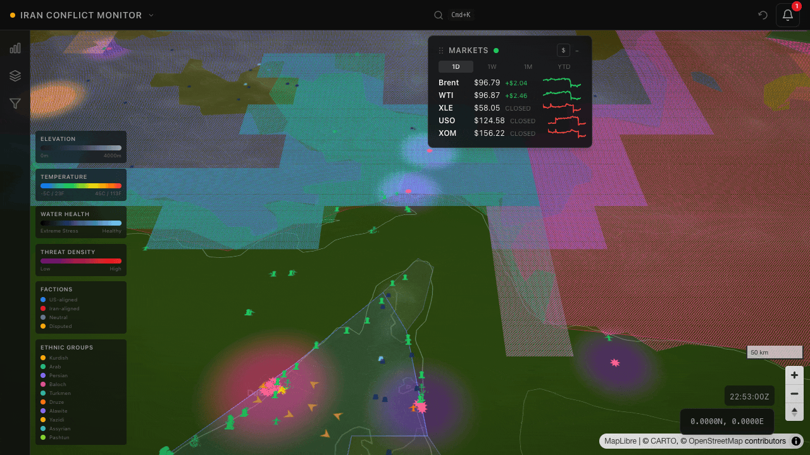

# Iran Monitor

> **Real-time Iran conflict intelligence dashboard. Numbers over narratives.**



A personal open-source intelligence (OSINT) tool that fuses ten upstream public
data feeds into a single 2.5D map of the Greater Middle East. Flights, ships,
GDELT conflict events, OpenStreetMap infrastructure, news clusters, oil market
prices, weather, water stress, political alignment, and ethnic distribution —
all updated live, all gated through the same cache-first serverless pipeline.
Built to answer one question: _what is actually happening around the Strait of
Hormuz right now, quantitatively?_

---

**Live demo:** [otg-iran-monitor.vercel.app](https://otg-iran-monitor.vercel.app)

**Portfolio tour:** [docs/SHOWCASE.md](docs/SHOWCASE.md) — a 1-page guided tour through the decisions, architecture, and the agentic-dev meta-story.

> Please be gentle. This is a single-user Redis budget (Upstash free tier, ~92%
> of the monthly command ceiling already in use). The live demo is protected by
> a 60 req/min per-IP global rate-limit tier on top of per-endpoint limiters —
> a burst of curl loops will trip it fast. `robots.txt` disallows `/api/*` to
> keep crawlers off the upstream budget. Operator surfaces (DevApiStatus
> dashboard, operator-control endpoints) are Bearer-gated and skip the global
> rate-limit tier when authenticated (Phase 28.2 D-04).

---

## Engineering

[](https://github.com/zack-maz/otg-iran-monitor/actions/workflows/ci.yml)
[](https://github.com/zack-maz/otg-iran-monitor/actions/workflows/codeql.yml)
[](https://codecov.io/gh/zack-maz/otg-iran-monitor)


[](server/openapi.yaml)

**2543 passing tests across 208 files.** TypeScript strict mode with
`noUncheckedIndexedAccess` on the server tsconfig. Type coverage gated at 97%
in CI (ratchet floor, 99% aspirational). Pino structured logging with secret
redaction proven by a write-stream sink test. Graceful degradation against
Upstash Redis failure proven by a chaos test that simulates Redis death and
asserts all 8 cached routes return 200/degraded or 502/503 but **never** 500.
A 2000ms `Promise.race` timeout caps hung Upstash calls so they can't freeze a
Vercel lambda. Pre-commit hooks lint, format, and scan for leaked secrets with
gitleaks. CodeQL runs on every PR plus weekly on `main`.

See the [Engineering deep dive](#engineering-deep-dive) section below for test
matrices, coverage details, and the honest tech-debt accounting.

---

## Table of Contents

- [Features](#features)
- [Quick Start](#quick-start)
- [Architecture](#architecture)
- [Data Sources](#data-sources)
- [Visualization Layers](#visualization-layers)
- [Screenshots](#screenshots)
- [Engineering Deep Dive](#engineering-deep-dive)
- [Environment Variables](#environment-variables)
- [Testing](#testing)
- [LLM Enrichment](#llm-enrichment)
- [What I Learned / What I'd Do Differently](#what-i-learned--what-id-do-differently)
- [License](#license)

---

## Features

- **Live entity tracking** — flights (3 pluggable sources: OpenSky, ADS-B
  Exchange, adsb.lol), ships (AISStream), conflict events (GDELT v2)
- **Key infrastructure sites** — nuclear, naval, oil, airbase, port facilities
  sourced from OpenStreetMap via Overpass, attack-status cross-referenced
  against recent GDELT events within 5 km
- **News feed** — GDELT DOC 2.0 + 5 RSS feeds (BBC, Al Jazeera, Tehran Times,
  Times of Israel, Middle East Eye) with Jaccard dedup/clustering and
  relevance-scored keyword filtering
- **Notification center** — severity-scored alerts correlating GDELT events
  with news headlines (temporal + geographic/keyword matching), proximity
  warnings for flights/ships within 50 km of key sites
- **Oil markets tracker** — Brent, WTI, XLE, USO, XOM with sparkline charts
  (Yahoo Finance, 60 s polling)
- **Seven visualization layers** — geographic (elevation contours + color
  relief), weather (temperature heatmap + wind barbs), threat density (custom
  GLSL radial gradient shader over BFS-clustered events), political alignment
  (Natural Earth faction fills + disputed territories), ethnic distribution
  (GeoEPR 2021 with FillStyleExtension hatching), water stress (WRI Aqueduct
  4.0 + Open-Meteo precipitation anomaly at named facilities), satellite
  (deferred)
- **Advanced search** — Cmd+K modal with ~25 tag prefixes (`type:`, `near:`,
  `country:`, `callsign:`, `cameo:`, `severity:`, etc.), implicit-OR
  evaluation, bidirectional sync between search bar and sidebar filter
  toggles, two-stage autocomplete with live entity counts
- **Date-range filtering** — custom dual-thumb slider with minute/hour/day
  granularity toggle; default 24 h window when no custom range is active
- **Detail panels** — 360 px right-side slide-out with per-entity data in dual
  units (ft/m, kn/m-s, ft-min/m-s), flash-on-change animations, lost-contact
  grayscale state, browser-like back navigation stack with slide animations

---

## Quick Start

**Prerequisites:**

- **Node 22.x** (pinned in `package.json` engines)
- **gitleaks** _(recommended)_ — `brew install gitleaks` for pre-commit secret
  scanning (the hook fails open without it, so this is optional for local dev
  but strongly recommended before pushing)
- **Upstash Redis account** _(optional)_ — the server runs with graceful
  degradation against in-memory cache when Upstash credentials are absent, so
  you can develop and test without it

**Clone and install:**

```bash
git clone https://github.com/zack-maz/otg-iran-monitor.git
cd otg-iran-monitor
npm install
```

The `prepare` script auto-installs husky hooks on `npm install`, so pre-commit
linting, formatting, and secret scanning is live from the first commit.

**Configure environment:**

```bash
cp .env.example .env.local
# Edit .env.local — all vars are optional for local dev, but the server will
# log a warning and degrade gracefully when each is absent. See the
# `scripts/check-env-example.ts` drift checker for the authoritative list.
```

**Run dev server (frontend + backend concurrently):**

```bash
npm run dev
```

- Frontend: <http://localhost:5173>
- API: <http://localhost:3001>
- Vite proxies `/api/*` from 5173 to 3001

**Run tests:**

```bash
npx vitest run              # full suite (2543 tests across 208 files)
npx vitest run src/         # frontend only
npx vitest run server/      # server only
npx vitest run --coverage   # with coverage report
```

**Typecheck + type coverage gate:**

```bash
npm run typecheck           # tsc -b + type-coverage at 97% floor
```

**Lint + format:**

```bash
npm run lint                # eslint
npm run format:check        # prettier check
npm run format              # prettier write
```

**Env drift check:**

```bash
npx tsx scripts/check-env-example.ts    # asserts .env.example matches server/config.ts
```

---

## Architecture

| Layer         | Technology                                                                        |
| ------------- | --------------------------------------------------------------------------------- |
| Frontend      | React 19, TypeScript 5.9 (strict), Vite 6, Tailwind CSS v4 (CSS-first `@theme`)   |
| State         | Zustand 5 (curried `create<T>()()` pattern, selector-based subscriptions)         |
| Map rendering | Deck.gl + MapLibre GL JS (2.5 D terrain, AWS Terrarium DEM, custom GLSL shaders)  |
| Backend       | Express 5 (serverless functions on Vercel, `createApp()` factory)                 |
| Cache         | Upstash Redis (REST-based) with in-memory fallback on failure                     |
| CDN           | Vercel Edge with per-endpoint `Cache-Control: max-age=0, s-maxage=N`              |
| Security      | Helmet CSP, per-endpoint sliding-window rate limits, public baseline tier         |
| Validation    | Zod input schemas on queries, Zod output schemas via `sendValidated<S>` helper    |
| Observability | Pino structured JSON with `redact` config for secrets/PII, `X-Request-ID` trace   |
| Monitoring    | `/health` endpoint with per-source freshness + Redis latency, Vercel cron warming |
| Build         | Vite (frontend) + tsup (server bundle) + `tsc -b` (typecheck) + `type-coverage`   |

**High-level data flow:**

```
Browser (React SPA, port 5173)
    │
    │  polls /api/{flights,ships,events,news,sites,markets,weather,water}
    ▼
Vercel Edge (CDN cache — s-maxage per endpoint)
    │
    ▼
Express createApp() (serverless function)
    │
    ├── rateLimiters.public (60 req/min global tier)
    ├── rateLimiters.<endpoint> (per-endpoint ceilings)
    ├── cacheGetSafe() → Upstash Redis (CacheEntry<T>)
    │       │
    │       │ hit (fresh)           hit (stale)            miss
    │       ▼                       ▼                      ▼
    │   return cached           serve + mark stale     upstream fetch
    │                                                      │
    │                                                      ▼
    │                                          8 upstream adapters
    │                                          (see Data Sources table)
    │                                                      │
    │                                                      ▼
    │                                          cacheSetSafe() + sendValidated()
    │
    └── Upstash failure → withTimeout(Promise.race, 2000ms) → in-memory fallback
```

_Full mermaid diagrams live in [`docs/architecture/`](docs/architecture/README.md):
[system context](docs/architecture/system-context.md),
[data flows per source](docs/architecture/data-flows.md),
[frontend component graph](docs/architecture/frontend.md),
[deployment topology](docs/architecture/deployment.md), and a
[four-file ontology deep dive](docs/architecture/ontology/README.md)
covering types, algorithms, state machines, and complexity. 21 Mermaid
blocks, all rendering natively on GitHub._

---

## Data Sources

| Source                              | Data                    | Polling   | Auth               |
| ----------------------------------- | ----------------------- | --------- | ------------------ |
| OpenSky / ADS-B Exchange / adsb.lol | Flights (ADS-B)         | 5–260 s   | optional OAuth2    |
| AISStream.io                        | Ships (AIS, WebSocket)  | 30 s      | API key (optional) |
| GDELT v2 events export              | Conflict events (CAMEO) | 15 min    | none (public)      |
| GDELT DOC 2.0 + 5 RSS feeds         | News articles           | 15 min    | none (public)      |
| Overpass / OpenStreetMap            | Infrastructure sites    | 24 h      | none (public)      |
| WRI Aqueduct 4.0 + Open-Meteo       | Water stress + precip   | 6 h / 24h | none (public/CSV)  |
| Yahoo Finance (unofficial)          | Oil markets             | 60 s      | none (public)      |
| Open-Meteo                          | Weather grid            | 10 min    | none (public)      |
| Natural Earth 110m/10m              | Political + disputed    | static    | bundled GeoJSON    |
| GeoEPR 2021 (ETH Zurich)            | Ethnic zones            | static    | bundled GeoJSON    |
| Nominatim                           | Reverse geocoding       | on-demand | none (cache 30 d)  |

All data routes share a common `CacheResponse<T>` envelope (`{data, stale,
lastFresh, source}`) and the same cache-first pattern. See
[`server/openapi.yaml`](server/openapi.yaml) for the authoritative API
contract.

---

## Visualization Layers

| Layer          | Description                                                                        | Screenshot                                           |
| -------------- | ---------------------------------------------------------------------------------- | ---------------------------------------------------- |
| Geographic     | Elevation color-relief, maplibre-contour lines, feature labels                     | _(active in every shot)_                             |
| Weather        | Open-Meteo temperature heatmap (bilinear-interpolated canvas) + wind barbs         | _(active in hero GIF)_                               |
| Threat density | BFS-clustered GDELT events with custom GLSL radial gradient + P90 normalization    | [screenshot](public/screenshots/threat-density.png)  |
| Political      | Natural Earth faction fills (US-aligned blue / Iran-aligned red / neutral gray)    | [screenshot](public/screenshots/political-layer.png) |
| Ethnic         | 10 ethnic zones (GeoEPR 2021) with `FillStyleExtension` hatching + overlap stripes | [screenshot](public/screenshots/ethnic-layer.png)    |
| Water stress   | Facility-level stress via WRI Aqueduct + precipitation anomaly, 6 rivers as lines  | [screenshot](public/screenshots/water-stress.png)    |
| Satellite      | ArcGIS World Imagery — _deferred (carried forward)_                                | _(coming soon)_                                      |

Entity filters (flights, ships, events, sites) operate independently from
visualization layer toggles. Layer stacking is zoom-dependent: threat clusters
render below entities below zoom 9, above them at zoom ≥ 9.

---

## Screenshots

- **Threat density:** [public/screenshots/threat-density.png](public/screenshots/threat-density.png)
- **Political layer:** [public/screenshots/political-layer.png](public/screenshots/political-layer.png)
- **Ethnic distribution:** [public/screenshots/ethnic-layer.png](public/screenshots/ethnic-layer.png)
- **Water stress:** [public/screenshots/water-stress.png](public/screenshots/water-stress.png)
- **Detail panel:** [public/screenshots/detail-panel.png](public/screenshots/detail-panel.png)
- **Search modal (Cmd+K):** [public/screenshots/search-modal.png](public/screenshots/search-modal.png)

---

## Engineering Deep Dive

This section is deliberately verbose. If you're evaluating this as a work
sample, this is the part worth reading carefully.

### Test Suite

| Metric              | Value                                             |
| ------------------- | ------------------------------------------------- |
| Total tests         | **2543 passing** (19 skipped, 5 todo)             |
| Test files          | 208                                               |
| Frontend tests      | ~1170                                             |
| Server tests        | ~1369                                             |
| Duration (cold)     | ~38 s (vitest forks pool)                         |
| Coverage (baseline) | lines 66 / funcs 69 / branches 53 / statements 65 |
| Type coverage       | **97.05%** (7977 / 8219 typed)                    |

Coverage thresholds are locked at the current baseline as a regression
ratchet in `vite.config.ts` — a `TODO` comment tracks the aspirational 80 %
target. Type coverage is locked at 97 as a hard CI gate: any `any`
regression fails the build. The remaining 3 % of "untyped" expressions are
almost entirely deck.gl v9 and maplibre 5 type-cast leaks in layer config —
tracked for a future cleanup pass.

### Pre-commit Hooks

- **husky v9 + lint-staged v15** — eslint `--fix` + prettier `--write` on
  staged TS/TSX files; prettier-only on JSON/MD/CSS/YAML
- **gitleaks** — scans staged files for leaked secrets; hook fails open if
  the binary is missing (documented in Quick Start)
- **Target runtime:** < 2 s per commit (measured ~1.5 s on a fresh file)
- **tsc and vitest are NOT run in pre-commit** — CI catches those

### CI / CD (GitHub Actions)

- **`.github/workflows/ci.yml`** — runs on every PR and push to `main`. Three
  jobs in parallel:
  - `lint-and-typecheck` — eslint, prettier-check, `tsc -b`, type-coverage,
    knip (advisory, continue-on-error)
  - `test` — `vitest run --coverage` + codecov upload
  - `audit` — `npm audit --audit-level=high`
- **`.github/workflows/codeql.yml`** — CodeQL v3 analysis (JavaScript +
  TypeScript) on every PR, every push to `main`, and a weekly Monday 06:00
  UTC scheduled run
- **Vercel preview deploys** — enabled via the Vercel ↔ GitHub integration
  (no YAML), comment bot posts preview URL on every PR within ~60 s
- **Concurrency** — `ci-${{ github.ref }}` with `cancel-in-progress` cancels
  stale PR runs automatically

### Palantir-Grade Hardening (Phase 26.4-03)

These are the gaps that Phase 26.3 left open and Phase 26.4 closed:

1. **Log redaction** — Pino `redact` config strips `authorization`, `cookie`,
   `x-api-key`, `set-cookie`, wildcard `*.UPSTASH_*` / `*.OPENSKY_*` /
   `*.AISSTREAM_*` / `*.ADSB_*` tokens, plus production-only `req.ip` and
   `req.remoteAddress`. Proven by
   [`server/__tests__/lib/logger-redaction.test.ts`](server/__tests__/lib/logger-redaction.test.ts) —
   captures write-stream output and asserts sensitive fields are `[REDACTED]`
   plus an anti-leak stringify check that original secret strings appear
   nowhere in the JSON.
2. **Redis death chaos test** —
   [`server/__tests__/resilience/redis-death.test.ts`](server/__tests__/resilience/redis-death.test.ts)
   boots the real Express app via supertest, mocks `@upstash/redis` to throw
   on every call, and asserts all 8 cached routes + `/health` return 200
   degraded or 502/503 — **never 500**. Exposed two real production
   resilience gaps, both fixed:
   - `events.ts` had direct `redis.get/set` calls in the backfill cooldown
     tracking — now wrapped in try/catch via `shouldBackfill()` and
     `recordBackfillTimestamp()` helpers
   - `cacheGetSafe` / `cacheSetSafe` caught sync throws but NOT hung Upstash
     calls (client retries internally on missing URL, blocks indefinitely)
     — fixed by adding a 2000 ms `Promise.race` timeout wrapper in
     [`server/cache/redis.ts`](server/cache/redis.ts). This is a real
     production hardening, not test-only scaffolding.
3. **Zod at output boundary** — `sendValidated<S>(res, schema, payload)`
   helper in
   [`server/middleware/validateResponse.ts`](server/middleware/validateResponse.ts)
   with dev-throw / prod-warn semantics. Wired into flights, events, water
   routes as proof-of-concept (3 of 14; the remaining 11 are a mechanical
   follow-up).
4. **Live demo rate limit hardening (Phase 26.4-04 → Phase 28.1 / 28.2 D-04)** —
   `rateLimiters.public` global tier (60 req/min, prefix `ratelimit:public`)
   runs on every `/api/*` request before per-endpoint limiters, protecting
   the Redis command budget from scraper abuse once the demo URL is
   published. Was 6/min at Phase 26.4-04 land; raised to 60/min in Phase
   28.1 after the dashboard's own ~9-hook cold-start burst (flights, ships,
   events, news, markets, weather, water, waterPrecip, llmStatus) was
   tripping the cap and rendering red connection dots. Phase 28.2 D-04
   added Bearer bypass: a valid `DASHBOARD_PASSWORD` Bearer skips both the
   global tier and the per-endpoint tiers (flights 120/min, ships 60/min,
   events 20/min, etc.) via `timingSafeEqual` constant-time compare.
   `public/robots.txt` disallows `/api/*` and `/health` so well-behaved
   crawlers never touch upstream APIs.

### Operator surfaces (v1.5–v1.6)

The dev-open / Bearer-gated API-Health dashboard accumulated a set of
operator instruments across v1.5 and v1.6:

- **Budget & cost shadow (Phase 38)** — a `BudgetBlock` renders per-provider
  token-proximity bars (soft 0.8 / hard 0.95) sourced from
  `llm:tokens:{provider}:YYYY-MM-DD`, alongside a daily cost roll-up
  (`events:llm-cost-shadow:v3:{date}`, tokens-in × $0.20/M + tokens-out ×
  $0.40/M stored as integer microcents).
- **LLM Flight Recorder (Phase 39)** — `/api/events/llm-history` exposes a
  500-cap call-history recorder (`llm:calls:history`) and a 200-cap per-run
  summary recorder (`llm:runs:history`); a run killed by Vercel `maxDuration`
  leaves only its `running` record (the "run that died" signal). Cold-start
  hydration repopulates the in-memory singletons after a Fluid Compute cold
  start.
- **Water-facility romanization (Phase 38)** — water facilities carry a
  `nameLatin` / `nameOriginal` pair so non-Latin OSM labels render legibly on
  the map and in the detail panel.
- **API-Health dashboard consolidation (Phase 40)** — the dev dashboard was
  consolidated into a single API-Health tab with a hero summary plus four
  collapsible groups (endpoint health, LLM pipeline, budget & cost, operator
  actions & data quality).
- **v1.5 operator actions** — registry-drift gate, dead-URL prune flow
  (`prune-dead-urls`, per-Bearer daily quota), and actor-confidence / data
  quality counts surfaced through `/api/operator-status`, all read-only in
  the captured screenshots.

### OpenAPI Contract

[`server/openapi.yaml`](server/openapi.yaml) — 1164-line hand-written
OpenAPI 3.0.3 spec documenting every route, the `CacheResponse<T>`
envelope, the canonical error envelope, and the sliding-window rate limit
policies per endpoint. Not generated from code — hand-curated so the
editorial descriptions are portfolio-readable. Response schemas are
cross-validated at runtime via `sendValidated` for drift detection between
the spec and the implementation.

### Graceful Degradation (3 bullets)

- **In-memory fallback:** `cacheGetSafe` / `cacheSetSafe` catch every
  Upstash failure (throws, timeouts, missing credentials) and transparently
  fall through to a process-local `Map` with the same `CacheEntry<T>`
  semantics. The client never sees the transition.
- **Stale serving:** when an upstream adapter fails on cache miss, the
  server serves the most recent cached copy with `stale: true` instead of
  propagating the error. The UI reads `stale` and degrades its connection
  dot from green to yellow.
- **`/health` degraded state:** `/health` reports
  `{status: 'degraded', redis: false}` when Upstash is unreachable while
  still returning HTTP 200 so Vercel cron doesn't retry unnecessarily.

Full contract in [`docs/degradation.md`](docs/degradation.md) — documents
every layer (cache, data source, response validation, rate limiter,
frontend, `/health`), the failure modes each catches, and the test or
code path that proves each contract. The cache layer contract is
**proven** by the Redis-death chaos test at
[`server/__tests__/resilience/redis-death.test.ts`](server/__tests__/resilience/redis-death.test.ts).

### Engineering Documentation

This directory ships four additional sets of artifacts that document
the project's engineering story beyond the code itself:

- **[Architecture](docs/architecture/README.md)** — 12 architecture files
  with 21 Mermaid diagrams covering system context, per-source data
  flows, frontend composition, deployment topology, and a four-file
  ontology deep dive (types, algorithms, state machines, complexity).
  Known tech debt labeled inline with `TODO(26.2)` markers.
- **[Architecture Decision Records](docs/adr/README.md)** — 11 ADRs in
  Michael Nygard short format documenting the load-bearing decisions
  from Phase 13 through Phase 26.4: Upstash, Vercel, GDELT,
  RadialGradientExtension shader, Pino+Zod hardening, water stress
  point-facility pivot, GeoEPR hatched overlays, and the honest
  retrospective on the scrapped Phase 26.2 NLP approach.
  **[ADR-0005](docs/adr/0005-phase-26-2-nlp-approach-scrapped.md)** is
  the highest-signal artifact in this directory — a 300-line
  retrospective on two weeks of work that was deleted wholesale. See
  also the [What I Learned](#what-i-learned--what-id-do-differently)
  section below.
- **[Operations Runbook](docs/runbook.md)** — 9 real failure modes
  with Symptom / Detection / Cause / Remediation / Prevention per
  section, grounded in actual code paths (`cacheGetSafe` +
  `REDIS_OP_TIMEOUT_MS` timeout, GDELT backfill cooldown, Overpass
  mirror fallback, AISStream on-demand pattern, etc.). Plus a log
  query patterns appendix with `jq` recipes for filtering Pino
  structured logs.
- **[Graceful Degradation Contract](docs/degradation.md)** — the
  layered contract the app makes to operators and users when
  dependencies fail, with a summary table of failure modes and the
  test/code-path proof for each contract.

---

## Environment Variables

<details>
<summary>Click to expand environment variable reference</summary>

| Variable                   | Required | Description                                                    |
| -------------------------- | :------: | -------------------------------------------------------------- |
| `UPSTASH_REDIS_REST_URL`   |   no\*   | Upstash Redis REST endpoint; falls back to in-memory cache     |
| `UPSTASH_REDIS_REST_TOKEN` |   no\*   | Upstash Redis auth token; falls back to in-memory cache        |
| `CORS_ORIGIN`              |    no    | CORS origin (defaults to `*`)                                  |
| `PORT`                     |    no    | Server port (defaults to 3001)                                 |
| `OPENSKY_CLIENT_ID`        |    no    | OpenSky OAuth2 client ID; flights work via adsb.lol without it |
| `OPENSKY_CLIENT_SECRET`    |    no    | OpenSky OAuth2 client secret                                   |
| `ADSB_EXCHANGE_API_KEY`    |    no    | ADS-B Exchange RapidAPI key                                    |
| `AISSTREAM_API_KEY`        |    no    | AISStream WebSocket API key; ships layer disabled without it   |
| `NODE_ENV`                 |    no    | `development` \| `production` \| `test`                        |
| `VERCEL`                   |    no    | Set by Vercel runtime; toggles compression and rate limiters   |

\* _Server runs with graceful degradation when Upstash credentials are
absent — all cached routes fall back to in-memory cache. Authoritative list
lives in [`server/config.ts`](server/config.ts); drift is checked by
[`scripts/check-env-example.ts`](scripts/check-env-example.ts)._

</details>

---

## Testing

```bash
# Full suite (2543 tests)
npx vitest run

# With coverage report (lcov + HTML)
npx vitest run --coverage

# Specific scope
npx vitest run src/            # frontend
npx vitest run server/         # server
npx vitest run -t "redaction"  # by test name match

# Typecheck + type coverage gate (chained via `npm run typecheck`)
npm run typecheck

# Lint + format
npm run lint
npm run format:check
```

**Mocks and fixtures:**

- `src/test/__mocks__/` — WebGL-dependent library mocks for jsdom (maplibre,
  deck.gl)
- `server/__tests__/fixtures/` — GDELT CSV fixtures, GeoJSON snippets, etc.
- Rate limiter is mocked as pass-through in route tests via
  `vi.mock('../../middleware/rateLimit.js', ...)`

**Smoke test against production:**

```bash
npx tsx scripts/smoke-test.ts https://<your-prod-url>
```

---

## LLM Enrichment

The conflict-event layer combines two streams: raw GDELT events (15-min
refresh) and v3 LLM-enriched events (daily 04:00 UTC cron). The LLM pipeline
is intentionally optional — when it's healthy, every event carries CAMEO
classification plus a precise lat/lon from the 6-path resolver and a
one-paragraph summary. When it's not, the map keeps rendering raw GDELT
(CAMEO classification only); the [Pitfall 1 cache bridge contract in
degradation.md](docs/degradation.md) documents this "map never goes blank"
invariant.

### v3 cron-driven extraction

`/api/cron/refresh-events` (daily 04:00 UTC) is the sole production writer
to the `events:llm:v3` Redis key. Anti-pattern #17 (cron-only writer
discipline) keeps the pipeline crash-free under Vercel Fluid Compute — the
pre-Phase-29 v2 fire-and-forget IIFE pattern was silently killed
mid-extraction when the HTTP response was sent, partial-writing the v3
cache and leaving the map in a half-enriched state. The v3 cron-only
architecture prevents this class of incident; see [runbook §14 — Cron
architecture lessons](docs/runbook.md#14-cron-architecture-lessons-phase-2826-fire-and-forget-iife-incident).
`/api/events` is cache-only at the request path: it reads `events:llm:v3`
when fresh, falls through to raw GDELT via the Pitfall 1 bridge otherwise,
and never triggers a write.

The active LLM provider is **NIM (qwen-235b instruct)**. The cascade
construction in `server/lib/freeClaudeRouter.ts` declares a NIM → OpenRouter
chain, but **OpenRouter is dormant at runtime** per the Phase 30.1
sub-block of [ADR-0010](docs/adr/0010-v1-5-llm-pipeline-narrowing-and-deletion.md) —
the free-tier probe landed in the not-viable bucket (~90% rate-limited
under the workload's per-batch concurrency). **Cerebras + Groq adapters are
deferred** per the Phase 34 sub-block of the same ADR; the operator chose
to skip provisioning at v1.5 close. Both providers' runtime paths are
dormant-ready — restoration is a future-phase decision, not a regression.
The [`docs/architecture/llm-pipeline-reliability.md`](docs/architecture/llm-pipeline-reliability.md)
deep-dive captures the measured throttle window, NIM's ~40 req/min RPM
ceiling, and the tuned `LLM_V3_CONCURRENCY` / `LLM_BATCH_SIZE` /
`LLM_BATCH_TIMEOUT_MS` / `BACKOFF_MS` defaults (so this README doesn't
duplicate numbers that drift).

### 6-path resolver

For each event, the resolver walks 6 paths in declared order until one
returns a coordinate with provenance:

1. **own-site-snapshot** — match against the existing infrastructure snapshot in `sites:v3`
2. **poi-amenity-nominatim** — Nominatim search constrained to POI / amenity tags
3. **nominatim-direct** — direct Nominatim forward geocode constrained to the ME viewbox
4. **nominatim-verified-2pass** — two-pass verify of an ambiguous result
5. **gdelt-actiongeo-fallback** — fall back to GDELT's ACTIONGEO coordinate
6. **bellingcat-coord-passthrough** — Bellingcat-source coordinate passthrough

The resolver never returns a coordinate without provenance — every event on
the map carries a traceable lineage entry at `events:llm:v3:lineage:{eventId}`.
Nominatim downstream is throttled at 1 req/s (their ToS) and aggressively
cached at `geocode:fwd:constrained:v2:<hash>` (30-day logical TTL).

### Production health verification

Production health is verified by `.github/workflows/prod-connectivity-audit.yml`
— a manually-triggered workflow (`workflow_dispatch`) that runs the tier audit
against `https://otg-iran-monitor.vercel.app`, exercises every public endpoint
plus every Bearer-gated operator endpoint, and writes the result envelope to
the `audit:connectivity:last-result` Redis key (7-day TTL). The audit result
is surfaced on the API Health dashboard tab and exposed via
[`/api/audit-status`](server/openapi.yaml) (degrade-open; no auth gate so
the dashboard banner renders even when Bearer is absent). The v1.5 acceptance
gate is **3× consecutive `allTiersGreen=true`** runs — that's what unblocks
the v1.6 milestone close.

### API Health dashboard tab (Phase 28.2 W5)

The DevApiStatus dashboard's five separate tabs (audit, operator-status,
byBearer, advEval, pinTtl) were merged into a single **API Health** tab in
Phase 28.2 W5. The unified tab aggregates `audit24h` (rolling 24-hour
audit-result digest) + `byBearer` per-Bearer quota counters + `pinTtl`
deep-link TTLs + `advEval` adversarial-eval drift + the operator-actions
log into one Bearer-gated operator surface. The merge reduced operator
cognitive load during incident response (one place to look) and simplified
per-Bearer quota visibility against the 50/24h replay cap. Bearer-gated via
`DASHBOARD_PASSWORD` with `timingSafeEqual` constant-time compare in the
shared `dashboardAuth.ts` middleware.

### Redis key registry

All Redis state — the 32 keys spanning the LLM pipeline, per-source caches,
operator audit log, cron tick sentinels, and dashboard rate-quota counters —
is documented in [`docs/architecture/redis-keys.md`](docs/architecture/redis-keys.md)
(Phase 35 D-05 deep-dive). A drift gate at
`src/__tests__/lib/redis-registry.test.ts` enforces parity between
CLAUDE.md §Serverless Cache, the architecture deep-dive, and the codebase —
adding an undocumented Redis key fails the next `vitest run`. Phase 36 ships
a similar mechanical primitive for the OpenAPI spec
(`server/__tests__/openapi/openapi-lint.test.ts`) so the public API
contract is held to the same drift discipline.

---

## What I Learned / What I'd Do Differently

This is the subjective section — the honest retrospective a hiring manager
actually reads to assess judgment. I'm not going to pretend everything went
smoothly.

### Phase 26.2: the NLP approach I had to scrap

> **Full ADR:** [ADR-0005 — Phase 26.2 NLP Geolocation Approach Scrapped](docs/adr/0005-phase-26-2-nlp-approach-scrapped.md).
> The section below is the short version; the ADR is the long version
> with the exact files deleted, the revert commits, a "What I Learned"
> section with four rules for next time, and the forward-looking plan
> for a future GDELT redo on a clean foundation. If you're evaluating
> this project as a work sample, that ADR is the single most
> portfolio-relevant artifact in the repo.
>
> **Renumbering note:** The redo of this work has been scheduled as
> **Phase 27 under milestone v1.4** (2026-04-08). The "Phase 26.2" name
> below refers to the scrapped attempt as it existed at the time, not
> the new plan. Historical artifacts from the scrapped attempt are
> preserved at `.planning/phases/archive-26.2-nlp-scrapped/`.

Phase 26.2 was supposed to be "Conflict Geolocation Improvement." The idea
was to use NLP entity extraction (via `compromise`, a browser-compatible NLP
library) on GDELT event text to re-derive missing or wrong coordinates, then
validate them against country polygons. I built the lexicon — 22 Middle East
country ISO codes bridged to FIPS 10-4, a multi-word city tokenizer for names
like "Deir ez-Zor" and "Mazar-i-Sharif," a conflict actor lexicon
(Houthi/Hamas/Hezbollah), a place-country match gate, a confidence threshold
of 0.38, and CAMEO 182/190 hard-exclusions.

**It didn't work.** Not because any individual piece was broken — each unit
had its passing test — but because the whole stack was patching a fundamentally
bad geocoding source with more heuristics. GDELT's `ActionGeo` fields are
noisy in ways that NLP can't fix: the same event gets tagged with different
actor countries on consecutive updates, centroid fallback values
(`ActionGeo_Type = 3/4`) pollute the signal, and the underlying CAMEO
taxonomy doesn't distinguish "Iran-involved" from "Iran-affecting." I was
adding epicycles to a wrong model.

I scrapped the whole phase and reverted the code. The commit history shows
it: Phase 26.2 was deleted wholesale, `parseAndFilter` reverted to
synchronous, the confidence threshold rolled back from 0.38 to 0.35, CAMEO
exclusions reset to the original `['180', '192']` pair. Two weeks of work,
in the bin.

**What I'd do differently:** start with the source data quality question,
not the inference layer. Before writing a single line of NLP code, I should
have quantified how bad GDELT's geolocation actually is — sampled 1000 events,
manually verified coordinates, and measured the false positive rate at each
confidence threshold. If I had done that first, I would have seen that the
noise floor was above any threshold I could realistically set, and spent the
two weeks on _filtering_ GDELT (excluding noisy CAMEO codes, requiring
multi-source corroboration) instead of _rescuing_ it with NLP. "Kill your
darlings" is cheap advice; actually killing a phase you've been executing for
a week is hard. I left the tech debt markers (`TODO(26.2)` in the hardcoded
CAMEO tables) in place so the next person — present-me, in a few months —
can see the honest accounting.

### I started with horizontal layers, ended with vertical slices

My first three phases were classic horizontal architecture: get the map
working, get the entities rendering, get the data flowing. That was fine
through Phase 5. But starting at Phase 13 (Serverless Cache Migration), I
realized I had been _avoiding_ the hard integration work — the pieces all
existed, but they weren't gelled.

From Phase 17 (Notification Center) onward I flipped the planning pattern to
vertical slices: one plan = one feature, across the full stack, including the
UI it renders in. That's how Phase 17 shipped a proximity alert overlay, a
severity scoring library, a news-to-event matcher, _and_ a notification bell
dropdown in a single plan. In retrospect, I should have been thinking that
way from Phase 10 at the latest.

### Redis budget management is not a deployment problem, it's a day-1 design problem

The Upstash free tier allows a fixed number of commands per month. By Phase
25 I was at 80 % of the monthly ceiling and panicking about Phase 26 (Water
Stress) adding another polling source. I had to retrofit per-endpoint
`Cache-Control` headers, convert AISStream from a persistent WebSocket to an
on-demand connect-collect-close pattern, and add a GDELT backfill cooldown
gate — all to buy back command budget.

If I had designed with a fixed per-phase command budget from day 1 — "you
get N commands per minute, and that's it" — I would have pushed harder on
CDN caching (`s-maxage` on Vercel Edge) earlier, and I would have put the
proximity alert and notification severity computations on the client side
from the start instead of migrating them later.

### TypeScript strict mode was worth the pain

`noUncheckedIndexedAccess` on the server tsconfig caught at least three
real bugs during Phase 26.3 — array accesses that would have been `undefined`
at runtime. I enabled it late and had to clean up 40+ call sites, which
sucked. I should have enabled it at Phase 1. I didn't enable it on the client
tsconfig because deck.gl v9 and maplibre 5 type definitions have loose runtime
contracts that would cascade through every layer factory — pragmatism over
purity.

### What this project is NOT

It is not a production intelligence system. It has no authentication, no
multi-tenancy, no persistent storage, no historical replay, no mobile app,
no real-time chat, no classified or paid intelligence feeds. It is a
single-user personal tool that exists to answer a narrow question — _what's
moving around the Strait of Hormuz right now?_ — from public data sources
only. The portfolio value is in the engineering rigor around that narrow
goal, not in the breadth of features.

---

## License

Private — personal project. Source code is provided as a portfolio work
sample. All third-party data sources are used under their respective public
terms of service.

---

_Phase 41 — Public reveal polish. Last updated 2026-06-05._
