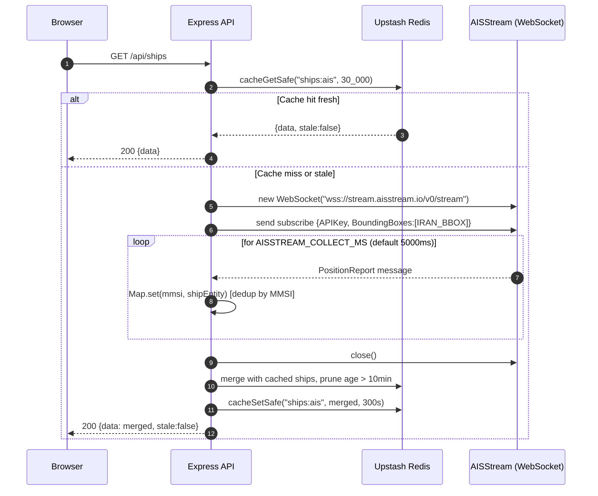
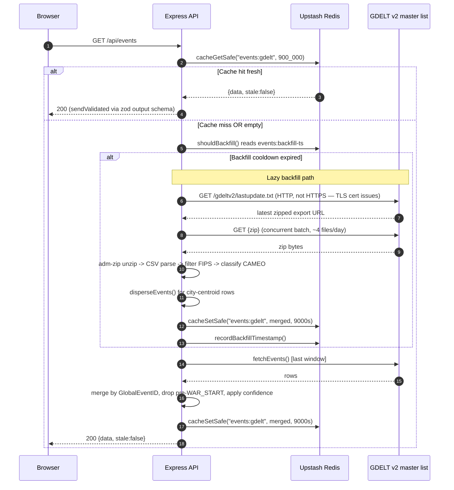
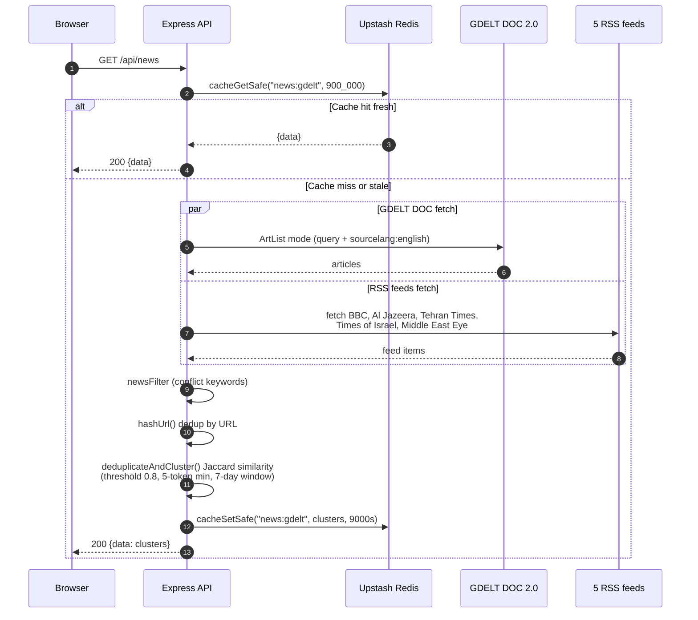
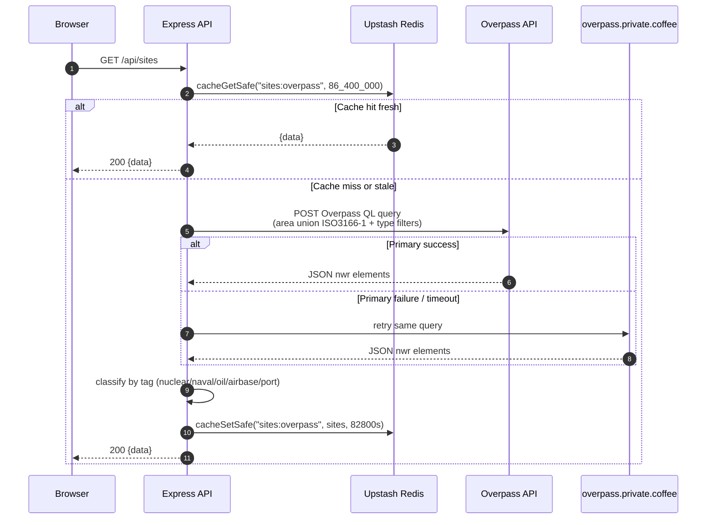
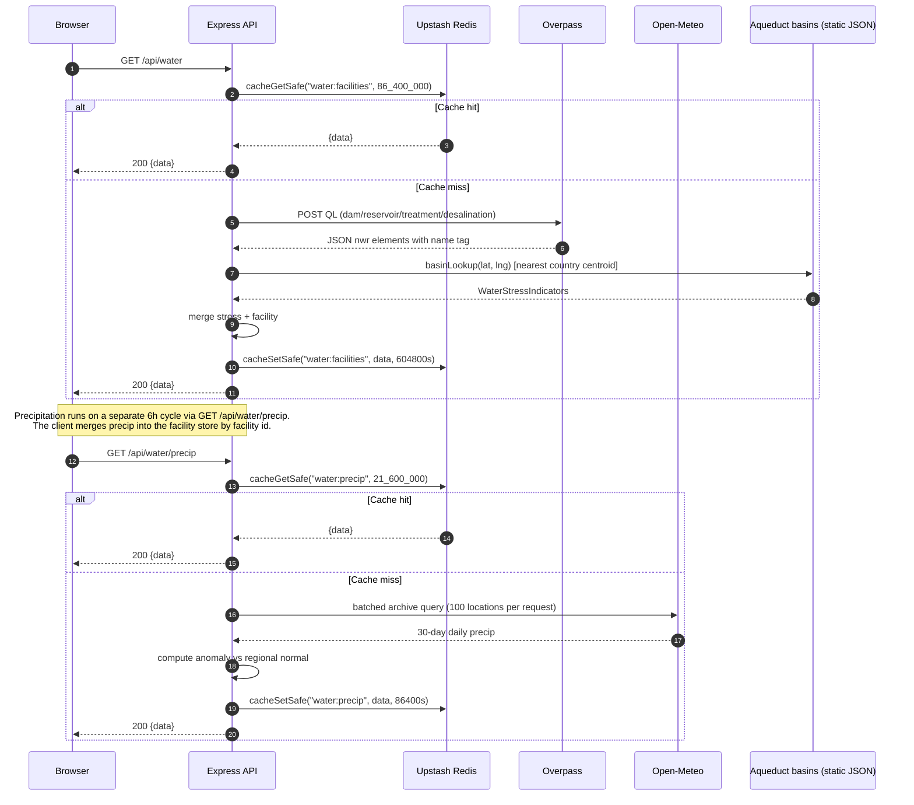
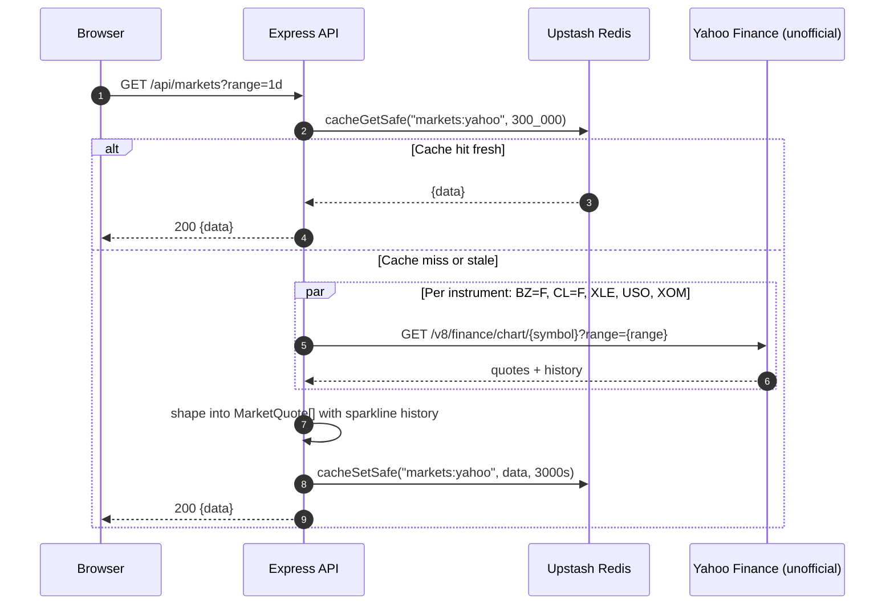
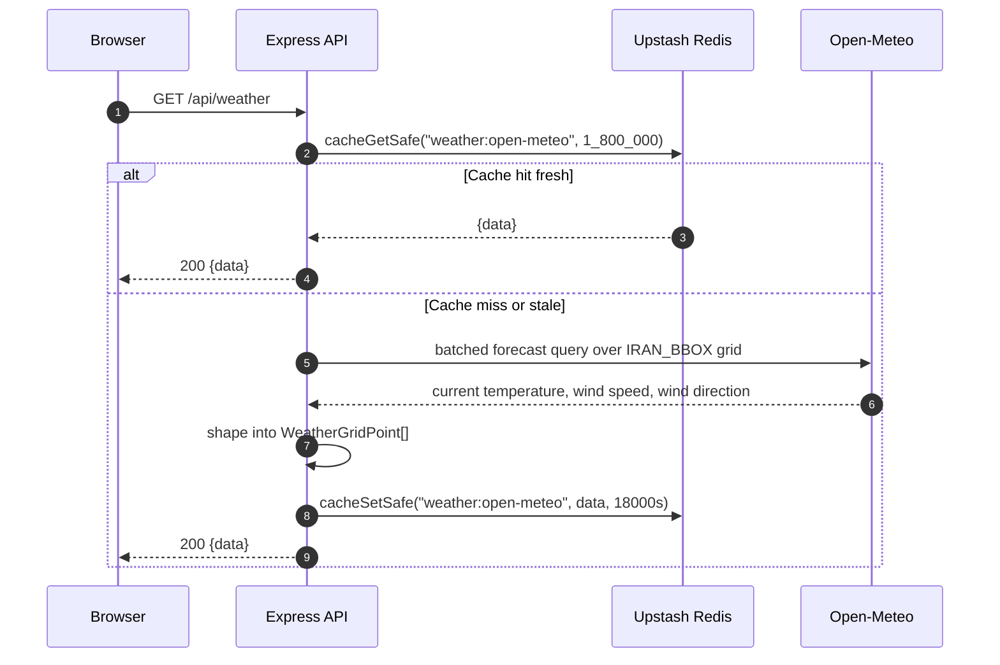
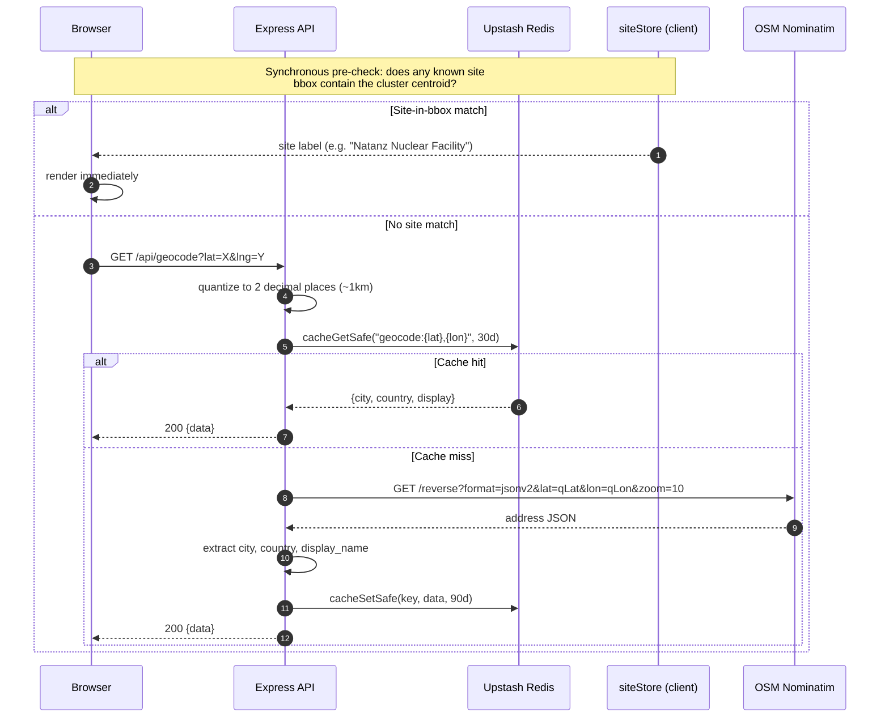

# Data Flows

One Mermaid `sequenceDiagram` per upstream data source, showing the full
round-trip from the browser to the cache to the upstream provider and back.

Every section names its adapter file, route file, Redis cache key, logical
TTL, and polling cadence so you can jump straight into the code. The
cross-cutting concerns section at the bottom covers fallback, rate limiting,
tracing, and CDN cache headers that apply uniformly across sources.

All cached routes use the safe wrappers
[`cacheGetSafe`](../../server/cache/redis.ts) and `cacheSetSafe`, which:

1. Wrap Redis calls in a 2000ms timeout via `Promise.race`
2. Fall through to an in-memory `Map` cache on error or timeout
3. Mark the response `degraded: true` when served from the fallback

Whenever "cache miss or stale" is shown below, the same cache fallback is
invoked implicitly even if an arrow is omitted for readability.

---

## 1. Flights

**Adapters:** [`server/adapters/opensky.ts`](../../server/adapters/opensky.ts),
[`server/adapters/adsb-lol.ts`](../../server/adapters/adsb-lol.ts)
**Route:** [`server/routes/flights.ts`](../../server/routes/flights.ts)
**Cache keys:** `flights:opensky` (10s TTL), `flights:adsblol` (30s TTL)
**Polling cadence:** 5s (OpenSky) or 30s (adsb.lol), via
[`useFlightPolling`](../../src/hooks/useFlightPolling.ts)
**Active source:** user-selectable, persisted to `localStorage`, default
`adsblol` (free, no auth).

```mermaid
sequenceDiagram
    autonumber
    participant Browser
    participant Edge as Vercel Edge
    participant API as Express API
    participant Cache as Upstash Redis
    participant OpenSky
    participant ADSBLol as adsb.lol

    Browser->>Edge: GET /api/flights?source=adsblol
    alt Edge cache fresh (s-maxage=5)
        Edge-->>Browser: 200 {data, stale:false}
    else Edge cache miss
        Edge->>API: forward
        API->>Cache: cacheGetSafe("flights:adsblol", 30_000)
        alt Cache hit fresh
            Cache-->>API: {data, stale:false, lastFresh}
            API-->>Edge: 200 {data}
            Edge-->>Browser: 200 {data}
        else Cache miss or stale
            alt source == adsblol
                API->>ADSBLol: fetchFlights() (free, no auth)
                ADSBLol-->>API: JSON
            else source == opensky
                API->>OpenSky: fetchFlights(IRAN_BBOX) (OAuth client-credentials)
                OpenSky-->>API: state vectors
            end
            API->>Cache: cacheSetSafe(key, data, ttl*10)
            API-->>Edge: 200 {data, stale:false, lastFresh:Date.now()}
            Edge-->>Browser: 200 {data}
        end
    end

    note over Browser: Poll loop runs every 5s via recursive setTimeout.<br/>Tab visibility hidden pauses polling; visible triggers<br/>immediate refetch (useFlightPolling.ts).
```

**Notes**

- The frontend exposes exactly two flight sources today: OpenSky and adsb.lol.
  The old ADS-B Exchange integration was removed in Phase 26.3 because the
  RapidAPI key cost was no longer justified.
- OpenSky requires OAuth client credentials (`OPENSKY_CLIENT_ID` /
  `OPENSKY_CLIENT_SECRET`). When credentials are missing the route returns
  a clean 4xx — no crash.
- Rate-limit events from upstream are surfaced to the client via the
  `rateLimited: true` flag on the response envelope, which the store maps
  to `connectionStatus: 'rate_limited'`.
- Stale data older than 60 seconds is **cleared** by the client rather than
  shown — a flight moving at 250 m/s drifts ~15 km in 60s, which is
  dangerously outdated for positioning.

---

## 2. Ships (AIS)

**Adapter:** [`server/adapters/aisstream.ts`](../../server/adapters/aisstream.ts)
**Route:** [`server/routes/ships.ts`](../../server/routes/ships.ts)
**Cache key:** `ships:ais` (30s logical TTL, 10min stale prune)
**Polling cadence:** 30s, via
[`useShipPolling`](../../src/hooks/useShipPolling.ts)



**Notes**

- **On-demand WebSocket connect.** Serverless functions can't hold a
  long-lived socket. Each request opens a socket, subscribes, collects
  messages for ~5 seconds, and closes. AIS is low-frequency enough that
  this is cheap.
- **Merge + prune.** Fresh ships are merged with cached ships by MMSI, and
  anything older than 10 minutes is pruned. This keeps a rolling presence
  window without losing briefly-silent vessels.
- **Stale threshold.** The client considers ships stale after 120 seconds
  — 2× the poll interval — because ships move slowly enough that a
  one-minute outage isn't dangerous the way a flight outage is.

---

## 3. Conflict Events (GDELT v2)

**Adapter:** [`server/adapters/gdelt.ts`](../../server/adapters/gdelt.ts)
**Route:** [`server/routes/events.ts`](../../server/routes/events.ts)
**Cache key:** `events:gdelt` (15min logical TTL, 2.5h hard TTL)
**Backfill key:** `events:backfill-ts` (1 hour cooldown)
**Polling cadence:** 15 min, via
[`useEventPolling`](../../src/hooks/useEventPolling.ts)



**Notes**

- **HTTP endpoint.** GDELT's master list is served over HTTP because their
  TLS certificate was problematic — the `GDELT_LASTUPDATE_URL` constant is
  explicitly `http://`. This is a known quirk, not a bug.
- **ZIP decompression.** GDELT ships its event exports as zipped CSVs.
  Node's `zlib` only handles gzip/deflate, so we depend on `adm-zip`.
- **Lazy backfill.** On an empty cache miss the route reads
  `events:backfill-ts` and, if the 1-hour cooldown is expired, pulls a
  sampled 4-files-per-day history back to `WAR_START` (Feb 28 2026). This
  hydrates the map after a cold start without hammering GDELT on every
  request.
- **`?backfill=true`.** A query param forces a fresh backfill regardless of
  cooldown — used by the warm cron.
- `TODO(26.2)`: The CAMEO → ConflictEventType mapping and the FIPS-10-4
  country code table in `gdelt.ts` are hand-maintained. Phase 26.2 will
  replace these with a data-driven config. Until then, new CAMEO codes
  are silently dropped.
- `TODO(26.2)`: The city-centroid dispersion step in
  [`server/lib/dispersion.ts`](../../server/lib/dispersion.ts) relies on a
  hardcoded centroid table (`CITY_CENTROIDS`). Centroid events not matched
  to a known city are pass-through and may stack visually.
- **Validated response.** The events route runs its payload through
  `sendValidated(res, eventsResponseSchema, payload)` before sending so
  any drift between implementation and `server/openapi.yaml` is caught
  immediately in dev and logged as a warning in production.

---

## 4. News (GDELT DOC + RSS)

**Adapters:**
[`server/adapters/gdelt-doc.ts`](../../server/adapters/gdelt-doc.ts),
[`server/adapters/rss.ts`](../../server/adapters/rss.ts)
**Route:** [`server/routes/news.ts`](../../server/routes/news.ts)
**Cache key:** `news:gdelt` (15min logical TTL, 2.5h hard TTL)
**Polling cadence:** 15 min, via
[`useNewsPolling`](../../src/hooks/useNewsPolling.ts)



**Notes**

- **Dual source.** GDELT DOC gives global English-language coverage via its
  `ArtList` mode; the five RSS feeds provide regional signal that GDELT
  sometimes misses or lags on. Both are merged before clustering.
- **Clustering.** Duplicates are removed by URL hash, then near-duplicates
  are merged via Jaccard similarity over tokenized titles (threshold 0.8,
  5-token minimum to be eligible for fuzzy match, 7-day sliding window).
  See [`server/lib/newsClustering.ts`](../../server/lib/newsClustering.ts).
- **`sourceCountry`.** Each article carries a `sourceCountry` tag populated
  from GDELT's `sourcecountry` field or the RSS feed's hardcoded country
  config. This is used by the search language (`country:Qatar`) and by
  the "regional coverage" pill in the detail panel.

---

## 5. Key Sites (Overpass / OSM)

**Adapter:** [`server/adapters/overpass.ts`](../../server/adapters/overpass.ts)
**Route:** [`server/routes/sites.ts`](../../server/routes/sites.ts)
**Cache key:** `sites:overpass` (24h logical TTL, 23h hard TTL)
**Polling cadence:** one-time fetch on mount, via
[`useSiteFetch`](../../src/hooks/useSiteFetch.ts)



**Notes**

- **Static infrastructure.** Sites are static OSM features (nuclear plants,
  naval bases, oil refineries, airbases, ports). A one-time client-side
  fetch on mount is enough; polling would be wasted work.
- **Mirror fallback.** The Overpass primary API is flaky. On failure we
  retry against `overpass.private.coffee`, a community mirror. If both
  fail the route returns a `stale:true` empty array so the rest of the
  map keeps working.
- **Desalination removed.** Desalination plants used to be a `SiteType`.
  They moved to the Water layer in Phase 26 and are no longer returned by
  this endpoint.
- **Attack status.** The client cross-references each site with nearby
  recent GDELT events (within 5 km / 24 h) via
  [`src/lib/attackStatus.ts`](../../src/lib/attackStatus.ts) to flip its
  icon color to "attacked" (orange). This is pure client-side derivation
  — no server round-trip.

---

## 6. Water (Overpass + Open-Meteo Precipitation)

**Adapters:**
[`server/adapters/overpass-water.ts`](../../server/adapters/overpass-water.ts),
[`server/adapters/open-meteo-precip.ts`](../../server/adapters/open-meteo-precip.ts)
**Route:** [`server/routes/water.ts`](../../server/routes/water.ts)
**Cache keys:** `water:facilities` (24h), `water:precip` (6h)
**Polling cadence:** facilities fetched once on mount
([`useWaterFetch`](../../src/hooks/useWaterFetch.ts)); precipitation
polled every 6h
([`useWaterPrecipPolling`](../../src/hooks/useWaterPrecipPolling.ts)).



**Notes**

- **Two-source merge.** Long-term stress (WRI Aqueduct 4.0 basin-level
  `bws_score`) is combined with rolling 30-day precipitation anomaly
  from Open-Meteo. See
  [`server/lib/basinLookup.ts`](../../server/lib/basinLookup.ts) and
  [`src/lib/waterStress.ts`](../../src/lib/waterStress.ts) for the scoring.
- **Batching.** Open-Meteo's archive API lets us request 100 locations
  per call. With ~4300 named facilities this is ~43 concurrent requests.
- **Core/extended country split.** Overpass query partitions 29 Middle
  East countries into a 12-country "core" batch (must succeed) and an
  11-country "extended" batch (best-effort). Partial data beats no data.
- **Desalination lives here.** Originally a `SiteType`, desalination
  moved to Water in Phase 26 — see the site diagram above.
- `TODO(26.2)`: Basin assignment uses nearest-country-centroid matching
  because WRI Aqueduct basins don't ship with lat/lng centroids. This is
  coarse. A spatial index over basin polygons would be more accurate but
  the basin polygon file is ~50 MB, which doesn't fit comfortably in a
  serverless bundle. Tracked for the Phase 27 performance pass.

---

## 7. Markets (Yahoo Finance)

**Adapter:**
[`server/adapters/yahoo-finance.ts`](../../server/adapters/yahoo-finance.ts)
**Route:** [`server/routes/markets.ts`](../../server/routes/markets.ts)
**Cache key:** `markets:yahoo` (5min logical TTL, 50min hard TTL)
**Polling cadence:** 5 min, via
[`useMarketPolling`](../../src/hooks/useMarketPolling.ts)



**Notes**

- **Unofficial API.** Yahoo's `v8/finance/chart` endpoint is not
  officially supported; they've broken it before and will again. We treat
  a 4xx from Yahoo as a soft failure and return `stale:true` with the
  last cached payload.
- **5 instruments.** Brent (BZ=F), WTI (CL=F), XLE energy sector ETF,
  USO oil ETF, XOM Exxon. Each has a sparkline history for the selected
  range (1d, 5d, 1mo).
- **Not geolocated.** Markets is the only source that doesn't produce
  map entities — it drives the MarketsSlot overlay panel only.

---

## 8. Weather (Open-Meteo)

**Adapter:**
[`server/adapters/open-meteo.ts`](../../server/adapters/open-meteo.ts)
**Route:** [`server/routes/weather.ts`](../../server/routes/weather.ts)
**Cache key:** `weather:open-meteo` (30min logical TTL, 5h hard TTL)
**Polling cadence:** 30 min, via
[`useWeatherPolling`](../../src/hooks/useWeatherPolling.ts)



**Notes**

- **Free, no auth.** Open-Meteo is one of the few genuinely free weather
  APIs with sensible quotas. It powers both the wind-barb overlay and
  the bilinear-interpolated temperature heatmap draped onto terrain.
- **Grid fetching.** The grid is a coarse ~1° spacing across `IRAN_BBOX`
  — fine enough to show the Persian Gulf being consistently hotter than
  the Iranian Plateau without ballooning the payload.

---

## 9. Reverse Geocode (Nominatim)

**Adapter:**
[`server/adapters/nominatim.ts`](../../server/adapters/nominatim.ts)
**Route:** [`server/routes/geocode.ts`](../../server/routes/geocode.ts)
**Cache key:** `geocode:{lat},{lon}` (30-day logical TTL, 90-day hard TTL)
**Invoked by:** Threat cluster detail panel, on click, via
[`useGeoContext`](../../src/hooks/useGeoContext.ts).



**Notes**

- **Two-tier lookup.** The client first checks its in-memory `siteStore`
  for a site whose bbox contains the click point — this is free and
  instant. Only if no site matches do we hit the server.
- **Quantization.** Coordinates are rounded to 2 decimal places before
  the Redis key is computed, so two clicks within ~1 km share a cache
  entry. This is the single most effective thing about this adapter:
  Nominatim has a hard "1 request per second" etiquette policy and
  quantization is what keeps us compliant without a client-side rate
  limiter.
- **User-Agent header.** Nominatim requires a descriptive User-Agent;
  ours is `IranConflictMonitor/1.0 (personal project)`. This is a
  policy, not a mandate, but it's the respectful thing to do.

---

## Cross-cutting concerns

These apply to every cached route above.

### Cache fallback

All cached routes use `cacheGetSafe` / `cacheSetSafe` from
[`server/cache/redis.ts`](../../server/cache/redis.ts). These:

- Wrap every Redis operation in a 2000ms timeout (`Promise.race`). This
  bounds the worst case when Upstash is misconfigured or the token is
  invalid — without the timeout, the client's internal retry loop could
  block the request thread indefinitely.
- Fall through to a process-local in-memory `Map` cache on timeout or
  error, returning `degraded: true` on the response envelope.
- Are covered by a chaos test
  ([`server/__tests__/resilience/redis-death.test.ts`](../../server/__tests__/resilience/redis-death.test.ts))
  that mocks every `@upstash/redis` call to throw, boots the real Express
  app via supertest, and asserts all 8 cached routes + `/health` return
  2xx degraded or 5xx gracefully — never a 500 surfacing an unhandled
  exception.

### Rate limiting

Per-endpoint rate limiters live in
[`server/middleware/rateLimit.ts`](../../server/middleware/rateLimit.ts).
Each route is wired up in
[`server/index.ts`](../../server/index.ts):

```ts
app.use('/api/flights', rateLimiters.flights, cacheControl(5, 25), flightsRouter);
app.use('/api/ships', rateLimiters.ships, cacheControl(10, 20), shipsRouter);
// ...
```

Limits are IP-scoped and sliding-window. The numbers are tuned by
endpoint — flights is chattier than events or sites — and documented in
[`server/openapi.yaml`](../../server/openapi.yaml).

### Request tracing

Every request gets a request ID from the
[`pino-http`](../../server/index.ts#L64) genReqId hook:

```ts
genReqId: (req) => (req.headers['x-request-id'] as string) ?? randomUUID(),
```

If the client sends `X-Request-ID`, it's preserved (useful when chaining
through the edge). Otherwise a UUID is generated. The ID is written back
as `X-Request-ID` on the response, and every log line from that request
is tagged with it by the pino child logger. Grepping logs for a
request ID gives you the full trace.

### CDN cache headers

The [`cacheControl(sMaxAge, staleWhileRevalidate)`](../../server/middleware/cacheControl.ts)
middleware emits:

```
Cache-Control: public, max-age=0, s-maxage=<N>, stale-while-revalidate=<M>
```

`max-age=0` means browsers don't cache, but Vercel's CDN does (for
`s-maxage` seconds), and can serve stale while re-validating for
another `stale-while-revalidate` seconds. This is how the same backend
can serve a burst of 100 requests/second without making 100 Redis
calls.

Per-route cache header table (from `server/index.ts`):

| Route          | s-maxage (s) | stale-while-revalidate (s) |
| -------------- | ------------ | -------------------------- |
| `/api/flights` | 5            | 25                         |
| `/api/ships`   | 10           | 20                         |
| `/api/events`  | 300          | 600                        |
| `/api/sources` | 60           | 60                         |
| `/api/sites`   | 3600         | 82800                      |
| `/api/news`    | 300          | 600                        |
| `/api/markets` | 30           | 30                         |
| `/api/weather` | 600          | 1200                       |
| `/api/geocode` | 86400        | 86400                      |
| `/api/water`   | 3600         | 82800                      |
| `/health`      | no-store     | —                          |
| `/api/cron/*`  | no-store     | —                          |

### Response envelope

Every cached route returns the shape:

```ts
interface CacheResponse<T> {
  data: T;
  stale: boolean; // past logical TTL but within hard TTL
  lastFresh: number; // unix ms of last successful upstream fetch
  degraded?: boolean; // serving from in-memory fallback
  rateLimited?: boolean; // upstream rate-limited us (flights only)
}
```

See
[`server/types.ts`](../../server/types.ts) for the canonical definition
and
[`ontology/types.md`](./ontology/types.md#cacheresponset) for more.
