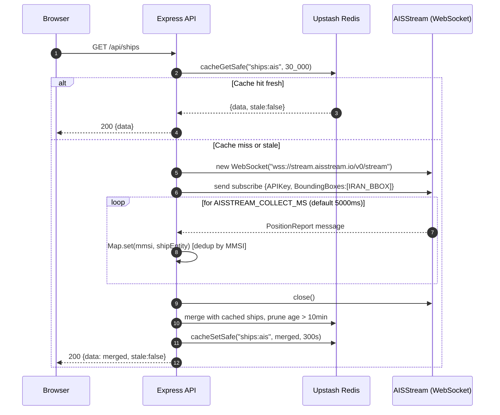
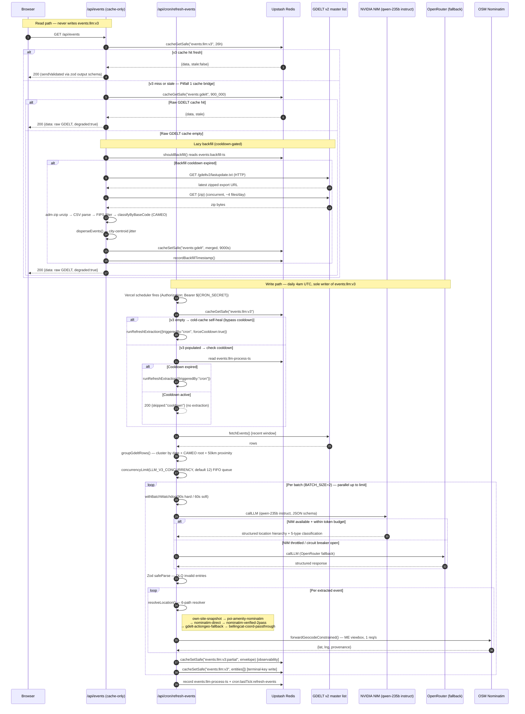
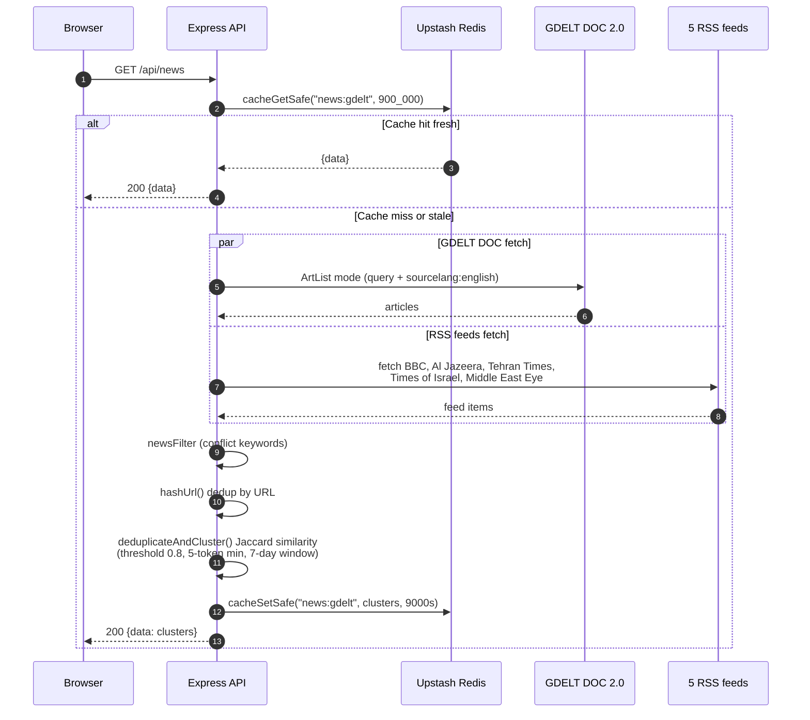
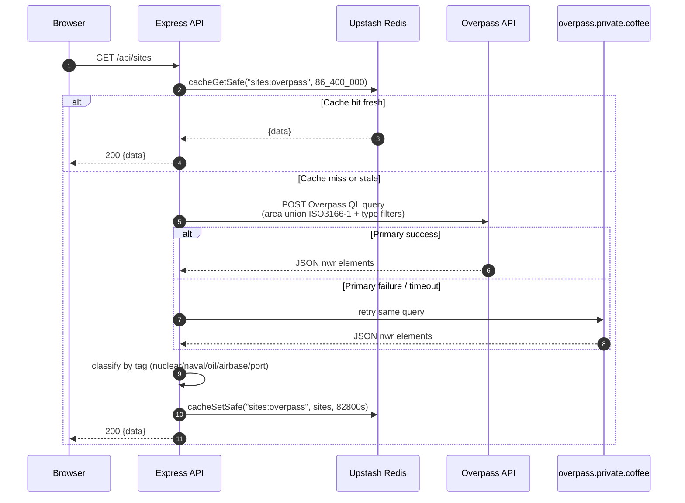
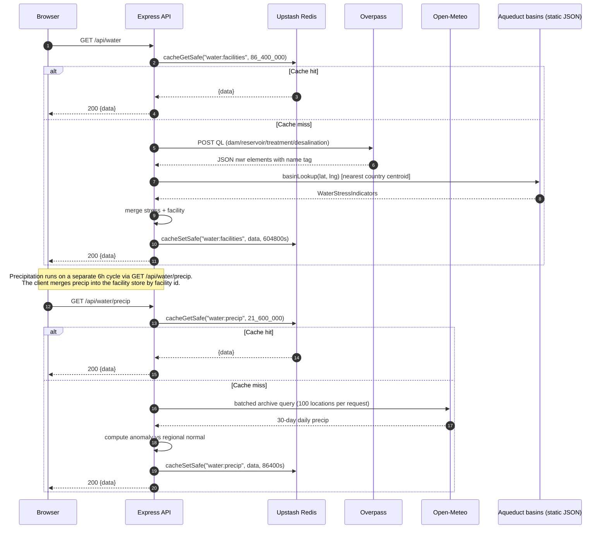
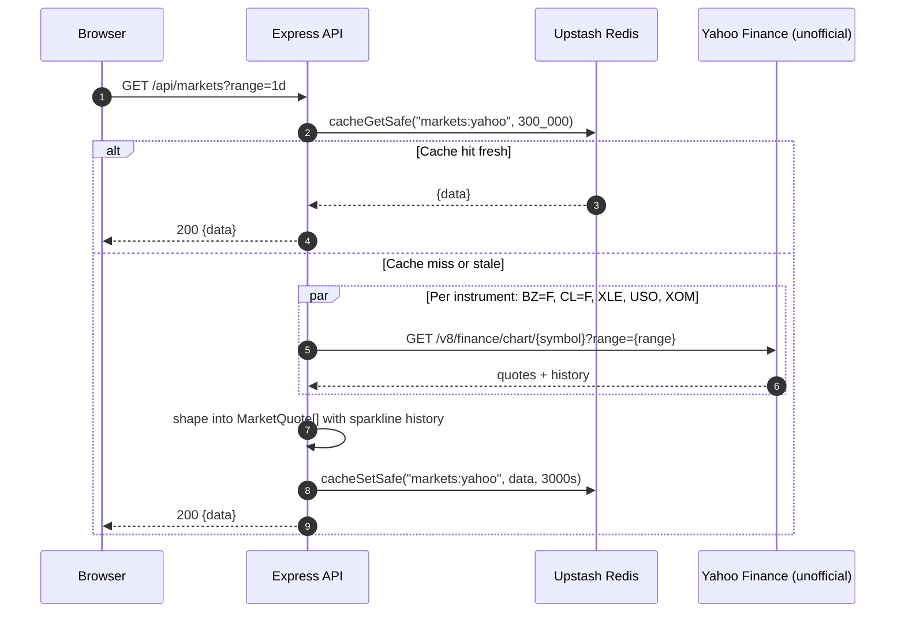
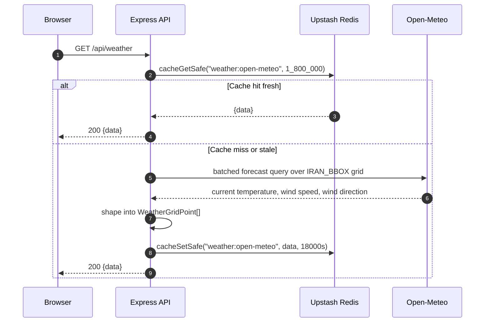
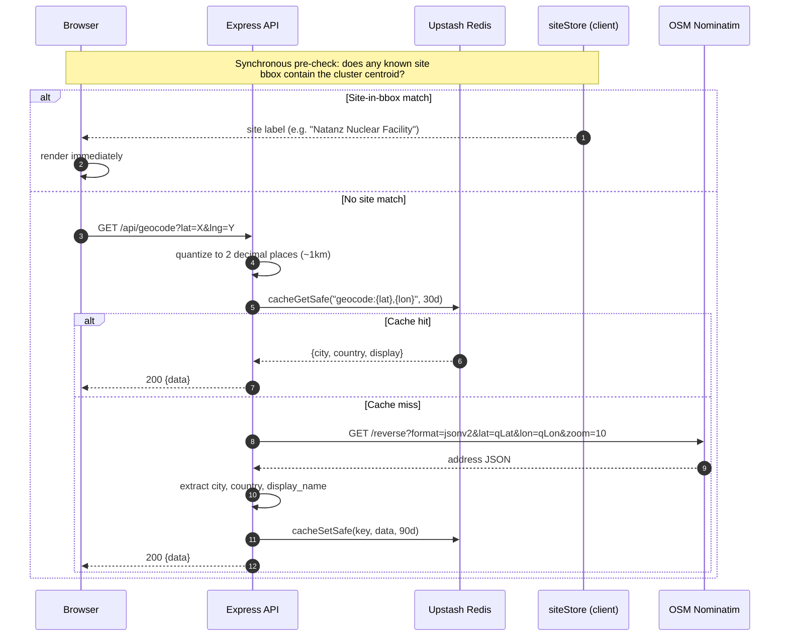

# Data Flows

One Mermaid `sequenceDiagram` per upstream data source, showing the full
round-trip from the browser to the cache to the upstream provider and back.

Every section names its adapter file, route file, Redis cache key, logical
TTL, and polling cadence so you can jump straight into the code. The
cross-cutting concerns section at the bottom covers fallback, rate limiting,
tracing, and CDN cache headers that apply uniformly across sources.

All cached routes use the safe wrappers
[`cacheGetSafe`](../../server/cache/redis.ts) and `cacheSetSafe`, which:

1. Wrap Redis calls in a 2000ms timeout via `Promise.race`
2. Fall through to an in-memory `Map` cache on error or timeout
3. Mark the response `degraded: true` when served from the fallback

Whenever "cache miss or stale" is shown below, the same cache fallback is
invoked implicitly even if an arrow is omitted for readability.

---

## 1. Flights

**Adapters:** [`server/adapters/opensky.ts`](../../server/adapters/opensky.ts),
[`server/adapters/adsb-lol.ts`](../../server/adapters/adsb-lol.ts)
**Route:** [`server/routes/flights.ts`](../../server/routes/flights.ts)
**Cache keys:** `flights:opensky` (10s TTL), `flights:adsblol` (30s TTL)
**Polling cadence:** 5s (OpenSky) or 30s (adsb.lol), via
[`useFlightPolling`](../../src/hooks/useFlightPolling.ts)
**Active source:** user-selectable, persisted to `localStorage`, default
`adsblol` (free, no auth).

```mermaid
sequenceDiagram
    autonumber
    participant Browser
    participant Edge as Vercel Edge
    participant API as Express API
    participant Cache as Upstash Redis
    participant OpenSky
    participant ADSBLol as adsb.lol

    Browser->>Edge: GET /api/flights?source=adsblol
    alt Edge cache fresh (s-maxage=5)
        Edge-->>Browser: 200 {data, stale:false}
    else Edge cache miss
        Edge->>API: forward
        API->>Cache: cacheGetSafe("flights:adsblol", 30_000)
        alt Cache hit fresh
            Cache-->>API: {data, stale:false, lastFresh}
            API-->>Edge: 200 {data}
            Edge-->>Browser: 200 {data}
        else Cache miss or stale
            alt source == adsblol
                API->>ADSBLol: fetchFlights() (free, no auth)
                ADSBLol-->>API: JSON
            else source == opensky
                API->>OpenSky: fetchFlights(IRAN_BBOX) (OAuth client-credentials)
                OpenSky-->>API: state vectors
            end
            API->>Cache: cacheSetSafe(key, data, ttl*10)
            API-->>Edge: 200 {data, stale:false, lastFresh:Date.now()}
            Edge-->>Browser: 200 {data}
        end
    end

    note over Browser: Poll loop runs every 5s via recursive setTimeout.<br/>Tab visibility hidden pauses polling; visible triggers<br/>immediate refetch (useFlightPolling.ts).
```

**Notes**

- The frontend exposes exactly two flight sources today: OpenSky and adsb.lol.
  The old ADS-B Exchange integration was removed in Phase 26.3 because the
  RapidAPI key cost was no longer justified.
- OpenSky requires OAuth client credentials (`OPENSKY_CLIENT_ID` /
  `OPENSKY_CLIENT_SECRET`). When credentials are missing the route returns
  a clean 4xx — no crash.
- Rate-limit events from upstream are surfaced to the client via the
  `rateLimited: true` flag on the response envelope, which the store maps
  to `connectionStatus: 'rate_limited'`.
- Stale data older than 60 seconds is **cleared** by the client rather than
  shown — a flight moving at 250 m/s drifts ~15 km in 60s, which is
  dangerously outdated for positioning.

---

## 2. Ships (AIS)

**Adapter:** [`server/adapters/aisstream.ts`](../../server/adapters/aisstream.ts)
**Route:** [`server/routes/ships.ts`](../../server/routes/ships.ts)
**Cache key:** `ships:ais` (30s logical TTL, 10min stale prune)
**Polling cadence:** 30s, via
[`useShipPolling`](../../src/hooks/useShipPolling.ts)


```mermaid
sequenceDiagram
    autonumber
    participant Browser
    participant API as Express API
    participant Cache as Upstash Redis
    participant AIS as AISStream (WebSocket)

    Browser->>API: GET /api/ships
    API->>Cache: cacheGetSafe("ships:ais", 30_000)
    alt Cache hit fresh
        Cache-->>API: {data, stale:false}
        API-->>Browser: 200 {data}
    else Cache miss or stale
        API->>AIS: new WebSocket("wss://stream.aisstream.io/v0/stream")
        API->>AIS: send subscribe {APIKey, BoundingBoxes:[IRAN_BBOX]}
        loop for AISSTREAM_COLLECT_MS (default 5000ms)
            AIS-->>API: PositionReport message
            API->>API: Map.set(mmsi, shipEntity) [dedup by MMSI]
        end
        API->>AIS: close()
        API->>Cache: merge with cached ships, prune age > 10min
        API->>Cache: cacheSetSafe("ships:ais", merged, 300s)
        API-->>Browser: 200 {data: merged, stale:false}
    end
```

**Notes**

- **On-demand WebSocket connect.** Serverless functions can't hold a
  long-lived socket. Each request opens a socket, subscribes, collects
  messages for ~5 seconds, and closes. AIS is low-frequency enough that
  this is cheap.
- **Merge + prune.** Fresh ships are merged with cached ships by MMSI, and
  anything older than 10 minutes is pruned. This keeps a rolling presence
  window without losing briefly-silent vessels.
- **Stale threshold.** The client considers ships stale after 120 seconds
  — 2× the poll interval — because ships move slowly enough that a
  one-minute outage isn't dangerous the way a flight outage is.

---

## 3. Conflict Events (GDELT v2 + v3 LLM enrichment)

**Adapters:** [`server/adapters/gdelt.ts`](../../server/adapters/gdelt.ts),
[`server/adapters/llm-provider.ts`](../../server/adapters/llm-provider.ts) (thin shim),
[`server/lib/freeClaudeRouter.ts`](../../server/lib/freeClaudeRouter.ts) (NIM + OpenRouter cascade),
[`server/adapters/nominatim.ts`](../../server/adapters/nominatim.ts)
**Pipeline:** [`server/lib/llmEventExtractor.v3.ts`](../../server/lib/llmEventExtractor.v3.ts),
[`server/lib/llmExtractionPipeline.ts`](../../server/lib/llmExtractionPipeline.ts),
[`server/lib/llmResolver.ts`](../../server/lib/llmResolver.ts) (6-path geocoding)
**Read route:** [`server/routes/events.ts`](../../server/routes/events.ts) (cache-only — Phase 27.4.6 anti-pattern #17 forbids fire-and-forget LLM from this path)
**Writer:** [`server/routes/cron-refresh-events.ts`](../../server/routes/cron-refresh-events.ts) (daily 4am UTC, Bearer-gated by Vercel — sole writer of `events:llm:v3`)
**Cache keys:** `events:llm:v3` (terminal, LLM-enriched, sole reader), `events:gdelt` (raw GDELT fallback), `events:llm:v3:partial` (observability-only per-batch incremental writes)
**Cron cooldown key:** `events:llm-process-ts` (15 min cooldown on the cron writer — cold-cache self-heal bypasses when `events:llm:v3` is empty)
**Backfill key:** `events:backfill-ts` (1 hour cooldown on GDELT raw backfill)
**Polling cadence:** 15 min from the browser via
[`useEventPolling`](../../src/hooks/useEventPolling.ts)


```mermaid
sequenceDiagram
    autonumber
    participant Browser
    participant API as /api/events (cache-only)
    participant Cron as /api/cron/refresh-events
    participant Cache as Upstash Redis
    participant GDELT as GDELT v2 master list
    participant NIM as NVIDIA NIM (qwen-235b instruct)
    participant OR as OpenRouter (fallback)
    participant Nominatim as OSM Nominatim

    note over Browser,API: Read path — never writes events:llm:v3
    Browser->>API: GET /api/events
    API->>Cache: cacheGetSafe("events:llm:v3", 26h)
    alt v3 cache hit fresh
        Cache-->>API: {data, stale:false}
        API-->>Browser: 200 (sendValidated via zod output schema)
    else v3 miss or stale — Pitfall 1 cache bridge
        API->>Cache: cacheGetSafe("events:gdelt", 900_000)
        alt Raw GDELT cache hit
            Cache-->>API: {data, stale}
            API-->>Browser: 200 {data: raw GDELT, degraded:true}
        else Raw GDELT cache empty
            note over API,GDELT: Lazy backfill (cooldown-gated)
            API->>Cache: shouldBackfill() reads events:backfill-ts
            alt Backfill cooldown expired
                API->>GDELT: GET /gdeltv2/lastupdate.txt (HTTP)
                GDELT-->>API: latest zipped export URL
                API->>GDELT: GET {zip} (concurrent, ~4 files/day)
                GDELT-->>API: zip bytes
                API->>API: adm-zip unzip → CSV parse → FIPS filter → classifyByBaseCode (CAMEO)
                API->>API: disperseEvents() — city-centroid jitter
                API->>Cache: cacheSetSafe("events:gdelt", merged, 9000s)
                API->>Cache: recordBackfillTimestamp()
            end
            API-->>Browser: 200 {data: raw GDELT, degraded:true}
        end
    end

    note over Cron,OR: Write path — daily 4am UTC, sole writer of events:llm:v3
    Cron->>Cron: Vercel scheduler fires (Authorization: Bearer ${CRON_SECRET})
    Cron->>Cache: cacheGetSafe("events:llm:v3")
    alt v3 empty → cold-cache self-heal (bypass cooldown)
        Cron->>Cron: runRefreshExtraction({triggeredBy:"cron", forceCooldown:true})
    else v3 populated → check cooldown
        Cron->>Cache: read events:llm-process-ts
        alt Cooldown expired
            Cron->>Cron: runRefreshExtraction({triggeredBy:"cron"})
        else Cooldown active
            Cron-->>Cron: 200 {skipped:"cooldown"} (no extraction)
        end
    end
    Cron->>GDELT: fetchEvents() [recent window]
    GDELT-->>Cron: rows
    Cron->>Cron: groupGdeltRows() — cluster by date + CAMEO root + 50km proximity
    Cron->>Cron: concurrencyLimit(LLM_V3_CONCURRENCY, default 12) FIFO queue
    loop Per batch (BATCH_SIZE=2) — parallel up to limit
        Cron->>Cron: withBatchWatchdog(90s hard / 60s soft)
        Cron->>NIM: callLLM (qwen-235b instruct, JSON schema)
        alt NIM available + within token budget
            NIM-->>Cron: structured location hierarchy + 5-type classification
        else NIM throttled / circuit breaker open
            Cron->>OR: callLLM (OpenRouter fallback)
            OR-->>Cron: structured response
        end
        Cron->>Cron: Zod safeParse — DLQ invalid entries
        loop Per extracted event
            Cron->>Cron: resolveLocation() — 6-path resolver
            note right of Cron: own-site-snapshot → poi-amenity-nominatim<br/>→ nominatim-direct → nominatim-verified-2pass<br/>→ gdelt-actiongeo-fallback → bellingcat-coord-passthrough
            Cron->>Nominatim: forwardGeocodeConstrained() — ME viewbox, 1 req/s
            Nominatim-->>Cron: {lat, lng, provenance}
        end
        Cron->>Cache: cacheSetSafe("events:llm:v3:partial", envelope) [observability]
        Cron->>Cache: cacheSetSafe("events:llm:v3", entities[]) [terminal-key write]
    end
    Cron->>Cache: record events:llm-process-ts + cron:lastTick:refresh-events
```

**Notes**

- **Cache-only read path (Phase 27.4.6).** `/api/events` never triggers LLM
  extraction — that was Phase 27.4.6's anti-pattern #17 fix. Vercel Fluid
  Compute kills function bodies once the response is sent, so the old
  fire-and-forget IIFE silently never executed in production. The cron is
  now the sole writer.
- **Pitfall 1 cache bridge (Phase 29-07).** Collapsed from a v3→v2→v1
  fallback chain to single-tier `events:llm:v3` → raw `events:gdelt`. Post
  Phase 29, no writer exists for `events:llm:v2` or the v1 alias; reading
  dead keys was pure latency.
- **Cold-cache self-heal (Phase 27.4.6 D-10).** The cron probes
  `events:llm:v3` BEFORE the cooldown check. Empty cache → bypass cooldown
  automatically. First cron invocation after a fresh deploy always
  populates the cache, regardless of timing relative to the next 4am tick.
- **Operator force-trigger.** `GET /api/cron/refresh-events?force=true`
  with valid Bearer skips the 15-min cooldown. Use cases:
  post-bug-fix re-extraction, post-cache-flush warm-up, testing during
  deploys.
- **Provider cascade (Phase 29 D-01).** `server/lib/freeClaudeRouter.ts`
  tries NVIDIA NIM (`qwen-3-235b-a22b-instruct-2507`) first, then
  OpenRouter as fallback. Cerebras and Groq factories were deleted in
  Phase 29 Plan 03; their adapter source files are gone from the runtime
  path. `isLLMConfigured()` returns true iff `NVIDIA_NIM_API_KEY` OR
  `OPENROUTER_API_KEY` is set.
- **Parallel batches (Phase 27.4.4).** `server/lib/concurrencyLimit.ts`
  FIFO queue. `LLM_V3_CONCURRENCY` env (default 12) drives ~26 req/min
  under NIM's 40/min ceiling. Set to `1` for fully sequential rollback.
  `BATCH_SIZE=2` means each LLM call handles 2 event groups.
- **Watchdog (Phase 27.4.1).** `withBatchWatchdog(batchFn, opts)` wraps
  each per-batch promise with `Promise.race([batchCall, timeoutPromise])`
  - AbortController + generation-counter late-resolve guard. Default 90s
    hard-kill + 60s soft-warn. Timed-out batches DLQ each group with
    `reason: 'timeout_watchdog'`; the loop continues to the next batch —
    timeout on batch N does NOT abort the run.
- **6-path resolver (Phase 27.4 Plan 05).** `server/lib/llmResolver.ts`
  `resolveLocation(hierarchy, ctx)` dispatches in order:
  `own-site-snapshot` → `poi-amenity-nominatim` → `nominatim-direct` →
  `nominatim-verified-2pass` → `gdelt-actiongeo-fallback` →
  `bellingcat-coord-passthrough`. Never returns a coord without
  provenance. 1-req/s Nominatim throttle. Redis cache at
  `geocode:fwd:constrained:<hash>` (30d logical TTL).
- **Terminal-key writes (Phase 28.2.6 + ADR-0009).** Each batch writes
  the full ConflictEventEntity[] to `events:llm:v3` as a terminal-shape
  array. The observability envelope (`{events, progress, complete}`)
  writes to `events:llm:v3:partial` only — readers never see envelope
  shape on the terminal key. This split was hardened after the v2 incident
  where a per-batch durability flush violated the `events.map is not a
function` consumer contract (see ADR-0009).
- **Token budget (Phase 27.4).** Per-provider daily caps tracked in
  `llm:tokens:{provider}:YYYY-MM-DD` (48h TTL): NIM 1M/day, OpenRouter
  per-key. Soft 0.8 + hard 0.95 caps short-circuit the provider when
  exceeded.
- **HTTP GDELT endpoint.** GDELT's master list is served over HTTP because
  their TLS certificate was problematic — the `GDELT_LASTUPDATE_URL`
  constant is explicitly `http://`. Known quirk, not a bug.
- **ZIP decompression.** GDELT ships zipped CSVs. Node's `zlib` only
  handles gzip/deflate; the adapter depends on `adm-zip`.
- **CAMEO classification retained.** `classifyByBaseCode` in `gdelt.ts`
  maps raw CAMEO EventBaseCodes into the 5-type taxonomy as a fallback
  for when LLM enrichment is unavailable.
- **City-centroid dispersion retained.** `server/lib/dispersion.ts` runs
  on raw GDELT events when serving from the Pitfall 1 bridge. LLM-enriched
  events get per-event `precision` (`exact` | `neighborhood` | `city` |
  `region`) and Nominatim coordinates instead, so dispersion is unnecessary
  for the enriched terminal cache.
- **LLM-optional architecture (Phase 29 D-04).** When `isLLMConfigured()`
  returns false (both NIM + OpenRouter keys absent), `/api/events` serves
  raw GDELT through the simplified bridge — the "map never goes blank"
  invariant. Asserted by
  [`server/__tests__/routes/llm-optional.test.ts`](../../server/__tests__/routes/llm-optional.test.ts).
- **Validated response.** The route runs its payload through
  `sendValidated(res, eventsResponseSchema, payload)` before sending so
  any drift between implementation and `server/openapi.yaml` is caught
  immediately in dev and logged as a warning in production.

See [ADR-0011](../adr/0011-v3-llm-pipeline-architecture.md) for the v3
design rationale; [ADR-0010](../adr/0010-v1-5-llm-pipeline-narrowing-and-deletion.md)
for what was deleted in Phase 29.

---

## 4. News (GDELT DOC + RSS)

**Adapters:**
[`server/adapters/gdelt-doc.ts`](../../server/adapters/gdelt-doc.ts),
[`server/adapters/rss.ts`](../../server/adapters/rss.ts)
**Route:** [`server/routes/news.ts`](../../server/routes/news.ts)
**Cache key:** `news:gdelt` (15min logical TTL, 2.5h hard TTL)
**Polling cadence:** 15 min, via
[`useNewsPolling`](../../src/hooks/useNewsPolling.ts)


```mermaid
sequenceDiagram
    autonumber
    participant Browser
    participant API as Express API
    participant Cache as Upstash Redis
    participant GDELTDoc as GDELT DOC 2.0
    participant RSS as 5 RSS feeds

    Browser->>API: GET /api/news
    API->>Cache: cacheGetSafe("news:gdelt", 900_000)
    alt Cache hit fresh
        Cache-->>API: {data}
        API-->>Browser: 200 {data}
    else Cache miss or stale
        par GDELT DOC fetch
            API->>GDELTDoc: ArtList mode (query + sourcelang:english)
            GDELTDoc-->>API: articles
        and RSS feeds fetch
            API->>RSS: fetch BBC, Al Jazeera, Tehran Times,<br/>Times of Israel, Middle East Eye
            RSS-->>API: feed items
        end
        API->>API: newsFilter (conflict keywords)
        API->>API: hashUrl() dedup by URL
        API->>API: deduplicateAndCluster() Jaccard similarity<br/>(threshold 0.8, 5-token min, 7-day window)
        API->>Cache: cacheSetSafe("news:gdelt", clusters, 9000s)
        API-->>Browser: 200 {data: clusters}
    end
```

**Notes**

- **Dual source.** GDELT DOC gives global English-language coverage via its
  `ArtList` mode; the five RSS feeds provide regional signal that GDELT
  sometimes misses or lags on. Both are merged before clustering.
- **Clustering.** Duplicates are removed by URL hash, then near-duplicates
  are merged via Jaccard similarity over tokenized titles (threshold 0.8,
  5-token minimum to be eligible for fuzzy match, 7-day sliding window).
  See [`server/lib/newsClustering.ts`](../../server/lib/newsClustering.ts).
- **`sourceCountry`.** Each article carries a `sourceCountry` tag populated
  from GDELT's `sourcecountry` field or the RSS feed's hardcoded country
  config. This is used by the search language (`country:Qatar`) and by
  the "regional coverage" pill in the detail panel.

---

## 5. Key Sites (Overpass / OSM)

**Adapter:** [`server/adapters/overpass.ts`](../../server/adapters/overpass.ts)
**Route:** [`server/routes/sites.ts`](../../server/routes/sites.ts)
**Cache key:** `sites:overpass` (24h logical TTL, 23h hard TTL)
**Polling cadence:** one-time fetch on mount, via
[`useSiteFetch`](../../src/hooks/useSiteFetch.ts)


```mermaid
sequenceDiagram
    autonumber
    participant Browser
    participant API as Express API
    participant Cache as Upstash Redis
    participant Overpass as Overpass API
    participant Mirror as overpass.private.coffee

    Browser->>API: GET /api/sites
    API->>Cache: cacheGetSafe("sites:overpass", 86_400_000)
    alt Cache hit fresh
        Cache-->>API: {data}
        API-->>Browser: 200 {data}
    else Cache miss or stale
        API->>Overpass: POST Overpass QL query<br/>(area union ISO3166-1 + type filters)
        alt Primary success
            Overpass-->>API: JSON nwr elements
        else Primary failure / timeout
            API->>Mirror: retry same query
            Mirror-->>API: JSON nwr elements
        end
        API->>API: classify by tag (nuclear/naval/oil/airbase/port)
        API->>Cache: cacheSetSafe("sites:overpass", sites, 82800s)
        API-->>Browser: 200 {data}
    end
```

**Notes**

- **Static infrastructure.** Sites are static OSM features (nuclear plants,
  naval bases, oil refineries, airbases, ports). A one-time client-side
  fetch on mount is enough; polling would be wasted work.
- **Mirror fallback.** The Overpass primary API is flaky. On failure we
  retry against `overpass.private.coffee`, a community mirror. If both
  fail the route returns a `stale:true` empty array so the rest of the
  map keeps working.
- **Desalination removed.** Desalination plants used to be a `SiteType`.
  They moved to the Water layer in Phase 26 and are no longer returned by
  this endpoint.
- **Attack status.** The client cross-references each site with nearby
  recent GDELT events (within 5 km / 24 h) via
  [`src/lib/attackStatus.ts`](../../src/lib/attackStatus.ts) to flip its
  icon color to "attacked" (orange). This is pure client-side derivation
  — no server round-trip.

---

## 6. Water (Overpass + Open-Meteo Precipitation)

**Adapters:**
[`server/adapters/overpass-water.ts`](../../server/adapters/overpass-water.ts),
[`server/adapters/open-meteo-precip.ts`](../../server/adapters/open-meteo-precip.ts)
**Route:** [`server/routes/water.ts`](../../server/routes/water.ts)
**Cache keys:** `water:facilities` (24h), `water:precip` (6h)
**Polling cadence:** facilities fetched once on mount
([`useWaterFetch`](../../src/hooks/useWaterFetch.ts)); precipitation
polled every 6h
([`useWaterPrecipPolling`](../../src/hooks/useWaterPrecipPolling.ts)).


```mermaid
sequenceDiagram
    autonumber
    participant Browser
    participant API as Express API
    participant Cache as Upstash Redis
    participant Overpass
    participant OpenMeteo as Open-Meteo
    participant WRI as Aqueduct basins (static JSON)

    Browser->>API: GET /api/water
    API->>Cache: cacheGetSafe("water:facilities", 86_400_000)
    alt Cache hit
        Cache-->>API: {data}
        API-->>Browser: 200 {data}
    else Cache miss
        API->>Overpass: POST QL (dam/reservoir/treatment/desalination)
        Overpass-->>API: JSON nwr elements with name tag
        API->>WRI: basinLookup(lat, lng) [nearest country centroid]
        WRI-->>API: WaterStressIndicators
        API->>API: merge stress + facility
        API->>Cache: cacheSetSafe("water:facilities", data, 604800s)
        API-->>Browser: 200 {data}
    end

    note over Browser,API: Precipitation runs on a separate 6h cycle via GET /api/water/precip.<br/>The client merges precip into the facility store by facility id.

    Browser->>API: GET /api/water/precip
    API->>Cache: cacheGetSafe("water:precip", 21_600_000)
    alt Cache hit
        Cache-->>API: {data}
        API-->>Browser: 200 {data}
    else Cache miss
        API->>OpenMeteo: batched archive query (100 locations per request)
        OpenMeteo-->>API: 30-day daily precip
        API->>API: compute anomaly vs regional normal
        API->>Cache: cacheSetSafe("water:precip", data, 86400s)
        API-->>Browser: 200 {data}
    end
```

**Notes**

- **Two-source merge.** Long-term stress (WRI Aqueduct 4.0 basin-level
  `bws_score`) is combined with rolling 30-day precipitation anomaly
  from Open-Meteo. See
  [`server/lib/basinLookup.ts`](../../server/lib/basinLookup.ts) and
  [`src/lib/waterStress.ts`](../../src/lib/waterStress.ts) for the scoring.
- **Batching.** Open-Meteo's archive API lets us request 100 locations
  per call. With ~4300 named facilities this is ~43 concurrent requests.
- **Core/extended country split.** Overpass query partitions 29 Middle
  East countries into a 12-country "core" batch (must succeed) and an
  11-country "extended" batch (best-effort). Partial data beats no data.
- **Desalination lives here.** Originally a `SiteType`, desalination
  moved to Water in Phase 26 — see the site diagram above.
- **Known limitation:** Basin assignment uses nearest-country-centroid
  matching because WRI Aqueduct basins don't ship with lat/lng centroids.
  This is coarse. A spatial index over basin polygons would be more
  accurate but the ~50 MB polygon file doesn't fit in a serverless bundle.
  Tracked for a future performance phase.

---

## 7. Markets (Yahoo Finance)

**Adapter:**
[`server/adapters/yahoo-finance.ts`](../../server/adapters/yahoo-finance.ts)
**Route:** [`server/routes/markets.ts`](../../server/routes/markets.ts)
**Cache key:** `markets:yahoo` (5min logical TTL, 50min hard TTL)
**Polling cadence:** 5 min, via
[`useMarketPolling`](../../src/hooks/useMarketPolling.ts)


```mermaid
sequenceDiagram
    autonumber
    participant Browser
    participant API as Express API
    participant Cache as Upstash Redis
    participant Yahoo as Yahoo Finance (unofficial)

    Browser->>API: GET /api/markets?range=1d
    API->>Cache: cacheGetSafe("markets:yahoo", 300_000)
    alt Cache hit fresh
        Cache-->>API: {data}
        API-->>Browser: 200 {data}
    else Cache miss or stale
        par Per instrument: BZ=F, CL=F, XLE, USO, XOM
            API->>Yahoo: GET /v8/finance/chart/{symbol}?range={range}
            Yahoo-->>API: quotes + history
        end
        API->>API: shape into MarketQuote[] with sparkline history
        API->>Cache: cacheSetSafe("markets:yahoo", data, 3000s)
        API-->>Browser: 200 {data}
    end
```

**Notes**

- **Unofficial API.** Yahoo's `v8/finance/chart` endpoint is not
  officially supported; they've broken it before and will again. We treat
  a 4xx from Yahoo as a soft failure and return `stale:true` with the
  last cached payload.
- **5 instruments.** Brent (BZ=F), WTI (CL=F), XLE energy sector ETF,
  USO oil ETF, XOM Exxon. Each has a sparkline history for the selected
  range (1d, 5d, 1mo).
- **Not geolocated.** Markets is the only source that doesn't produce
  map entities — it drives the MarketsSlot overlay panel only.

---

## 8. Weather (Open-Meteo)

**Adapter:**
[`server/adapters/open-meteo.ts`](../../server/adapters/open-meteo.ts)
**Route:** [`server/routes/weather.ts`](../../server/routes/weather.ts)
**Cache key:** `weather:open-meteo` (30min logical TTL, 5h hard TTL)
**Polling cadence:** 30 min, via
[`useWeatherPolling`](../../src/hooks/useWeatherPolling.ts)


```mermaid
sequenceDiagram
    autonumber
    participant Browser
    participant API as Express API
    participant Cache as Upstash Redis
    participant OpenMeteo as Open-Meteo

    Browser->>API: GET /api/weather
    API->>Cache: cacheGetSafe("weather:open-meteo", 1_800_000)
    alt Cache hit fresh
        Cache-->>API: {data}
        API-->>Browser: 200 {data}
    else Cache miss or stale
        API->>OpenMeteo: batched forecast query over IRAN_BBOX grid
        OpenMeteo-->>API: current temperature, wind speed, wind direction
        API->>API: shape into WeatherGridPoint[]
        API->>Cache: cacheSetSafe("weather:open-meteo", data, 18000s)
        API-->>Browser: 200 {data}
    end
```

**Notes**

- **Free, no auth.** Open-Meteo is one of the few genuinely free weather
  APIs with sensible quotas. It powers both the wind-barb overlay and
  the bilinear-interpolated temperature heatmap draped onto terrain.
- **Grid fetching.** The grid is a coarse ~1° spacing across `IRAN_BBOX`
  — fine enough to show the Persian Gulf being consistently hotter than
  the Iranian Plateau without ballooning the payload.

---

## 9. Reverse Geocode (Nominatim)

**Adapter:**
[`server/adapters/nominatim.ts`](../../server/adapters/nominatim.ts)
**Route:** [`server/routes/geocode.ts`](../../server/routes/geocode.ts)
**Cache key:** `geocode:{lat},{lon}` (30-day logical TTL, 90-day hard TTL)
**Invoked by:** Threat cluster detail panel, on click, via
[`useGeoContext`](../../src/hooks/useGeoContext.ts).


```mermaid
sequenceDiagram
    autonumber
    participant Browser
    participant API as Express API
    participant Cache as Upstash Redis
    participant Sites as siteStore (client)
    participant Nominatim as OSM Nominatim

    note over Browser,Sites: Synchronous pre-check: does any known site<br/>bbox contain the cluster centroid?
    alt Site-in-bbox match
        Sites-->>Browser: site label (e.g. "Natanz Nuclear Facility")
        Browser->>Browser: render immediately
    else No site match
        Browser->>API: GET /api/geocode?lat=X&lng=Y
        API->>API: quantize to 2 decimal places (~1km)
        API->>Cache: cacheGetSafe("geocode:{lat},{lon}", 30d)
        alt Cache hit
            Cache-->>API: {city, country, display}
            API-->>Browser: 200 {data}
        else Cache miss
            API->>Nominatim: GET /reverse?format=jsonv2&lat=qLat&lon=qLon&zoom=10
            Nominatim-->>API: address JSON
            API->>API: extract city, country, display_name
            API->>Cache: cacheSetSafe(key, data, 90d)
            API-->>Browser: 200 {data}
        end
    end
```

**Notes**

- **Two-tier lookup.** The client first checks its in-memory `siteStore`
  for a site whose bbox contains the click point — this is free and
  instant. Only if no site matches do we hit the server.
- **Quantization.** Coordinates are rounded to 2 decimal places before
  the Redis key is computed, so two clicks within ~1 km share a cache
  entry. This is the single most effective thing about this adapter:
  Nominatim has a hard "1 request per second" etiquette policy and
  quantization is what keeps us compliant without a client-side rate
  limiter.
- **User-Agent header.** Nominatim requires a descriptive User-Agent;
  ours is `IranConflictMonitor/1.0 (personal project)`. This is a
  policy, not a mandate, but it's the respectful thing to do.

---

## Cross-cutting concerns

These apply to every cached route above.

### Cache fallback

All cached routes use `cacheGetSafe` / `cacheSetSafe` from
[`server/cache/redis.ts`](../../server/cache/redis.ts). These:

- Wrap every Redis operation in a 2000ms timeout (`Promise.race`). This
  bounds the worst case when Upstash is misconfigured or the token is
  invalid — without the timeout, the client's internal retry loop could
  block the request thread indefinitely.
- Fall through to a process-local in-memory `Map` cache on timeout or
  error, returning `degraded: true` on the response envelope.
- Are covered by a chaos test
  ([`server/__tests__/resilience/redis-death.test.ts`](../../server/__tests__/resilience/redis-death.test.ts))
  that mocks every `@upstash/redis` call to throw, boots the real Express
  app via supertest, and asserts all 8 cached routes + `/health` return
  2xx degraded or 5xx gracefully — never a 500 surfacing an unhandled
  exception.

### Rate limiting

Per-endpoint rate limiters live in
[`server/middleware/rateLimit.ts`](../../server/middleware/rateLimit.ts).
Each route is wired up in
[`server/index.ts`](../../server/index.ts):

```ts
app.use('/api/flights', rateLimiters.flights, cacheControl(5, 25), flightsRouter);
app.use('/api/ships', rateLimiters.ships, cacheControl(10, 20), shipsRouter);
// ...
```

Limits are IP-scoped and sliding-window. The numbers are tuned by
endpoint — flights is chattier than events or sites — and documented in
[`server/openapi.yaml`](../../server/openapi.yaml).

### Request tracing

Every request gets a request ID from the
[`pino-http`](../../server/index.ts#L64) genReqId hook:

```ts
genReqId: (req) => (req.headers['x-request-id'] as string) ?? randomUUID(),
```

If the client sends `X-Request-ID`, it's preserved (useful when chaining
through the edge). Otherwise a UUID is generated. The ID is written back
as `X-Request-ID` on the response, and every log line from that request
is tagged with it by the pino child logger. Grepping logs for a
request ID gives you the full trace.

### CDN cache headers

The [`cacheControl(sMaxAge, staleWhileRevalidate)`](../../server/middleware/cacheControl.ts)
middleware emits:

```
Cache-Control: public, max-age=0, s-maxage=<N>, stale-while-revalidate=<M>
```

`max-age=0` means browsers don't cache, but Vercel's CDN does (for
`s-maxage` seconds), and can serve stale while re-validating for
another `stale-while-revalidate` seconds. This is how the same backend
can serve a burst of 100 requests/second without making 100 Redis
calls.

Per-route cache header table (from `server/index.ts`):

| Route          | s-maxage (s) | stale-while-revalidate (s) |
| -------------- | ------------ | -------------------------- |
| `/api/flights` | 5            | 25                         |
| `/api/ships`   | 10           | 20                         |
| `/api/events`  | 300          | 600                        |
| `/api/sources` | 60           | 60                         |
| `/api/sites`   | 3600         | 82800                      |
| `/api/news`    | 300          | 600                        |
| `/api/markets` | 30           | 30                         |
| `/api/weather` | 600          | 1200                       |
| `/api/geocode` | 86400        | 86400                      |
| `/api/water`   | 3600         | 82800                      |
| `/health`      | no-store     | —                          |
| `/api/cron/*`  | no-store     | —                          |

### Response envelope

Every cached route returns the shape:

```ts
interface CacheResponse<T> {
  data: T;
  stale: boolean; // past logical TTL but within hard TTL
  lastFresh: number; // unix ms of last successful upstream fetch
  degraded?: boolean; // serving from in-memory fallback
  rateLimited?: boolean; // upstream rate-limited us (flights only)
}
```

See
[`server/types.ts`](../../server/types.ts) for the canonical definition
and
[`ontology/types.md`](./ontology/types.md#cacheresponset) for more.
