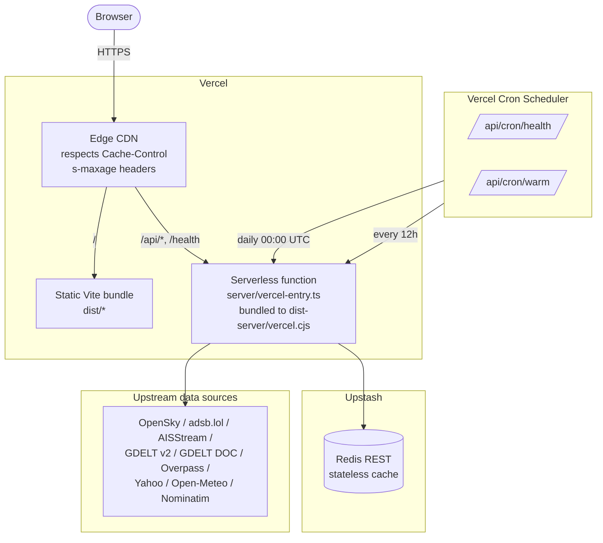
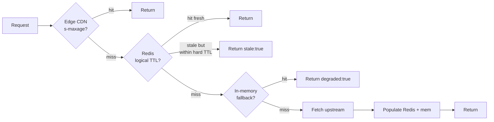

# Deployment Architecture

The project deploys to Vercel as a hybrid: the Vite SPA is served as
static assets from the edge CDN, and every `/api/*` and `/health`
request is routed to a single serverless function. There's no long-
running server, no Docker, no Kubernetes — just static files and
per-request lambdas.

## Topology



- **Single serverless function.** `vercel.json` rewrites every
  `/api/*`, `/api/cron/*`, and `/health` path to
  `/api/vercel-entry`. This is a thin wrapper that calls the
  `createApp()` factory from
  [`server/index.ts`](../../server/index.ts) and hands the resulting
  Express app to `serverless-http`. One function, all routes.
- **Edge CDN first.** Every cached route emits a `Cache-Control`
  header with `s-maxage` and `stale-while-revalidate`, so a burst of
  identical requests never reaches the function. The lambda is a
  cache miss handler.
- **SPA fallback.** The last rewrite rule sends any non-matching path
  to `/index.html`, which lets React Router (if we had one — we
  don't) or vanity URLs work without per-route config.

## Build pipeline

```bash
npm run build
```

Runs three steps in sequence:

1. **`vite build`** — bundles the React app into `dist/` (hashed JS,
   CSS, assets).
2. **`tsup server/vercel-entry.ts`** — bundles the server entrypoint
   and every imported file (including adapters, routes, middleware)
   into a single CommonJS file at `dist-server/vercel.cjs`. CommonJS
   because Vercel's serverless runtime still expects it for the
   legacy Node API, which is what `@vercel/node` uses.
3. **`tsc -b`** — typechecks the server and app projects end-to-end.
   Fails the build on any type error; there is no `any` escape hatch
   tolerated (strict mode + `noUncheckedIndexedAccess` on the server).

Output:

- `dist/` — Vite-built SPA, uploaded as static assets.
- `dist-server/vercel.cjs` — single-file serverless bundle.
- `api/vercel-entry.js` — tiny stub that re-exports from
  `dist-server/vercel.cjs` for the Vercel runtime to discover.

## Cache strategy

Per-endpoint cache headers are set by the
[`cacheControl(sMaxAge, staleWhileRevalidate)`](../../server/middleware/cacheControl.ts)
middleware. The tuple is chosen per route in
[`server/index.ts`](../../server/index.ts):

| Route          | `s-maxage` | `stale-while-revalidate` | Reason                                 |
| -------------- | ---------- | ------------------------ | -------------------------------------- |
| `/api/flights` | 5s         | 25s                      | Match client poll cadence              |
| `/api/ships`   | 10s        | 20s                      | Ships move slower than flights         |
| `/api/events`  | 5min       | 10min                    | GDELT updates every 15 minutes         |
| `/api/sources` | 1min       | 1min                     | Static per-source config               |
| `/api/sites`   | 1h         | 23h                      | OSM infrastructure is near-static      |
| `/api/news`    | 5min       | 10min                    | Matches GDELT DOC update frequency     |
| `/api/markets` | 30s        | 30s                      | Half the client poll interval          |
| `/api/weather` | 10min      | 20min                    | Open-Meteo hourly grid                 |
| `/api/geocode` | 24h        | 24h                      | Address lookups are effectively static |
| `/api/water`   | 1h         | 23h                      | Facility list is near-static           |
| `/health`      | no-store   | —                        | Must reflect current state             |
| `/api/cron/*`  | no-store   | —                        | Cron results are single-use            |

The two-tier scheme — CDN `s-maxage` in front of Redis logical TTL in
front of Redis hard TTL in front of in-memory fallback — gives us
four layers of cache before a cache miss can bubble up to an upstream
call:



## Cron jobs

Scheduled from `vercel.json`:

```json
{
  "crons": [
    { "path": "/api/cron/health", "schedule": "0 0 * * *" },
    { "path": "/api/cron/warm", "schedule": "0 */12 * * *" }
  ]
}
```

- **`/api/cron/health`** (daily at 00:00 UTC) — pings `/health`
  internally, logs the degraded-vs-healthy state of every upstream.
  Surfaces silent upstream outages before a user notices.
- **`/api/cron/warm`** (every 12 hours) — pre-fetches the GDELT events
  backfill, water facilities, and key sites so a cold lambda doesn't
  block a user-facing request on a multi-second Overpass query.
  This is especially important because Vercel lambdas get cold
  quickly on low-traffic periods.

Both cron endpoints are gated by a `user-agent: vercel-cron` check in
production so they can't be hit from the public internet. In dev
they're wide open, which is fine because nothing's listening.

## Environment variables

The authoritative env schema is the Zod schema in
[`server/config.ts`](../../server/config.ts). The `.env.example` file
is a snapshot of that schema and is drift-checked in CI by
`scripts/check-env-example.ts`.

**Required** (the app crashes at startup if these are missing in
production):

- `UPSTASH_REDIS_REST_URL` — Upstash REST endpoint URL.
- `UPSTASH_REDIS_REST_TOKEN` — Upstash REST API token.

**Optional** (gracefully degrade if missing — empty string means
unconfigured, and routes that depend on them return a clean 4xx):

- `OPENSKY_CLIENT_ID` / `OPENSKY_CLIENT_SECRET` — OAuth for the
  OpenSky flight source. Without them, adsb.lol remains available.
- `AISSTREAM_API_KEY` — required for `/api/ships`. Without it the
  route returns an empty array.
- `ACLED_EMAIL` / `ACLED_PASSWORD` — historical; ACLED adapter is
  preserved but not active.

**Tuning parameters** (optional, have sane defaults):

- `EVENT_CONFIDENCE_THRESHOLD`, `EVENT_MIN_SOURCES`,
  `EVENT_CENTROID_PENALTY`, `EVENT_EXCLUDED_CAMEO`,
  `BELLINGCAT_CORROBORATION_BOOST`, `NEWS_RELEVANCE_THRESHOLD` —
  GDELT event scoring knobs. See `server/config.ts` for defaults and
  acceptable ranges.

**Test mode.** When `NODE_ENV=test` or `VITEST=true`, the schema
parser injects safe defaults for the Upstash vars so unit tests can
import server modules without hitting a real Redis. Production still
fails loud on missing required vars.

## Failover posture

Three layers of resilience, documented in order of most-likely to
least-likely failure:

1. **In-memory fallback when Upstash is unreachable.**
   `cacheGetSafe` / `cacheSetSafe` wrap every Redis op in a 2000ms
   `Promise.race` timeout and fall through to a process-local `Map`
   on error or timeout. The response envelope carries
   `degraded: true` so the client can surface a "cached" indicator.
   Validated by the Phase 26.3 chaos test
   ([`server/__tests__/resilience/redis-death.test.ts`](../../server/__tests__/resilience/redis-death.test.ts)).

2. **Stale-while-revalidate via CDN.** When Redis is healthy but an
   upstream is slow, the CDN's `stale-while-revalidate` window lets
   Vercel return the last known response immediately while triggering
   a background refresh. Worst case: users see data that's `s-maxage
   - swr` seconds old.

3. **`/health` degraded state.** The `/health` endpoint inspects the
   last-seen timestamps of every cache key and returns a
   machine-readable JSON describing which upstreams are healthy,
   stale, or degraded. The cron health check logs this daily so
   monitoring can alert on it.

The philosophy is "degrade visibly, never crash." A 500 from this
service means a bug, not an upstream outage.

## See also

- [`system-context.md`](./system-context.md) — altitude above this.
- [`data-flows.md`](./data-flows.md) — altitude below this, showing
  per-source cache behavior.
- [`../../server/openapi.yaml`](../../server/openapi.yaml) — the
  canonical API contract, including rate-limit ceilings and response
  envelopes.
