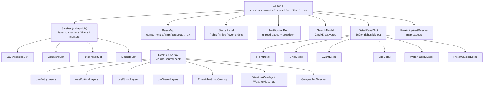
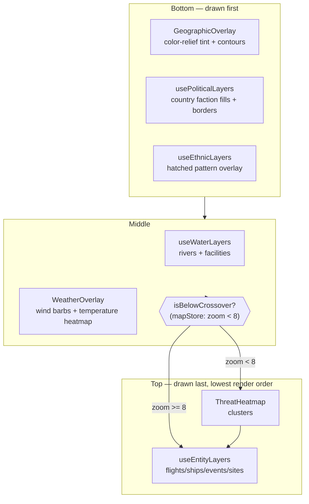
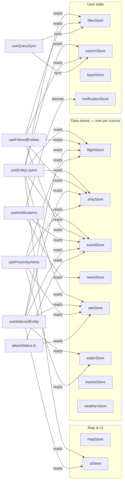

# Frontend Architecture

The frontend is a single-page React application using Vite, TypeScript,
MapLibre for the base map, deck.gl for vector overlays, and Zustand for
state. There's no router and no global Redux-style store — each slice of
state lives in its own Zustand store, and components subscribe with
selector functions to minimize re-renders.

This page has four sections:

1. [Component layout](#component-layout) — what's rendered where.
2. [Map layer stacking](#map-layer-stacking) — deck.gl render order.
3. [Zustand store graph](#zustand-store-dependency-graph) — who reads whom.
4. [Polling hooks](#polling-hooks) — cadences and ownership.

## Component layout

`AppShell` is the root layout. It mounts `BaseMap` plus every overlay
slot, wires the polling hooks, and hosts the search modal. Everything
else hangs off these four or five components.



One-sentence descriptions for the major components:

- **AppShell** — root layout, wires all polling hooks
  (`useFlightPolling`, `useShipPolling`, `useEventPolling`,
  `useNewsPolling`, `useMarketPolling`, `useWeatherPolling`,
  `useSiteFetch`, `useWaterFetch`, `useWaterPrecipPolling`) so the data
  lifecycle is bound to the UI root.
- **BaseMap** — the MapLibre map with terrain, style customization,
  navigation control, and the `DeckGLOverlay` bridge.
- **DeckGLOverlay** — thin wrapper that calls `useControl` from
  `react-maplibre` to register a `MapboxOverlay` (deck.gl)
  as a map control. This is the magic that lets deck.gl layers project
  correctly alongside MapLibre sources.
- **Sidebar + slots** — collapsible left sidebar with four sections
  (counters, layers, filters, markets). Each slot is its own component.
- **StatusPanel** — HUD in the upper-right showing live flights/ships/
  events counts and connection dots (green/yellow/red).
- **NotificationBell** — bell icon with unread badge; dropdown shows
  scored `NotificationItem` cards derived from matched event + news
  pairs.
- **SearchModal** — Cmd+K activated modal with autocomplete and tag
  language (~25 prefixes like `type:`, `site:`, `near:`).
- **DetailPanelSlot** — 360px right-side slide-out that renders a
  per-entity-type detail component. Supports a navigation stack
  (push/pop) for drilling from clusters into events into flights and
  back.
- **ProximityAlertOverlay** — transient warning badges on the map for
  flights/ships within 50 km of key sites.

## Map layer stacking

The deck.gl layer order matters: later layers render on top. We feed
`DeckGLOverlay` a single concatenated layer array every render, with
the exact order computed by a `useMemo` that reads the various hooks
below. The stacking order is:



- **Zoom crossover.** The `mapStore.isBelowCrossover` boolean (from
  [`src/stores/mapStore.ts`](../../src/stores/mapStore.ts)) flips when
  zoom crosses the `ZOOM_CROSSOVER = 8` threshold. Below zoom 8 the
  threat clusters render on top (regional view, cluster-first); above
  zoom 8 entity markers render on top so individual events and flights
  become clickable.
- **Why a boolean, not the raw zoom.** Rendering on every zoom tick
  would force the entire layer array to rebuild at 60fps. Tracking a
  single boolean that changes only at the crossover point means the
  `useMemo` that builds the layer array only re-runs when the ordering
  actually needs to change.
- **Entity toggles are independent from visualization layer toggles.**
  The flights/ships/events/sites toggles in `uiStore` gate entity
  visibility, while the `layerStore` Set controls the
  geographic/political/ethnic/water/weather/threat overlays.
  `useEntityLayers` and the visualization hooks never cross-reference
  each other — they just both return arrays that `BaseMap` concatenates
  in the right order.

## Zustand store dependency graph

Each store owns one slice of state. Cross-store derivation happens in
hooks (never inside the stores themselves), which keeps the stores
pure and testable.



- **No store imports another store.** This is a strict rule — stores
  are leaves. All fan-in happens in hooks, which makes the dependency
  graph explicit and keeps tests isolated.
- **Zustand selectors minimize re-renders.** Every `useXStore(s => ...)`
  call is a selector subscription. When the store updates, Zustand
  only re-renders the components whose selector output actually
  changed (shallow equality by default).
- **notificationStore is a derived store.** It gets rebuilt by
  `useNotifications` whenever `eventStore` or `newsStore` update, via
  `newsMatching.ts` (temporal + geographic + keyword overlap) and
  `severity.ts` (scoring). See
  [`ontology/algorithms.md`](./ontology/algorithms.md) for the scoring
  details.
- **uiStore hosts the navigation stack.** The detail panel supports a
  back-button via `uiStore.navigationStack: PanelView[]`, with
  `pushView`/`popView`/`clearStack` actions and a `slideDirection`
  hint for CSS animations. See
  [`ontology/state-machines.md`](./ontology/state-machines.md#detail-panel-navigation-stack)
  for the full state machine.

## Polling hooks

Every hook here uses the same recursive `setTimeout` pattern with tab
visibility awareness. `setInterval` is deliberately avoided — it can
overlap async fetches if the upstream is slow, and it keeps firing when
the tab is backgrounded (wasteful).

The pattern, distilled from
[`useFlightPolling.ts`](../../src/hooks/useFlightPolling.ts):

```ts
const schedulePoll = () => {
  timeoutRef.current = setTimeout(async () => {
    await fetchData();
    checkStaleness();
    schedulePoll(); // recurse
  }, POLL_INTERVAL);
};

// Start
fetchData().then(schedulePoll);

// Tab visibility
document.addEventListener('visibilitychange', () => {
  if (document.visibilityState === 'hidden') {
    clearTimeout(timeoutRef.current);
  } else {
    fetchData().then(schedulePoll); // immediate refresh on resume
  }
});
```

| Hook                    | Store          | Cadence                       | File                                                                             |
| ----------------------- | -------------- | ----------------------------- | -------------------------------------------------------------------------------- |
| `useFlightPolling`      | `flightStore`  | 5s (OpenSky) / 30s (adsb.lol) | [`src/hooks/useFlightPolling.ts`](../../src/hooks/useFlightPolling.ts)           |
| `useShipPolling`        | `shipStore`    | 30s                           | [`src/hooks/useShipPolling.ts`](../../src/hooks/useShipPolling.ts)               |
| `useEventPolling`       | `eventStore`   | 15 min                        | [`src/hooks/useEventPolling.ts`](../../src/hooks/useEventPolling.ts)             |
| `useNewsPolling`        | `newsStore`    | 15 min                        | [`src/hooks/useNewsPolling.ts`](../../src/hooks/useNewsPolling.ts)               |
| `useMarketPolling`      | `marketStore`  | 5 min                         | [`src/hooks/useMarketPolling.ts`](../../src/hooks/useMarketPolling.ts)           |
| `useWeatherPolling`     | `weatherStore` | 30 min                        | [`src/hooks/useWeatherPolling.ts`](../../src/hooks/useWeatherPolling.ts)         |
| `useWaterPrecipPolling` | `waterStore`   | 6 h                           | [`src/hooks/useWaterPrecipPolling.ts`](../../src/hooks/useWaterPrecipPolling.ts) |
| `useSiteFetch`          | `siteStore`    | once on mount                 | [`src/hooks/useSiteFetch.ts`](../../src/hooks/useSiteFetch.ts)                   |
| `useWaterFetch`         | `waterStore`   | once on mount                 | [`src/hooks/useWaterFetch.ts`](../../src/hooks/useWaterFetch.ts)                 |

- **Staleness thresholds.** Flights and ships clear themselves entirely
  after a threshold (60s for flights, 120s for ships) because a stuck
  position is worse than no position. Events and news don't auto-clear
  — old history is valuable context.
- **Active-source switching.** `useFlightPolling` takes `activeSource`
  as a `useEffect` dependency. Switching sources tears down the old
  polling loop and starts a fresh one at the new cadence.
- **useSiteFetch and useWaterFetch are one-shot.** Sites and water
  facilities are static infrastructure; polling would be wasted effort
  on the 24h cached endpoints.

## Cross-store interactions

Beyond the polling hooks, a few hooks and libraries correlate data
across stores. These are the "glue" computations that make the map
feel integrated.

- **`useSelectedEntity`** — given a `uiStore.selectedEntityId`, walks
  every data store (flightStore, shipStore, eventStore, siteStore,
  waterStore) to find the matching entity. Tracks "lost contact" via
  a `useRef` so the detail panel can gray out a flight that
  disappeared from the latest poll.
- **`attackStatus.ts`** — pure function library, called from
  `useEntityLayers` and `useWaterLayers`, cross-references each site /
  water facility with recent GDELT events within 5 km to flip icon
  color from green (healthy) to orange (attacked).
- **`useNotifications`** — runs `computeSeverityScore` from
  [`src/lib/severity.ts`](../../src/lib/severity.ts) on each event
  and `matchNewsToEvent` from
  [`src/lib/newsMatching.ts`](../../src/lib/newsMatching.ts) to bind
  matched headlines. The result is a sorted list of
  `NotificationItem`s that feeds `notificationStore`.
- **`useProximityAlerts`** — pairs flights/ships against sites/water
  facilities via haversine distance, producing transient alert badges
  for anything within 50 km.
- **`useQuerySync`** — bidirectional sync between `searchStore` (the
  search bar's tag AST) and `filterStore` (sidebar filter toggles).
  Typing `type:flight` in the search bar flips the Flights filter
  toggle; flipping the toggle writes the tag back into the query. This
  is the single most-linted hook in the codebase because the two-way
  sync edge cases are load-bearing.

## See also

- [`data-flows.md`](./data-flows.md) — what each polling hook actually
  calls on the backend.
- [`ontology/state-machines.md`](./ontology/state-machines.md) — the
  state machines behind `connectionStatus`, polling, and the
  navigation stack.
- [`ontology/algorithms.md`](./ontology/algorithms.md) — severity
  scoring, news clustering, threat clustering details.
