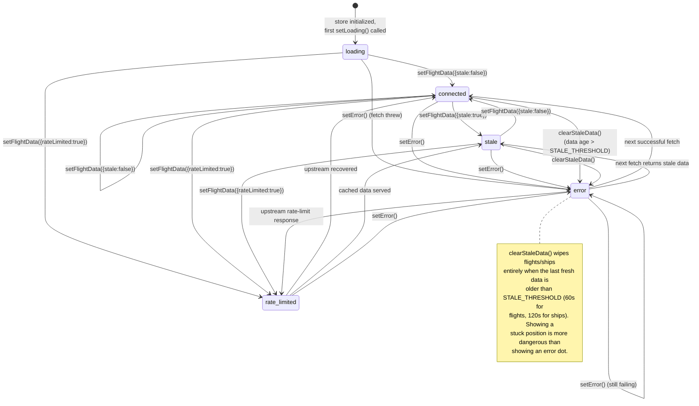
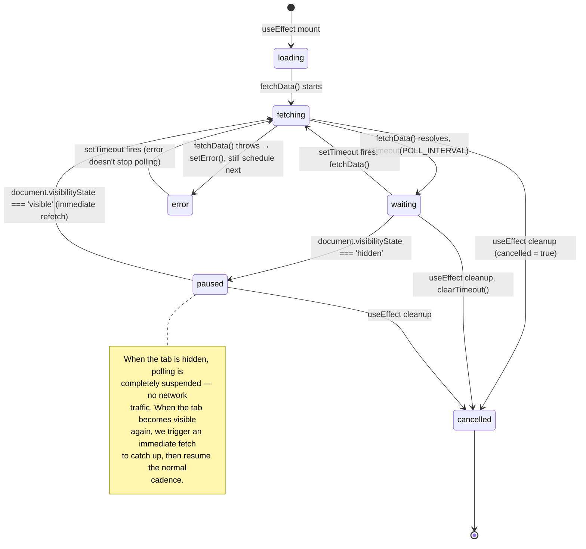
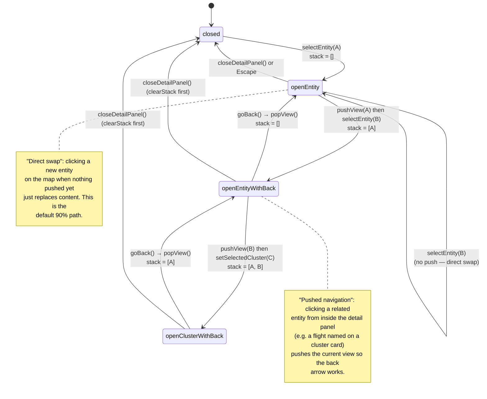

# State Machines

Four finite-state machines behind the runtime behavior of the
application:

1. [Connection lifecycle](#connection-lifecycle) — `ConnectionStatus`
   transitions per data store.
2. [Polling lifecycle](#polling-lifecycle) — recursive `setTimeout`
   polling with tab-visibility awareness.
3. [Detail panel navigation stack](#detail-panel-navigation-stack) —
   push / pop view history.
4. [Cache freshness](#cache-freshness) — fresh → stale → expired →
   evicted per Redis entry.

## Connection lifecycle

Every data store (`flightStore`, `shipStore`, `eventStore`,
`newsStore`, `marketStore`, `waterStore`) carries a
`ConnectionStatus` that drives the StatusPanel dots and detail-panel
"Updated Xs ago" ribbon.

### States explained

- **`loading`** — store was initialized or source switched. No data
  yet, dots are gray.
- **`connected`** — last fetch returned `stale: false`. Dots are
  green. Polling continues normally.
- **`stale`** — last fetch returned `stale: true` (past logical TTL
  but within hard TTL). Dots are yellow. Data is shown but the UI
  warns that it may be outdated.
- **`error`** — last fetch threw, or client-side staleness check
  triggered a `clearStaleData()`. Dots are red. Flights/ships
  arrays are cleared; events/news keep their last-known state.
- **`rate_limited`** — flights only. The upstream (OpenSky) returned
  a rate-limit signal. The store keeps the last known flights but
  surfaces an orange "rate limited" indicator.

### Not all stores have all transitions

- `siteStore` has an extra `'idle'` state for the period between
  store init and the one-shot fetch completing.
- `eventStore` and `newsStore` never transition through
  `clearStaleData()` because historical data is still useful.

## Polling lifecycle

Every polling hook implements the same recursive `setTimeout` state
machine with tab-visibility awareness. The diagram applies to
`useFlightPolling`, `useShipPolling`, `useEventPolling`,
`useNewsPolling`, `useMarketPolling`, `useWeatherPolling`, and
`useWaterPrecipPolling`.

### Invariants

- **No overlapping fetches.** Because we use recursive `setTimeout`
  (not `setInterval`), the next fetch is only scheduled **after**
  the current one completes. A slow upstream extends the effective
  interval without causing concurrent requests.
- **Cancellation is cooperative.** The `cancelled` flag lives in the
  `useEffect` closure; every async path checks it before mutating
  the store. The `timeoutRef` holds the pending timer so cleanup
  can `clearTimeout` it deterministically.
- **Errors never break the loop.** An error transitions the store to
  `error` but still schedules the next fetch. If the upstream
  recovers, the next cycle picks it up automatically.
- **Active-source change tears down.** `useFlightPolling` has
  `activeSource` in its `useEffect` dependency array. Switching
  sources triggers cleanup of the current loop and a fresh mount of
  the effect, which starts a new loop at the new cadence.

## Detail panel navigation stack

Added in Phase 23.1. The detail panel supports a back button by
maintaining a stack of previous views. Pushing a new view saves the
current panel state; popping restores it.

### States

- **`closed`** — `isDetailPanelOpen === false`, no selection.
- **`openEntity`** — a map entity is selected (`selectedEntityId`
  populated). Stack is empty.
- **`openEntityWithBack`** — entity selected, stack has ≥ 1 saved
  view, back arrow visible.
- **`openClusterWithBack`** — a `ThreatCluster` is selected via
  `selectedCluster` (mutually exclusive with `selectedEntityId`),
  stack non-empty.

### Key actions

- **`selectEntity(id)`** — sets `selectedEntityId`, clears
  `selectedCluster` (mutual exclusion).
- **`setSelectedCluster(cluster)`** — sets `selectedCluster`, clears
  `selectedEntityId`.
- **`pushView(view)`** — pushes a `PanelView = { entityId, cluster,
breadcrumbLabel }` onto the stack; usually called right before
  `selectEntity` or `setSelectedCluster` of a different target.
- **`goBack()`** — pops the top view and restores it via the
  appropriate setter. Sets `slideDirection: 'back'` to trigger the
  CSS slide-in-left animation.
- **`clearStack()`** — called from `closeDetailPanel()` to reset the
  history when the user dismisses the panel.

### Slide animations

`uiStore.slideDirection: 'forward' | 'back' | null` drives four CSS
keyframes in `app.css`:

- `forward`: slide-in-right + slide-out-left
- `back`: slide-in-left + slide-out-right

`null` disables animations entirely (used when swapping entities
without a push, so there's no flash).

### Escape key behavior

`useEscapeKeyHandler` binds `Escape` to:

1. If `navigationStack.length > 0`, pop one view (back behavior).
2. Otherwise call `closeDetailPanel()`.

So `Escape` acts like a browser back button within the panel and
falls through to close on the root view.

## Cache freshness

Per-entry lifecycle inside the Redis cache layer.

```mermaid
stateDiagram-v2
    [*] --> fresh : cacheSetSafe() writes {data, fetchedAt}<br/>with hard TTL = 10 × logical TTL
    fresh --> stale : Date.now() - fetchedAt > logicalTtlMs<br/>(computed on read, not a timer)
    stale --> fresh : cacheSetSafe() with fresh data<br/>(TTL resets)
    fresh --> evicted : Redis hard TTL (ex) expires
    stale --> evicted : Redis hard TTL (ex) expires
    evicted --> [*]

    fresh --> degraded : Redis call timed out<br/>or threw; mem fallback used
    stale --> degraded : same; mem fallback used
    degraded --> fresh : next cacheSetSafe() succeeds
    degraded --> evicted : mem fallback entry aged out

    note right of stale
        "Stale" is a flag on the response,
        not a separate Redis key. cacheGet
        computes it at read time. The client
        still gets the data, just with
        stale:true — the UI can show a
        warning but still render.
    end note

    note right of degraded
        Degraded means we're serving from
        the in-memory Map cache because
        Upstash is unreachable or the call
        hung past REDIS_OP_TIMEOUT_MS.
        Response carries degraded:true.
        Hard failure is the ONLY way a
        request sees no data at all.
    end note
```

### Logical vs hard TTL

- **Logical TTL** is the application-level staleness threshold. An
  entry older than `logicalTtlMs` gets `stale: true` on read but is
  still returned.
- **Hard TTL** is the Redis `ex` option (in seconds). Once this
  expires, Redis evicts the key entirely and the next read returns
  `null`.

The rule of thumb is **hard TTL = 10 × logical TTL**, giving us a
generous window where stale-but-servable data is still available
during an upstream outage.

Example: `news` has `logicalTtlMs = 900_000` (15 min) and
`redisTtlSec = 9000` (2.5h). So news is "fresh" for 15 min, "stale
but servable" for another 2h 15min, and finally evicted after 2h
30min from the last successful write.

### Read path: six possible outcomes

1. **Fresh hit.** Return data with `stale: false`.
2. **Stale hit.** Return data with `stale: true`. Route may trigger
   a background refresh if it wants to.
3. **Hard miss (never cached).** Return `null`, route falls through
   to upstream.
4. **Hard miss (TTL expired).** Same as (3) — Redis has evicted the
   key.
5. **Redis timeout/error → memCache hit.** Return data with
   `stale: true, degraded: true`.
6. **Redis timeout/error → memCache miss.** Return `null`, route
   falls through to upstream (which may also fail, in which case
   the route returns `stale: true` + empty data or a 5xx).

See [`server/cache/redis.ts`](../../../server/cache/redis.ts) for
the implementation and `server/__tests__/resilience/redis-death.test.ts`
for the chaos test that exercises every failure branch.
