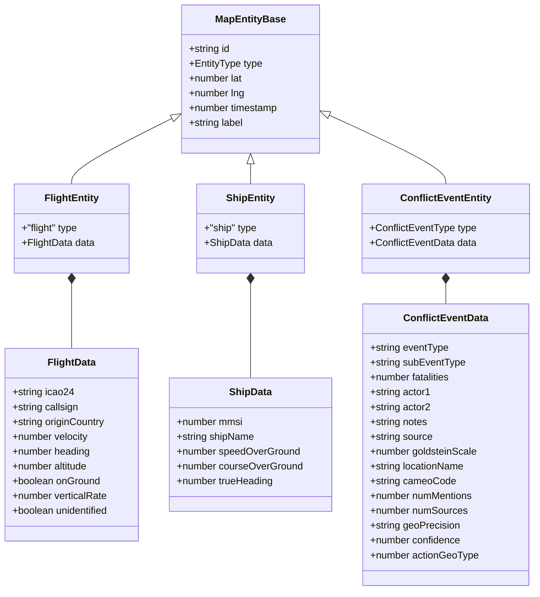

# Type Ontology

Every discriminated union, entity type, and shared envelope in the
system. All source pointers are relative to the repo root so you can
click through.

The canonical server-side source is
[`server/types.ts`](../../../server/types.ts). The frontend re-exports
these from
[`src/types/entities.ts`](../../../src/types/entities.ts) and adds
UI-only types in
[`src/types/ui.ts`](../../../src/types/ui.ts).

## `MapEntity` discriminated union

`MapEntity` is the shared data contract for anything that can appear
on the map as a clickable marker. It's a discriminated union with
three members sharing a common base:



**Key invariants:**

- `type` is the discriminator. TypeScript narrows the union by
  switching on it: `if (entity.type === 'flight') { entity.data /* typed as FlightData */ }`.
- `id` is globally unique across all entity types. Flights use their
  ICAO24 hex, ships use `mmsi-<n>`, events use the GDELT
  `GlobalEventID` prefixed with `gdelt-`.
- `lat` / `lng` are always populated (no map entity without a location).
  Events that arrived as country-level without coordinates are dropped
  at parse time.
- `timestamp` is Unix milliseconds UTC. Frontends are responsible for
  local-time display.
- `label` is a short human-readable string for the tooltip; longer
  descriptions live in `data`.

**`ConflictEventType`** expands the `type` discriminator into 11
CAMEO-derived values:

```ts
type ConflictEventType =
  | 'airstrike'
  | 'ground_combat'
  | 'shelling'
  | 'bombing'
  | 'assassination'
  | 'abduction'
  | 'assault'
  | 'blockade'
  | 'ceasefire_violation'
  | 'mass_violence'
  | 'wmd';
```

See [`server/types.ts#EntityType`](../../../server/types.ts) for the
literal union definition and
[`server/lib/eventScoring.ts`](../../../server/lib/eventScoring.ts) for
the CAMEO classification logic.

`TODO(26.2)`: the `classifyByBaseCode` map in the GDELT adapter is
hand-curated. Phase 26.2 will replace it with a data-driven config
and the type union here may grow.

## `SiteEntity` — NOT in `MapEntity` union

Key infrastructure (nuclear, naval, oil, airbase, port) uses a
separate `SiteEntity` type rather than joining the `MapEntity` union,
because:

- Sites are static, fetched once, not polled.
- Their fields (`siteType`, `operator`, `osmId`, `wikidata`) don't
  overlap cleanly with `FlightData` / `ShipData` / `ConflictEventData`.
- They have their own store (`siteStore`) with a slightly different
  connection lifecycle that includes an `'idle'` state.

```ts
type SiteType = 'nuclear' | 'naval' | 'oil' | 'airbase' | 'port';

interface SiteEntity {
  id: string; // "site-{osmId}"
  type: 'site';
  siteType: SiteType;
  lat: number;
  lng: number;
  label: string;
  operator?: string;
  wikidata?: string;
  osmId: number;
}
```

**Note.** `SiteType` no longer includes `'desalination'`. Desalination
plants moved to the Water layer in Phase 26, where they're represented
as `WaterFacility` instead. This is a deliberate split — a desalination
plant is more useful alongside dams and reservoirs than alongside
airbases and nuclear sites.

Source:
[`server/types.ts#SiteEntity`](../../../server/types.ts).

## `WaterFacility` — separate again

Water facilities are their own type, independent of both `MapEntity`
and `SiteEntity`:

```ts
type WaterFacilityType = 'dam' | 'reservoir' | 'desalination' | 'treatment_plant';

interface WaterFacility {
  id: string; // "water-{osmId}"
  type: 'water';
  facilityType: WaterFacilityType;
  lat: number;
  lng: number;
  label: string;
  operator?: string;
  osmId: number;
  stress: WaterStressIndicators;
  precipitation?: {
    last30DaysMm: number;
    anomalyRatio: number;
    updatedAt: number;
  };
}

interface WaterStressIndicators {
  bws_raw: number; // baseline water stress raw value
  bws_score: number; // 0-5 normalized score
  bws_label: string; // human label
  drr_score: number; // drought risk 0-5
  gtd_score: number; // groundwater table decline 0-5
  sev_score: number; // seasonal variability 0-5
  iav_score: number; // interannual variability 0-5
  compositeHealth: number; // 0-1 (0=worst, 1=best)
}
```

**Split rationale (Phase 26).** Originally desalination was shoehorned
into `SiteType`. When we added dams / reservoirs / treatment plants
with their own WRI Aqueduct stress indicators, it became obvious that
water facilities are a different ontology — they have stress scores,
precipitation anomalies, and a composite health computation that
sites don't. Extracting `WaterFacility` as its own type kept both
type families clean.

Source:
[`server/types.ts#WaterFacility`](../../../server/types.ts).

## `NewsCluster` and `NewsArticle`

News articles are deduplicated by URL hash, then clustered by Jaccard
similarity over tokenized titles within a 24h window (see
[`server/lib/newsClustering.ts`](../../../server/lib/newsClustering.ts)).
A cluster contains a primary article (the earliest seen) plus any
near-duplicates.

```ts
interface NewsArticle {
  id: string; // SHA-256 hash of URL (hex, 16 chars)
  title: string;
  url: string;
  source: string; // "GDELT", "BBC", "Al Jazeera", ...
  sourceCountry?: string; // "United Kingdom", "Qatar", ...
  publishedAt: number; // Unix ms
  summary?: string;
  imageUrl?: string;
  lat?: number;
  lng?: number;
  keywords: string[];
  actor?: string;
  action?: string;
  target?: string;
  relevanceScore?: number;
}

interface NewsCluster {
  id: string; // Same as primaryArticle.id
  primaryArticle: NewsArticle;
  articles: NewsArticle[]; // All articles in cluster
  firstSeen: number;
  lastUpdated: number;
}
```

`TODO(26.2)`: `actor` / `action` / `target` are populated by an
NLP extraction pass that Phase 26.2 is planning to improve. They're
currently `undefined` for most articles.

## `NotificationItem` (frontend-derived)

Not in `server/types.ts` because it's computed client-side from
`eventStore + newsStore`. Lives in
[`src/stores/notificationStore.ts`](../../../src/stores/notificationStore.ts):

```ts
interface NotificationItem {
  id: string;
  event: ConflictEventEntity;
  score: number; // computeSeverityScore(event)
  matchedHeadlines: MatchedHeadline[]; // matchNewsToEvent(event, clusters)
  bucket: 'Last hour' | 'Last 6 hours' | 'Last 24 hours';
  read: boolean;
}
```

See [`algorithms.md#severity-scoring`](./algorithms.md#3-severity-scoring)
for how `score` is computed, and
[`algorithms.md#news-matching`](./algorithms.md#5-news-matching) for
how `matchedHeadlines` are attached.

## `ConnectionStatus`

Every data store carries a connection status, used by the StatusPanel
dots and by the detail panel "Updated Xs ago" rendering.

```ts
type ConnectionStatus = 'connected' | 'stale' | 'error' | 'loading' | 'rate_limited';
```

- `loading` — initial mount, no fetch completed yet.
- `connected` — last fetch returned fresh data (`stale: false`).
- `stale` — last fetch returned `stale: true` (past logical TTL but
  within hard TTL).
- `error` — last fetch threw.
- `rate_limited` — upstream returned a rate-limit signal (flights
  only, since only OpenSky surfaces this).

`SiteConnectionStatus` additionally has `'idle'` — sites are fetched
once, so after the single fetch there's no "ongoing" state.

See [`state-machines.md`](./state-machines.md#connection-lifecycle)
for the transition diagram.

## `CacheResponse<T>`

The envelope every cached `/api/*` route returns. Defined once in
`server/types.ts` and shared with the client via the re-export in
`src/types/entities.ts`:

```ts
interface CacheResponse<T> {
  data: T;
  stale: boolean; // past logical TTL but within hard TTL
  lastFresh: number; // Unix ms of last successful upstream fetch
  degraded?: boolean; // true when serving from in-memory fallback
  rateLimited?: boolean; // upstream returned a rate-limit signal
}
```

The OpenAPI 3.0 equivalent is an `allOf` composition of a
`CacheResponseBase` component with the per-route data schema — see
[`server/openapi.yaml`](../../../server/openapi.yaml) for the schema
definition and
[`server/schemas/cacheResponse.ts`](../../../server/schemas/cacheResponse.ts)
for the Zod output validators used by `sendValidated`.

Internally, Redis stores a `CacheEntry<T>` rather than a
`CacheResponse<T>`:

```ts
interface CacheEntry<T> {
  data: T;
  fetchedAt: number; // Unix ms
}
```

The `stale` and `degraded` flags are computed at read time by
`cacheGet` / `cacheGetSafe` based on `Date.now() - fetchedAt` vs the
logical TTL. The hard Redis TTL (set via the `ex` option) is 10×
the logical TTL, so a "stale" entry is still servable until the
hard TTL expires and Redis evicts the key.

Source:
[`server/cache/redis.ts`](../../../server/cache/redis.ts).

## `AppError` (Phase 26.3)

Every route throws typed errors via the `AppError` class, and the
`errorHandler` middleware serializes them into a consistent envelope:

```ts
class AppError extends Error {
  statusCode: number;
  code: string;
  constructor(statusCode: number, code: string, message: string) {
    super(message);
    this.name = 'AppError';
    this.statusCode = statusCode;
    this.code = code;
  }
}

// Response envelope on error
interface ErrorResponse {
  error: string;
  code: string;
  statusCode: number;
  requestId: string;
}
```

- `error` is the human-readable message
- `code` is a stable machine-readable identifier (`BAD_REQUEST`,
  `UPSTREAM_UNAVAILABLE`, `RESPONSE_SCHEMA_MISMATCH`, ...)
- `statusCode` mirrors the HTTP status
- `requestId` is populated from the pino-http `X-Request-ID` header
  so clients can report bugs with a reference

Source:
[`server/middleware/errorHandler.ts`](../../../server/middleware/errorHandler.ts).

## Summary by source location

| Type                                                          | Source file                                | Purpose                      |
| ------------------------------------------------------------- | ------------------------------------------ | ---------------------------- |
| `MapEntityBase`, `MapEntity`                                  | `server/types.ts`                          | Discriminated union base     |
| `FlightEntity`, `FlightData`                                  | `server/types.ts`                          | Flight discriminator         |
| `ShipEntity`, `ShipData`                                      | `server/types.ts`                          | Ship discriminator           |
| `ConflictEventEntity`                                         | `server/types.ts`                          | Event discriminator          |
| `ConflictEventType`                                           | `server/types.ts`                          | 11-member CAMEO union        |
| `SiteEntity`, `SiteType`                                      | `server/types.ts`                          | Key sites (separate)         |
| `WaterFacility`, `WaterFacilityType`, `WaterStressIndicators` | `server/types.ts`                          | Water layer (separate)       |
| `NewsArticle`, `NewsCluster`                                  | `server/types.ts`                          | News feed                    |
| `MarketQuote`                                                 | `server/types.ts`                          | Commodity prices             |
| `WeatherGridPoint`                                            | `server/types.ts`                          | Weather grid                 |
| `CacheResponse<T>`, `CacheEntry<T>`                           | `server/types.ts`, `server/cache/redis.ts` | Cache envelope               |
| `RateLimitError`                                              | `server/types.ts`                          | Upstream rate-limit sentinel |
| `AppError`, `ErrorResponse`                                   | `server/middleware/errorHandler.ts`        | Error envelope               |
| `ConnectionStatus`, `SiteConnectionStatus`                    | Per-store files under `src/stores/`        | Data liveness states         |
| `NotificationItem`                                            | `src/stores/notificationStore.ts`          | Frontend-derived             |
| `ThreatCluster`, `PanelView`                                  | `src/types/ui.ts`                          | Frontend-only UI types       |
| `FlightSource`                                                | `src/types/ui.ts`                          | Client source selector       |
| `CONFLICT_TOGGLE_GROUPS`                                      | `src/types/ui.ts`                          | Filter group mapping         |

## See also

- [`algorithms.md`](./algorithms.md) — what operates on these types.
- [`state-machines.md`](./state-machines.md) — how `ConnectionStatus`,
  polling, and the navigation stack transition.
- [`complexity.md`](./complexity.md) — runtime characteristics of the
  hot paths that read and write these types.
