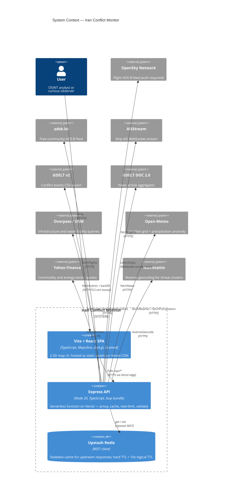
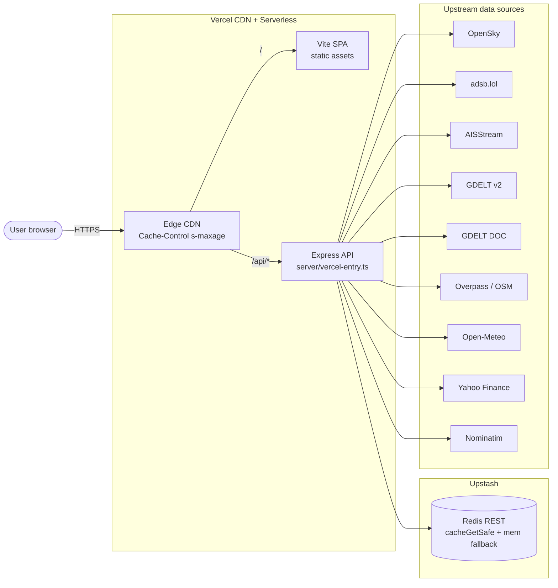

# System Context

The Iran Conflict Monitor is a single-page React application backed by a
serverless Express API. All upstream data is fetched through the API layer
so the browser never talks directly to third-party providers, which gives
us a single place to cache, rate-limit, sanitize, and trace every request.

This page answers the top-level question: **what are the moving parts and
who talks to whom?** Zoom in via [`data-flows.md`](./data-flows.md) for
per-source request sequences and [`deployment.md`](./deployment.md) for the
Vercel topology.

## Topology

The C4Context diagram below gives the 10,000-foot view. If your Mermaid
renderer doesn't support `C4Context` (some older ones don't), the flowchart
further down shows the same topology in plain `flowchart` syntax.

### Fallback diagram (plain flowchart)

## Notes

- **Single control plane.** Every upstream request is brokered by the Express
  API. The browser only ever calls `/api/*` and `/health`, which lets us hide
  API keys, enforce per-endpoint rate limits, and apply a consistent cache
  strategy without touching the client.

- **CDN edge caching.** Vercel's edge CDN sits between the browser and the
  serverless function. Each route emits a `Cache-Control: public,
s-maxage=<N>, stale-while-revalidate=<M>` header via the
  [`cacheControl` middleware](../../server/middleware/cacheControl.ts). This
  absorbs traffic spikes well before a Redis call is needed.

- **Upstash REST, not persistent connections.** Serverless functions can be
  killed at any moment, so we use the Upstash REST client rather than a
  long-lived TCP connection. It's "a fetch that stores bytes."

- **In-memory fallback.** If Upstash is unreachable or a single call hangs
  past `REDIS_OP_TIMEOUT_MS` (2000 ms, see
  [`server/cache/redis.ts`](../../server/cache/redis.ts)), the safe wrappers
  `cacheGetSafe` / `cacheSetSafe` fall through to a process-local `Map`
  cache and mark the response `degraded: true`. This is validated by a chaos
  test that mocks every Redis call to throw, asserting that all 8 cached
  routes return 2xx degraded responses — never a 5xx cascade.

- **Per-endpoint rate limiting.** The
  [`rateLimiters`](../../server/middleware/rateLimit.ts) map provides
  individually-tuned limits per route (flights is chattier than events).
  Limits are IP-scoped and reset on a sliding window — see
  [`server/openapi.yaml`](../../server/openapi.yaml) for the documented
  ceilings.

- **Tech debt, honestly labeled.** The GDELT event pipeline still relies
  on several hardcoded tables (CAMEO → event type, FIPS country codes,
  city centroids) that are out of date whenever CAMEO updates.
  `TODO(26.2)` markers are attached wherever those tables show up in the
  data-flow diagrams. Phase 26.2 will fold these into a data-driven
  configuration; Phase 26.4 (this one) just documents the current state.

## Next steps

- [`data-flows.md`](./data-flows.md) — zoom in on what happens inside each
  `/api/*` call with one Mermaid `sequenceDiagram` per source.
- [`deployment.md`](./deployment.md) — zoom in on the Vercel topology, cron
  jobs, and cache-header table.
- [`ontology/types.md`](./ontology/types.md) — zoom in on the types that
  flow through these arrows.
